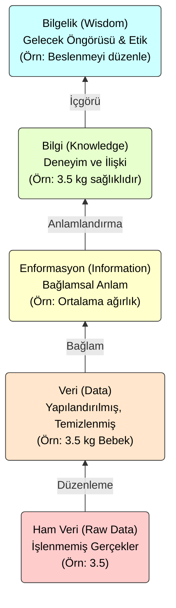

# Yüksek Başarımlı Hesaplama ve Büyük Veri Sistemleri

Gençler, bu dönem boyunca yüksek başarımlı hesaplama sistemlerini konuşacağız, ama motoru çalıştırmadan önce yakıtı tanımamız lazım. Bizim yakıtımız **Veri**. Çoğu zaman "veri", "bilgi", "enformasyon" kelimelerini günlük hayatta birbirinin yerine kullanıyorsunuz. Ancak mühendislikte, özellikle de büyük veri (Big Data) dünyasında bu kavramlar arasında dağlar kadar fark vardır. Eğer bu temel hiyerarşiyi oturtamazsak, kuracağımız bilgisayarlar sadece elektrik israf eden ısıtıcılar olur.


## 1. Hafta: Veri, Enformasyon ve Bilgelik Hiyerarşisi

Meseleye en temelden, **DIKW hiyerarşisi** dediğimiz yapıdan başlıyoruz. DIKW; **D**ata (Veri), **I**nformation (Enformasyon), **K**nowledge (Bilgi) ve **W**isdom (Bilgelik) kelimelerinin baş harfleridir. Bunu bir piramit gibi düşünün; alt katmanlar sağlam olmadan üst katmanlar oluşamaz.

### 1. Ham Veri (Raw Data)

Piramidin en altında Ham Veri bulunur. Latincede *Datum* "verilen şey" demektir. Henüz işlenmemiş, bir bağlama oturtulmamış, ham gerçektir.  
Şöyle düşünün: Bir hastanedesiniz ve bir kağıtta sadece **"3.5"** yazıyor. Bu nedir?

* Dolar kuru mu?
* Deprem şiddeti mi?
* Yoksa bir bebeğin kilosu mu?

Bilemezsiniz. Ham veri, ölçülmüş ama henüz ilişkilendirilmemiş gerçektir. Sadece potansiyel bir veridir.

### 2. Veri (Data)

Ham veriyi alıp temizlediğimizde, düzenlediğimizde ve örneğin bir Excel tablosuna veya veritabanına kaydettiğimizde **Veri** elde ederiz. Veri yapılandırılmıştır.  
Örnek: `[01-10-2023, 10:00, 3.5 kg]`  
Artık elimizde bir tarih, saat ve birim var. Bu veri, işlenmeye hazır hammaddedir.

### 3. Enformasyon (Information - Malumat)

Veriyi alıp "Bu ne anlama geliyor?" sorusunu sorduğumuzda **Enformasyon** seviyesine çıkarız. Veriyi analiz eder, özetler ve bir bağlam katarız.  
Örnek: "Yeni doğan bu bebeğin ağırlığı 3.5 kg'dır ve bu hastanenin bu ayki ortalamasıdır." demek enformasyondur. Karar verme sürecinin ilk basamağıdır.

### 4. Bilgi (Knowledge)

Burada işin rengi değişir. Bilgi, enformasyonun deneyim ve içgörü ile harmanlanmasıdır. "Neden?" ve "Nasıl?" sorularına odaklanır. İlişkileri ve nedenselliği kurar.  
Örnek: "3.5 kg doğan bir bebek, tıbbi standartlara göre sağlıklıdır" çıkarımı bir bilgidir. Literatürden gelen tecrübe ile eldeki enformasyon birleşmiştir.

### 5. Bilgelik (Wisdom)

Piramidin en tepesidir. Geleceğe dair öngörüde bulunma ve etik değerleri işin içine katma sanatıdır.  
Örnek: "Bu bölgedeki annelerin beslenme alışkanlıklarını düzenlersek, bebek ölümlerini azaltırız" demek bilgeliktir. Sadece durumu tespit etmez, sorunu çözmek için bir yargıya varır.



Market Depo veritabanınızda ürünlerin tarihleri var (Veri). Salçaların tarihinin yaklaştığını gördünüz (Enformasyon). Geçmiş satışlara bakıp, salça alanın yanında makarna da aldığını tespit ettiniz (Bilgi/Birliktelik Kuralı). "İkisini paket yapıp satarsam stok erir" kararı stratejik bir **Bilgeliktir**.

### Veri Kaynakları

Peki bu veriyi nereden topluyoruz? Mühendis olarak "veri" denince aklınıza sadece veritabanları gelmesin. Kaynaklarımız çok çeşitli.

1. **Dijital Veri Kaynakları:**
   * *Yapılandırılmış Veriler:* SQL veritabanları gibi satırı sütunu belli olanlar.
   * *Yapılandırılmamış Veriler:* Sosyal medya Tweet'leri, web siteleri.
   * *Makine Verileri:* IoT sensör verileri, sunucu log (erişim) dosyaları.
   * *Multimedya:* Video ve ses kayıtları.

2. **Fiziksel (Basılı) Veri Kaynakları:**
   * Dijitalleşmeyi bekleyen kitaplar, faturalar, Osmanlı arşivleri, eski haritalar. Bunların dijitale aktarılması (digitization) başlı başına bir iştir.

3. **Soyut Veri Kaynakları:**
   * İnsan davranışları, duyguları ve kültürel kodları. Bir müşterinin reyondaki kararsızlığı veya bir tweetin içerdiği öfke/sevinç (Sentiment Analysis) bu gruba girer. Ölçülmesi en zor ama katma değeri en yüksek veriler genellikle buradadır.

    ```mermaid
    flowchart TD
        %% Ana Düğüm
        Center([Veri Kaynakları])
        
        %% Kategoriler
        Digital[Dijital Kaynaklar]
        Physical[Fiziksel/Basılı Kaynaklar]
        Abstract[Soyut Kaynaklar]
        
        %% Bağlantılar - Ana
        Center --> Digital
        Center --> Physical
        Center --> Abstract
        
        %% Bağlantılar - Detaylar
        Digital --> D1(Veritabanları<br/>SQL/NoSQL)
        Digital --> D2(Sensörler - IoT)
        Digital --> D3(Log Dosyaları)
        Digital --> D4(Multimedya<br/>Video/Ses)
        
        Physical --> P1(Kitaplar &<br/>El Yazmaları)
        Physical --> P2(Faturalar &<br/>Resmi Evraklar)
        
        Abstract --> A1(İnsan Davranışları)
        Abstract --> A2(Duygu ve<br/>Düşünceler)

        %% Stiller
        classDef main fill:#333,color:#fff,stroke:#000,stroke-width:2px;
        classDef digit fill:#add8e6,stroke:#333,color:#000;
        classDef phys fill:#d3d3d3,stroke:#333,color:#000;
        classDef abs fill:#fffacd,stroke:#333,color:#000;
        
        class Center main;
        class Digital,D1,D2,D3,D4 digit;
        class Physical,P1,P2 phys;
        class Abstract,A1,A2 abs;
    ```

### Yapısal Durumuna Göre Veri

Mühendis olarak karşınıza çıkacak veri her zaman temiz ve düzenli olmayacak. Dünyadaki verinin **%80'inden fazlası yapısal değildir** (unstructured). Asıl mücadele, o düzensiz resim, video ve metin yığınından anlamlı bilgi çıkarmakta yatıyor.

| Veri Tipi | Tanım | Örnek | Depolama Yöntemi |
| :--- | :--- | :--- | :--- |
| **Yapısal (Structured)** | Satır ve sütunları bellidir. Kalıba girer. | Excel dosyaları, Banka hesap dökümleri | İlişkisel Veritabanları (SQL - RDBMS) |
| **Yarı Yapısal (Semi-structured)** | Katı bir şeması yoktur ama etiketlerle (tag) ayrılmıştır. | JSON, XML dosyaları, E-postalar | NoSQL Veritabanları (MongoDB, Couchbase) |
| **Yapısal Olmayan (Unstructured)** | Belli bir formatı yoktur. Karışık yığındır. | Videolar, Ses kayıtları, PDF dokümanları, Resimler | Nesne Depolama (Object Storage), Veri Gölleri (Data Lakes) |

Dünya üzerinde küçük bir zaman diliminde bile *inanılmaz* miktarda veri üretiliyor ve depolanan veri her geçen gün katlanarak artıyor. Sadece **bir dakikada** neler olduğunu hayal edin:

*   **WhatsApp:** Kullanıcılar dakikada 41,6 milyon mesaj gönderiyor. (İletişimin inanılmaz hızı ve hacmi)
*   **Google:** Dakikada 6,3 milyon arama yapılıyor. (Bilgiye erişimin yaygınlığı)
*   **Amazon:** Alışveriş yapanlar dakikada 455 bin dolar harcıyor. (E-ticaretin büyüklüğü)
*   **Global İnternet:** Kullanıcılar dakikada 25,1 milyon saat çevrimiçi vakit geçiriyor. (İnternetin yaşamımızdaki merkezi rolü)
*   **Ortalama Kişi:** Her bir birey, dakikada ortalama 102 MB veri üretiyor.

İşte bu veri tsunamisiyle başa çıkmak için buradayız.


## 2\. Hafta: Büyük Veri ve İşleme İhtiyacı

Veri miktarının nasıl arttığını hayal etmeniz zor olabilir. Dakikada Google'da yapılan milyonlarca aramayı, gönderilen mesajları düşünün. Bu verinin **Hacmi (Volume)**, **Hızı (Velocity)** ve **Çeşitliliği (Variety)** arttıkça, klasik yöntemlerimiz yetersiz kalıyor. Buna literatürde **3V** denir. Son zamanlarda verinin doğruluğu (**Veracity**) da dördüncü bir V olarak eklendi.  
Veri bu kadar büyüyünce, onu tek bir diskte saklamak veya tek bir işlemciyle işlemek imkânsız hale geliyor. İşte burada **Yüksek Başarımlı Hesaplama (High Performance Computing \- HPC)** devreye giriyor. HPC, aslında çok sayıda işlemciyi veya bilgisayarı bir arada çalıştırarak, tek başına bir bilgisayarın aylar sürecek işini saatlere indirme sanatıdır.  
Özellikle akan veri (streaming data) dediğimiz, sürekli ve durmaksızın gelen veriyi işlemek, borudan akan suyu kovayla taşımaya benzer. Kovalarınız (belleğiniz) ve taşıyanlarınız (işlemcileriniz) yetersizse su taşar, veri kaybolur.

## 3\. Hafta: Bilgisayar Mimarisine Bakış

HPC yapacaksak, elimizdeki aleti, yani bilgisayarı tanımamız lazım. Alan Turing ve Von Neumann'ın 1940'larda çizdiği mimari hala geçerli.  
digraph VonNeumann {  
    rankdir=LR;  
    node \[shape=box, style=filled, fillcolor=lightblue\];  
    CPU \[label="Merkezi İşlem Birimi (CPU)\\n(Kontrol \+ Aritmetik Mantık)"\];  
    Memory \[label="Bellek (Memory)\\n(Veri \+ Komutlar)"\];  
    IO \[label="Giriş/Çıkış (I/O)"\];  
      
    CPU \-\> Memory \[label="Veri/Komut İsteği", dir=both\];  
    CPU \-\> IO \[label="Veri Aktarımı", dir=both\];  
}  
Buradaki en büyük sorun, işlemcinin çok hızlı, belleğin ise ona göre çok yavaş olmasıdır. Buna **Von Neumann Darboğazı (Von Neumann Bottleneck)** diyoruz. İşlemci sürekli "Veri nerede kaldı?" diye bekler.  
Modern işlemcilerde bu beklemeyi azaltmak için **Pipelining (Boru Hattı)** tekniği kullanılır. Çamaşır yıkamayı düşünün: Yıkama, kurutma ve katlama işleri vardır. Bir grup çamaşır kurumadayken, diğerini makineye atarsınız. İşlemci de bir komutu yürütürken (execute), sıradakini çözer (decode), bir sonrakini bellekten getirir (fetch). Böylece her saat döngüsünde bir iş bitirmeye çalışır.

## 4\. Hafta: Bellek Hiyerarşisi ve Yerellik

Gençler, işlemci ile ana bellek (RAM) arasındaki hız farkı uçurum gibidir. Bu açığı kapatmak için **Önbellek (Cache)** kullanırız. İşlemcinin hemen yanında, çok hızlı ama çok küçük bellekler vardır (L1, L2, L3).  
Burada temel prensip **Yerellik (Locality)** ilkesidir. İki türü vardır:

1. **Zamansal Yerellik (Temporal Locality):** Bir veriyi kullandıysam, birazdan yine kullanma ihtimalim yüksektir. Masamda duran kitaba tekrar bakmam gibi.  
2. **Mekânsal Yerellik (Spatial Locality):** Bir veriyi kullandıysam, onun yanındaki veriyi de kullanma ihtimalim yüksektir. Kütüphaneden bir kitap aldıysam, yanındaki cildi de almam muhtemeldir.

Kod yazarken dizilere (array) erişiminiz bu yüzden önemlidir. Bellekte yan yana duran verilere sırasıyla erişirseniz (stride-1 access), donanım sizin için sıradaki verileri önbelleğe çeker ve işiniz hızlanır. Rastgele erişirseniz, işlemci sürekli ana belleği bekler, buna **Cache Miss (Önbellek Iskalama)** denir ve performansın katilidir.

## 5\. Hafta: Paralel Hesaplama Modelleri

Tek işlemcinin hızı fiziksel sınırlarına (ısınma, güç tüketimi) dayandığı için artık hızlanmak için daha fazla çekirdek (core) ekliyoruz. Flynn taksonomisi dediğimiz bir sınıflandırma var:

* **SISD (Single Instruction Single Data):** Klasik tek çekirdek. Bir emir, bir veriyi işler.  
* **SIMD (Single Instruction Multiple Data):** Tek bir emirle çoklu veriyi işlemek. Mesela bir vektördeki tüm sayıları aynı anda 2 ile çarpmak. GPU'ların mantığı budur.  
* **MIMD (Multiple Instruction Multiple Data):** Birden fazla işlemci, farklı veriler üzerinde farklı işler yapar. Modern süper bilgisayarlar ve çok çekirdekli sistemler genelde budur.

Bir işi paralelleştirirken **Amdahl Yasası**'nı unutmayın. Bir programın sadece belli bir kısmı paralelleştirilebilir. Geri kalanı seri çalışmak zorundaysa, ne kadar işlemci eklerseniz ekleyin, o seri kısım sizin maksimum hızlanmanızı sınırlar. Yani 1000 aşçı da tutsanız, keki fırında pişirme süresini kısaltamazsınız.

## 6\. Hafta: Paylaşımlı Bellek Programlama (Shared Memory)

Elinizdeki laptopta veya sunucuda birden fazla çekirdek var ve hepsi aynı RAM'i görüyor. Buna paylaşımlı bellek mimarisi diyoruz. Burada programlama yaparken **OpenMP** (Open Multi-Processing) standardını sıkça kullanırız.  
OpenMP, derleyiciye (compiler) verdiğiniz ipuçlarıdır (directives). "Bu döngüyü çekirdekler arasında paylaştır" dersiniz.  
Ancak dikkat\! Aynı değişkene birden fazla iş parçacığı (thread) aynı anda yazmaya çalışırsa **Yarış Durumu (Race Condition)** oluşur. Sonuç tamamen şansa kalır. Bunu engellemek için **Kritik Bölge (Critical Section)** yapıları kullanırız; yani "buraya tek tek girin" deriz. Ama bu da performansı düşürür. Dengeyi iyi kurmak lazım.  
İngilizcedeki *thread* kelimesi iplik demektir, biz buna iş parçacığı diyoruz. Bir kumaşı dokuyan birden fazla iplik gibi, işlemciyi de aynı anda kullanan iş parçacıklarıdır.

## 7\. Hafta: Dağıtık Bellek Programlama (Distributed Memory)

Tek bir makinenin belleği yetmediğinde, birden fazla bilgisayarı ağ üzerinden bağlarız. Buna **Küme (Cluster)** denir. Burada her bilgisayarın kendi belleği vardır ve birbirlerinin belleğine doğrudan erişemezler. İletişim kurmak zorundadırlar.  
Burada **MPI (Message Passing Interface \- Mesaj Geçiş Arayüzü)** devreye girer. Bir işlemci diğerine "Al şu veriyi işle" diye mektup (mesaj) gönderir. Posta teşkilatı gibi düşünün. Gönderici MPI\_Send, alıcı MPI\_Recv komutunu kullanır.  
Bu modelde en büyük darboğaz ağ hızıdır. Veri transferi hesaplamadan çok daha yavaştır. O yüzden **İletişim/Hesaplama (Communication to Computation Ratio)** oranını düşük tutmaya çalışırız. Yani az konuşup çok iş yapmalıyız.

## 8\. Hafta: Kod Optimizasyonu ve Profilleme

Yazdığınız kodun nerede yavaşladığını bilmeden hızlandıramazsınız. Tahmin yürütmek mühendislik değildir. **Profilleme (Profiling)** araçları kullanmalıyız.  
Linux'ta top, ps gibi komutlar anlık durumu gösterir. Ama daha derine inmek için perf veya gprof gibi araçlar kullanırız. Bunlar size kodunuzun hangi fonksiyonunda ne kadar vakit harcandığını söyler. Buna **Hot Spot (Sıcak Nokta)** analizi denir. Genelde kodun %10'u, sürenin %90'ını harcar. Orayı düzeltirseniz program uçar.  
Derleyiciler de akıllıdır. gcc \-O3 gibi bayraklarla (flags) derleyiciden kodu optimize etmesini isteyebiliriz. Döngü açma (loop unrolling) gibi teknikleri otomatik yapabilirler. Ama sihirbaz değiller, kötü yazılmış algoritmayı düzeltemezler.

## 9\. Hafta: Büyük Veri Ekosistemi \- Hadoop

Veri tek bir diske sığmadığında **HDFS (Hadoop Distributed File System)** kullanırız. Dosyaları bloklara böler ve farklı makinelerde saklar. Hatta her bloğun kopyasını (replica) tutar ki bir makine bozulursa veri kaybolmasın.  
Bu veri üzerinde işlem yapmak için **MapReduce** paradigması geliştirilmiştir. İki aşamalıdır:

1. **Map (Haritala):** İşlemciler ellerindeki veriyi işler ve bir ara sonuç üretir (anahtar-değer çifti).  
2. **Reduce (İndirge):** Aynı anahtara sahip veriler bir araya getirilir ve özetlenir.

Örnek: Bir kütüphanedeki tüm kitaplarda geçen kelimeleri sayacaksanız; her öğrenci (Mapper) bir kitabı alır sayar, sonra tüm "ve" kelimelerinin sayıları bir kişide (Reducer) toplanır ve genel toplam bulunur.

## 10\. Hafta: Bellek İçi Hesaplama \- Spark

Hadoop MapReduce güzeldir ama her adımda veriyi diske yazar ve okur. Bu da yavaştır. **Apache Spark**, veriyi mümkün mertebe RAM'de (bellekte) tutarak işler. Bu sayede 100 kata kadar daha hızlı olabilir.  
Spark'ın temelinde **RDD (Resilient Distributed Dataset \- Esnek Dağıtık Veri Seti)** vardır. Bu, verinin hafızada dağıtık olarak duran ve hata durumunda yeniden hesaplanabilen halidir. Spark ile veri işleme hattı (pipeline) kurarız. Veri, işlemler zincirinden akar.  
Özellikle makine öğrenmesi algoritmaları gibi aynı veri üzerinde tekrar tekrar dönen (iteratif) işler için Spark biçilmiş kaftandır.

## 11\. Hafta: Heterojen Hesaplama ve Hızlandırıcılar

Artık sadece CPU kullanmıyoruz. GPU (Grafik İşlem Birimi), FPGA gibi hızlandırıcılar var.  
GPU'lar, binlerce küçük ve basit çekirdekten oluşur. CPU'yu bir üniversite profesörü, GPU'yu ise binlerce ilkokul öğrencisi gibi düşünebilirsiniz. Karmaşık bir integral sorusunu profesör (CPU) çözer. Ama "1 milyon tane kutuyu kırmızıya boya" derseniz, binlerce öğrenci (GPU) bunu profesörden çok daha hızlı yapar.  
Bu yapıya **Heterojen Hesaplama** diyoruz. Ana program CPU'da çalışır, ağır ve paralel işleri GPU'ya yıkar (offload). **CUDA** veya **OpenCL** gibi dillerle GPU'ları programlarız.

## 12\. Hafta: Makine Öğrenmesi ve HPC Yakınsaması

Yapay zeka modelleri, özellikle Derin Öğrenme (Deep Learning), muazzam işlem gücü istiyor. Büyük modelleri eğitmek için **Veri Paralelliği (Data Parallelism)** kullanırız. Modelin kopyaları farklı GPU'larda durur, her biri verinin bir parçasını işler ve öğrendiklerini (parametre güncellemelerini) birleştirirler.  
Burada HPC teknikleri kritik önem taşır. GPU'lar arası iletişim hızı, bellek yönetimi, eğitimin süresini belirler. TensorFlow, PyTorch gibi kütüphaneler arka planda bizim anlattığımız bu paralel hesaplama kütüphanelerini (cuDNN, NCCL gibi) kullanır.

## 13\. Hafta: Sistem İzleme ve Hata Ayıklama (Debugging)

Sistem bir anda yavaşladığında veya çöktüğünde ne yapacaksınız? "Yeniden başlatalım düzelir" mühendis yaklaşımı değildir.  
Linux dünyasında elimizdeki fenerler şunlardır:

* ps (Process Status): Çalışan süreçleri görürüz.  
* top / htop: Kaynak tüketimini anlık izleriz. Load average (yük ortalaması) sistemin ne kadar meşgul olduğunu gösterir.  
* strace (System Trace): Bir programın işletim sisteminden ne istediğini (dosya açma, ağa bağlanma) adım adım izleriz. Hata ayıklamanın kara kutusudur.  
* dmesg: Çekirdek (kernel) mesajlarını gösterir. Donanım hatası varsa burada görürsünüz.

Bir program çöktüğünde (crash), geriye bir **Core Dump** (Bellek Dökümü) bırakır. Bu, olay yerinin fotoğrafı gibidir. Bunu gdb (GNU Debugger) ile açıp, programın tam hangi satırda, hangi değişkenlerle patladığını görebiliriz.

## 14\. Hafta: Gelecek Trendleri ve Yeşil Hesaplama

Gençler, bu güç bedava değil. Süper bilgisayarlar devasa elektrik tüketir. Megawattlarca güçten bahsediyoruz. Bu yüzden **Watt başına Performans (Performance per Watt)** artık en önemli kriterlerden biri. Buna **Yeşil Hesaplama (Green Computing)** diyoruz.  
Ayrıca **Bulut Bilişim (Cloud Computing)** ile artık herkesin evine süper bilgisayar almasına gerek kalmadı. AWS, Azure, Google Cloud gibi sağlayıcılardan ihtiyacınız kadar işlemciyi saatlik kiralayabiliyorsunuz. Ama arka planda çalışan teknoloji yine bu derste öğrendiğiniz sanallaştırma, konteynerler (Docker) ve HPC mimarileridir.  
Gelecekte **Kuantum Hesaplama** gibi paradigmalar da geliyor ama klasik HPC ve paralel programlama mantığı, özellikle veri analitiğinde uzun süre temel taş olmaya devam edecek.  
