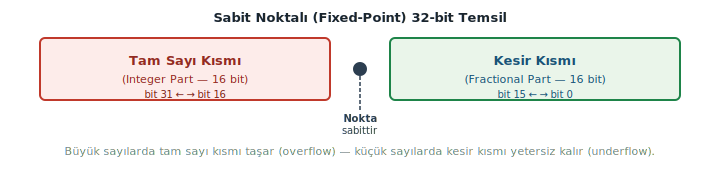
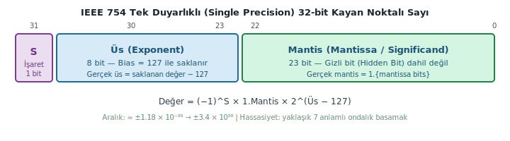
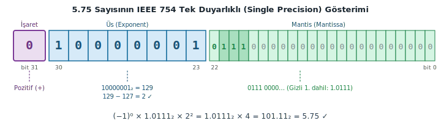
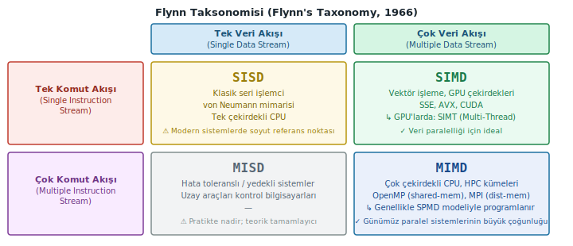
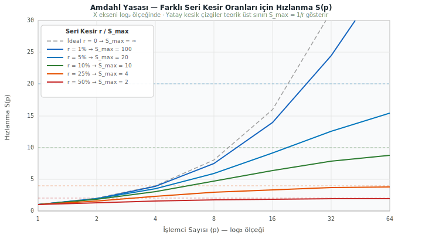
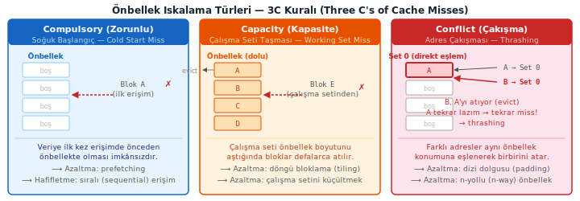
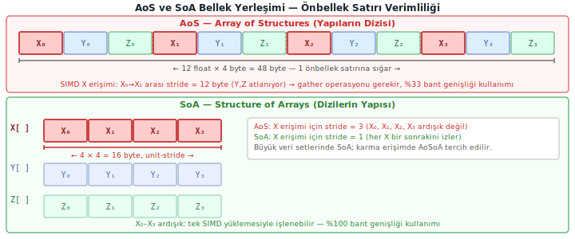
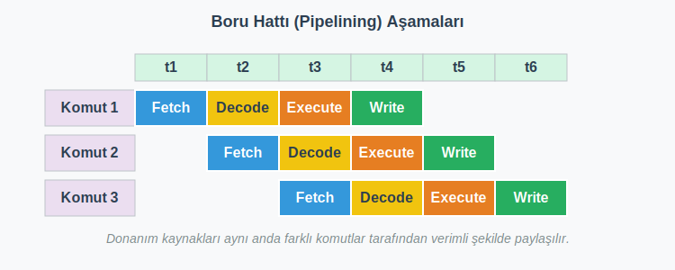
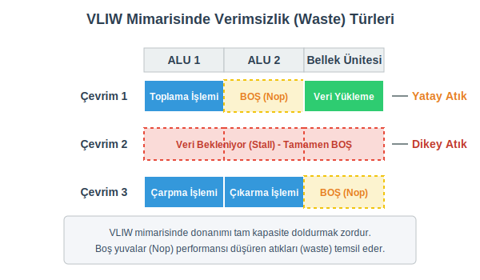
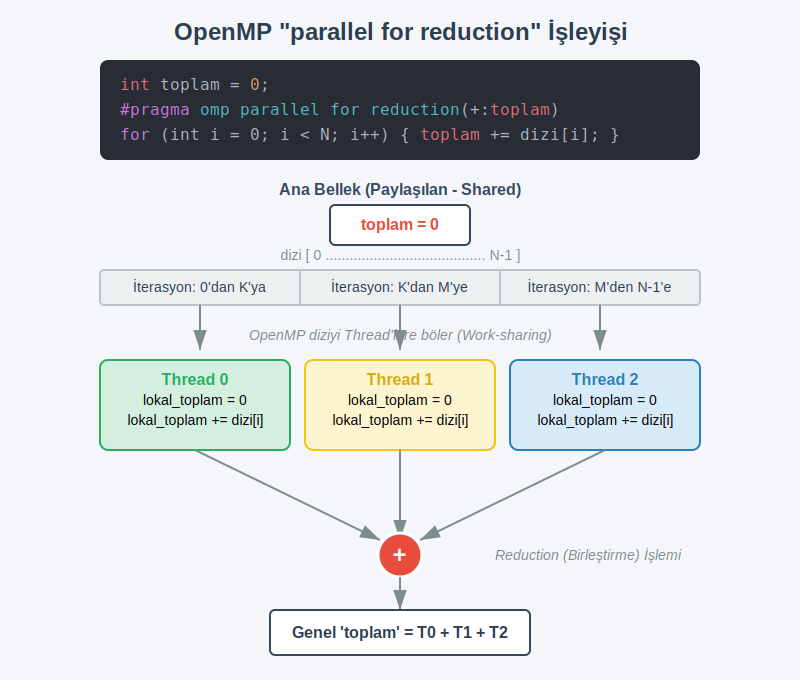

# Yüksek Başarımlı Hesaplama (HPC) - Ders Notları
## Modern İşlemciler

### Konrad Zuse ve Bilgisayarların Etkisi
1941 yılında Konrad Zuse, dünyanın ilk tam otomatik, serbest programlanabilir ve ikili kayan noktalı aritmetiğe sahip bilgisayarını inşa ettiğinde, bu devrimci cihazın sadece bilim ve mühendislikte değil, yaşamın her alanındaki potansiyelini öngörmüştü. Bugün, Zuse'nin hayali gerçeğe dönüşmüş durumda: Bilgisayarlar, onun zamanından beri hayatımızı ve araştırmalarımızı kökten değiştirmiştir. Hesaplamaları, görselleştirmeleri ve genel veri işlemeyi inanılmaz ve sürekli artan bir hızda gerçekleştirebilmeleri sayesinde artık vazgeçilmez hale gelmişlerdir.

### Zuse'nin Vizyonu ve Gerçeklik
Zuse, bilgisayarların sadece bilimsel ve mühendislik problemlerini çözmek için değil, günlük yaşamın her alanına nüfuz edeceğini hayal etti.
Bugün, bilgisayarlar bankacılıktan tıpa, eğitimden eğlenceye kadar her sektörde kritik rol oynamaktadır.

### Bilgisayarların Etkileri
- **Hız:** Hesaplamalar ve veri işleme inanılmaz derecede hızlı hale geldi. Bu da karmaşık problemleri çözmemizi ve daha önce mümkün olmayan keşifler yapmamızı sağlıyor.
- **Verimlilik:** Rutin ve tekrarlayan görevler otomasyona tabi tutularak zamandan ve emekten tasarruf sağlanıyor.
- **İletişim:** Gecikmesiz iletişim ve bilgi paylaşımı mümkün hale geldi.
- **Karmaşık Araştırma:** Karmaşık modeller ve simülasyonlar kullanılarak bilimsel araştırmalar yeni bir boyut kazandı.


### Kayan Noktalı Aritmetik ve Sayı Temsili
Bilgisayar bilimlerinde, kayan noktalı aritmetik (Floating Point-FP), gerçek sayıların alt kümelerini, sabit bir hassasiyete sahip bir tamsayı (signifikand) olarak, sabit bir tabanın tamsayı üssü ile çarpılarak gösteren bir aritmetiktir. Bu formdaki sayılara kayan noktalı sayılar denir.

### IEEE 754 32-bit Standardı: Kayan Noktalı Sayıların Yapısı

Sayıların bilgisayarda nasıl saklandığını anlamak, performans odaklı kod yazmanın temel taşlarından biridir. Önce sorunu, ardından çözümü ele alalım.

#### Sorun: Sabit Noktalı (Fixed-Point) Temsil

32 bitlik bir kaydı ikiye böldüğümüzü düşünelim: 16 bit tam sayı, 16 bit kesir için. Bu tasarımda noktanın yeri kalıcı olarak sabittir.



Sorun açıktır: büyük bir sayıyı temsil etmek istediğinizde tam sayı kısmı taşar (overflow); çok küçük bir sayıda ise kesir kısmı yeterli çözünürlüğü sağlayamaz. Bir terzi, hem kilometre cinsinden kumaş toplarını hem de milimetrik dikişleri aynı mezura ile ölçmeye çalışıyorsa iki uçta da yetersiz kalır.

#### Çözüm: Kayan Noktalı (Floating-Point) Temsil — IEEE 754

Standart, sayıyı bilimsel gösterime benzer biçimde üç alana böler. Her 32-bitlik kayan noktalı sayı şu yapıda saklanır:



- **S — İşaret (Sign), 1 bit:** $0$ pozitif, $1$ negatif.
- **Üs (Exponent), 8 bit:** Noktanın kaç basamak sağa ya da sola kaydığını kodlar. Negatif üsleri de temsil edebilmek için gerçek üs değerine **bias** (sapma) adı verilen sabit bir değer olan 127 eklenerek saklanır; bellekteki değer her zaman *gerçek üs + 127*'dir.
- **Mantis (Mantissa / Significand / Anlamlı Kısım), 23 bit:** Sayının anlamlı basamaklarını taşır. Normalleştirilmiş sayılarda baştaki `1.` daima mevcut kabul edildiğinden hafızaya yazılmaz — bu **gizli bit (hidden bit)** kuralı sayesinde 23 bit ile aslında 24 bitlik hassasiyet elde edilir.

Genel formül:

$$\text{Değer} = (-1)^{S} \times 1.\text{Mantis} \times 2^{(\text{Üs} - 127)}$$

---

### $5.75$ Sayısının IEEE 754 Gösterimi

Somut bir örnekle bu yapıyı pekiştirelim.

#### Adım 1 — İkili (Binary) Sisteme Dönüştürme

Tam sayı ve kesir kısımlarını ayrı ayrı dönüştürürüz:

- $5_{10} = 101_{2}$
- $0.75_{10} = 0.5 + 0.25 = 0.11_{2}$
- Birleşim: $101.11_{2}$

#### Adım 2 — Normalleştirme

Noktayı en soldaki 1'in hemen sağına taşıyoruz; bilimsel gösterimdeki mantıkla aynıdır:

$$101.11_{2} \;\longrightarrow\; 1.0111 \times 2^{2}$$

Nokta 2 basamak sola kaydı, dolayısıyla gerçek üs = 2.

#### Adım 3 — Alanları Doldurma

**A) İşaret (S):**
Sayı pozitif → **0**

**B) Üs (Exponent):**
$2 + 127 = 129 = 10000001_{2}$

**C) Mantis (Mantissa):**
Normalleştirme sonrası virgülden sonraki kısım `0111`'dir. Gizli bit kuralı gereği başındaki `1.` saklanmaz; kalan 23 biti sona sıfır ekleyerek doldururuz: `01110000000000000000000`

Bellekteki nihai düzen:



Sonucu doğrulayalım: $(-1)^{0} \times 1.0111_{2} \times 2^{2} = 101.11_{2} = 5.75$ ✓


## Bölüm 1 — Modern Donanım ve Paralel Hesaplamaya Giriş

### 1.1 Paralel Hesaplamaya Neden İhtiyaç Duyarız?

Bilgisayar bilimlerinin ilk yıllarından itibaren işlemci performansındaki artış donanım mimarisindeki ilerlemelerle paralellik göstermiştir. 1986'dan 2003 yılına kadar standart mikroişlemcilerin performansı yılda ortalama %50'den fazla artmıştır; bu artış yazılımcıların yeni donanımı kullanarak uygulamaları hızlandırmasını kolaylaştırmıştır. Bu yükselişin itici gücü Moore Yasasıdır.

2003'ten itibaren tek çekirdekli performans artışı yavaşlamış ve yıllık %4'lerin altına düşmüştür. Bunun temel nedeni **Güç Duvarı (Power Wall)** olarak anılan fiziksel sınırlardır. Bu sınırlamaların akademik literatürdeki temel nedeni **Dennard Ölçeklemesinin (Dennard Scaling)** çöküşüdür: transistörler küçüldükçe uygulanan voltajın aynı oranda düşürülememesi güç yoğunluğunu fırlatmıştır.

- **Güç ve ısı:** Transistörler küçüldükçe saat frekansı artırılabilse de güç tüketimi frekansın küpü oranında artar; ortaya çıkan ısı soğutma sınırlarına takılır.
- Bu yüzden çip üreticileri monolitik tek hızlı çekirdekler yerine aynı çipte birden fazla çekirdek (multicore) tasarımlarına yönelmiştir. Örnek: Mutfakta çok hızlı çalışan ama ısıdan bayılmak üzere olan tek bir şefe yüklenmek yerine, işi normal hızda çalışan 4 ayrı şefe dağıtmak gibidir.

Sonuç: Artık donanım ekleyerek eski seri yazılımları otomatik hızlandırmak mümkün değil; programcıların hesaplamaları paralel alt parçalara bölmesi gerekir.

## Bölüm 2 — Paralel Mimariler ve Flynn Taksonomisi

Michael Flynn (1966), paralel bilgisayar mimarilerini sınıflandırmak için iki eksenli bir çerçeve önerdi: eş zamanlı işlenebilen **komut (instruction)** akışı sayısı ve **veri (data)** akışı sayısı. Her eksen iki değer alır — tekli ya da çoklu — ve bu kombinasyonlar dört kategoriyi tanımlar:



Mimariyi etiketlemek için önce komut akışının, ardından veri akışının tekli mi çoklu mu olduğuna bakmak yeterlidir.

### 2.1 SISD — Tek Komut, Tek Veri (Single Instruction, Single Data)

Klasik von Neumann mimarisi tam olarak bu tanıma oturur: tek bir işlemci, tek bir komut dizisini, tek bir veri akışı üzerinde sırayla yürütür. Bugünkü çok çekirdekli sistemlerin her çekirdeği seri kodda SISD gibi davranır; bu nedenle SISD, paralel performansı değerlendirirken kullanılan referans noktasıdır.

Kasabadaki tek eczacıyı düşünün: müşteriler sırayla reçetelerini getirir, eczacı her birini ayrı ayrı hazırlar. Hız tamamen eczacının kapasitesiyle sınırlıdır.

### 2.2 SIMD — Tek Komut, Çok Veri (Single Instruction, Multiple Data)

Tek bir kontrol birimi, aynı komutu eş zamanlı olarak birçok veri öğesine uygular; buna **veri paralelliği (data parallelism)** denir. Döngü gövdelerindeki bağımsız aritmetik işlemler bu modele en uygun adaylardır.

CPU vektör uzantıları olan **SSE** (Streaming SIMD Extensions) ve **AVX** (Advanced Vector Extensions), tek bir komutla 4 ya da 8 kayan noktalı değeri aynı anda işler. **GPU** (Graphics Processing Unit / Grafik İşlem Birimi) çekirdekleri de bu yaklaşımı son derece geniş veri genişliklerinde uygular.

Konserve fabrikasındaki doldurma hattını düşünün: tek bir piston hareketi, bant üzerinde yan yana duran 8 kutuyu aynı anda doldurur. Komut aynı; kutuların içindeki veri farklı.

GPU mimarisinde SIMD'nin iş parçacığı düzeyine taşınmış biçimi olan **SIMT** (Single Instruction, Multiple Threads — Tek Komut, Çok İş Parçacığı) kullanılır. SIMT, iş parçacıklarının kendi koşullu dallanmalarını yönetmesine izin vererek programlama modelini önemli ölçüde kolaylaştırır. Öte yandan `if-else` dallanmaları farklı iş parçacıklarını farklı yollara yönlendirdiğinde, bazı birimler o adımı boşta geçirmek zorunda kalır — bu duruma **maskeleme (masking)** denir ve gerçek verimi düşürür.

### 2.3 MIMD — Çok Komut, Çok Veri (Multiple Instruction, Multiple Data)

Birbirinden bağımsız işlem birimleri, her biri kendi komut akışıyla, farklı veri kümeleri üzerinde eş zamanlı çalışır. Günümüzdeki çok çekirdekli masaüstü işlemcilerden yüz binlerce çekirdekli HPC sistemlerine kadar büyük çoğunluk bu kategoriye girer.

Büyük bir inşaat şantiyesini düşünün: elektrikçi tesisatı çekerken sıvacı iç duvarları işler, çatı ustası ise kiremit döşer. Her ekip farklı araç kullanıyor, farklı materyal işliyor; hepsi aynı anda bağımsız biçimde çalışıyor.

MIMD sistemler çoğunlukla **SPMD** (Single Program, Multiple Data — Tek Program, Çok Veri) modeliyle programlanır: her işlem birimi aynı programı çalıştırır, ancak kendi kimliğine (rank / ID) göre farklı veri dilimini işler. **MPI** (Message Passing Interface — İleti Geçirme Arayüzü) tabanlı uygulamalar bu modelin en yaygın örneğidir. MIMD'nin esnekliği büyük; ancak bunun karşılığı, doğruluğu güvence altına almak için gereken senkronizasyon mekanizmaları ve artan yazılım karmaşıklığıdır.

### 2.4 MISD — Çok Komut, Tek Veri (Multiple Instruction, Single Data)

Aynı veri akışı, birbirinden bağımsız birden fazla işlem biriminden geçirilir ve her birim farklı işlem uygular. Pratikte nadir rastlanan bu yapının asıl kullanım alanı **hata toleransı (fault tolerance)** gerektiren kritik sistemlerdir: uzay araçlarında ya da uçuş kontrol sistemlerinde aynı sensör verisi birden fazla hesaplama birimi tarafından bağımsız olarak işlenir ve sonuçlar çoğunluk oylamasıyla (voting) doğrulanır.

Bir tıp merkezinin laboratuvarında aynı kan örneğinin birbirinden bağımsız üç analizörde eş zamanlı test edilmesini düşünün: örnek aynı, uygulanan ölçüm protokolleri farklı; tüm sonuçlar tutarlıysa tanıya güvenilir.

## Bölüm 3 — Paralel Hesaplamanın Temel Metrikleri ve Yasaları

Paralel bir programın ne kadar başarılı çalıştığını anlamak için ölçülebilir büyüklüklere ihtiyaç vardır. Bu bölümde performansı sayısallaştıran iki temel metrik ve bu metriklerin donanım sınırlarıyla ilişkisini ortaya koyan iki yasa ele alınmaktadır.

### 3.1 Hızlanma (Speedup) ve Verimlilik (Efficiency)

Seri çalışma süresini $T_{\text{serial}}$, $p$ işlemcili paralel çalışma süresini $T_{\text{parallel}}$ ile gösterirsek, **hızlanma (speedup)** şöyle tanımlanır:

$$S(p) = \frac{T_{\text{serial}}}{T_{\text{parallel}}}$$

İdeal durumda $p$ işlemci ile $S = p$ beklenir. Bu hedefe neredeyse hiç ulaşılamaz; temel engel **overhead**'dir. Overhead, Latince *superponere* (üstüne yüklemek) kökenli değil ama kavram olarak tam olarak bunu ifade eder: hesaplama yapmak yerine koordinasyon için harcanan her türlü zaman. Paralel hesaplamada başlıca overhead kaynakları şunlardır:

- **Senkronizasyon (synchronization):** iş parçacıklarının ortak bir kontrol noktasında birbirini beklemesi
- **İletişim (communication):** işlemciler arası veri transferi
- **Yük dengesizliği (load imbalance):** bazı iş parçacıklarının daha erken bitmesi ve diğerlerini boşta beklemesi
- **Başlatma maliyeti:** iş parçacıklarının oluşturulup zamanlayıcıya teslim edilmesi

Bunu somutlaştırmak için büyük bir inşaat şantiyesini düşünün. 20 işçiyi eşgüdümlü çalıştırmak için sabah toplantısı, öğle koordinasyonu ve akşam kontrolü gerekir. Bu toplantılar sırasında hiç tuğla örülmez; kaç işçi olursa olsun bu koordinasyon zamanı sıfıra inmez, aksine çoğu durumda işçi sayısıyla birlikte büyür.

**Verimlilik (efficiency)**, hızlanmanın ideal değere oranını gösterir:

$$E(p) = \frac{S(p)}{p} = \frac{T_{\text{serial}}}{p \cdot T_{\text{parallel}}}$$

$E = 1.0$ mükemmel verimlilik, $E < 1$ overhead veya yük dengesizliği demektir. HPC uygulamalarında yaygın kabul gören pratik alt sınır $E \geq 0.70$'tir; bunun altında ek işlemci eklemek marjinal kazancını yitirir.

### 3.2 Amdahl Yasası (Amdahl's Law)

Gene Amdahl (1967), herhangi bir programın **seri kalmak zorunda olan** $r$ oranındaki kısmının maksimum hızlanmayı doğrudan kısıtladığını formüle etti. $p$ işlemcili sistemde:

$$S(p) = \frac{1}{r + \dfrac{1-r}{p}}$$

$p \to \infty$ sınırında teorik üst tavan görünür:

$$S_{\max} = \frac{1}{r}$$

Bir fabrikanın üretim hattını düşünün: bantların taşıma hızını istediğiniz kadar artırabilirsiniz, ancak her parti başındaki kalıp kurma süresi (seri bölüm) sabit kalır. Bant ne kadar hızlanırsa hızlansın, kalıp kurma süresi toplam sürenin tabanını belirler.

Sayısal tablo keskindir:

| Seri Kesir $r$ | S_max (teorik üst sınır) |
| :---: | :---: |
| %50 | 2× |
| %25 | 4× |
| %10 | 10× |
| %5 | 20× |
| %1 | 100× |



Grafikten çıkan kritik sonuç: seri kesri %10'dan %1'e indirmek, işlemci sayısını iki katına çıkarmaktan çok daha büyük kazanım sağlar. Bu nedenle HPC programcıları, donanıma yatırım yapmadan önce profileyici (profiler) kullanarak darboğazları bulup seri kısımları küçültmeye odaklanır.

### 3.3 Gustafson–Barsis Yasası (Gustafson's Law)

Amdahl, **sabit** bir problem boyutunu daha fazla işlemciyle çözmeye bakıyordu; buna **güçlü ölçekleme (strong scaling)** denir. Ancak HPC sistemlerine geçişin asıl gerekçesi çoğunlukla farklıdır: aynı sürede çok daha büyük problem çözmek.

John Gustafson ve Ed Barsis (1988), bu bakış açısında tablonun değiştiğini gösterdi. Problem boyutu işlemci sayısıyla birlikte büyütüldüğünde — buna **zayıf ölçekleme (weak scaling)** denir — seri bölümün göreli ağırlığı küçülür ve **ölçeklenmiş hızlanma (scaled speedup)** çok daha iyimser bir değer verir:

$$S(p) = p - r(p - 1)$$

$r = 0.1$, $p = 32$ için:

$$S(32) = 32 - 0.1 \times 31 = 28.9$$

Amdahl aynı parametrelerle $S_{\max} = 1/0.1 = 10$ öngörürken Gustafson 28.9 veriyor. Bu iki sonuç çelişmez; farklı soruların yanıtıdır.

> **Amdahl:** "Aynı işi $p$ kat daha hızlı yapabilir miyim?"
> **Gustafson:** "Aynı sürede $p$ kat daha büyük iş yapabilir miyim?"

### 3.4 Güçlü ve Zayıf Ölçekleme: Ölçüm ve Yorum

Teorik sınırları bilmek gereklidir ama yeterli değildir; uygulamada bu yasaların pratiğe yansımasını ölçmek de en az teori kadar önemlidir.

**Güçlü ölçekleme testi (strong scaling test):** Problem boyutu sabit tutulur, işlemci sayısı artırılır. İdeal davranış: $T_{\text{parallel}}(p) = T_{\text{serial}} / p$. Gerçek eğri idealin altına düştüğünde seri bölüm ve overhead devreye girmiştir.

**Zayıf ölçekleme testi (weak scaling test):** Her işlemcinin üstüne düşen iş miktarı sabit tutularak işlemci sayısı artırılır. İdeal davranış: duvar saati süresi (wall-clock time) değişmez. Artan süre, iletişim maliyetini ve senkronizasyon ağırlığını gösterir.

| | Güçlü Ölçekleme | Zayıf Ölçekleme |
| :--- | :---: | :---: |
| **Problem boyutu** | Sabit | $p$ ile orantılı büyür |
| **Sorulan soru** | Kaç kat daha hızlı? | Aynı sürede ne kadar büyük? |
| **İdeal ölçüt** | $S(p) = p$ | $T_{\text{parallel}} = T_{\text{serial}}$ |
| **Sınırlayan faktör** | Seri kesir $r$ | İletişim & senkronizasyon overhead |
| **Yasa** | Amdahl | Gustafson–Barsis |

Gerçek bir HPC uygulamasında her iki test de yapılır. Güçlü ölçekleme testi, kodun hangi işlemci sayısına kadar verimli çalıştığını; zayıf ölçekleme testi ise sistemin büyük problem boyutlarına gerçekten uyarlanıp uyarlanamadığını ortaya koyar.


### Bölüm 1 — İşlemci Mimarisi ve Bellek Hiyerarşisi

Modern bir işlemci (CPU — Central Processing Unit, merkezi işlem birimi), bir komut dizisini ana bellekten (DRAM — Dynamic Random-Access Memory) veri çekme hızından çok daha hızlı tamamlayabilir. Son kırk yılda işlemci frekansları yılda yaklaşık %50 büyürken DRAM gecikme süreleri (latency) yalnızca birkaç kat iyileşebildi; bu giderek açılan makasın adı **von Neumann darboğazı** (von Neumann bottleneck) ya da **DRAM boşluğu** (DRAM gap) olarak geçer.

Mimarlar bu boşluğu kapatmak için işlemcinin içine veya hemen yanına, ana bellekten çok daha hızlı çalışan fakat kapasitesi sınırlı SRAM (Static RAM — statik rastgele erişimli bellek) birimler yerleştirdi. Bu bellek katmanları **önbellek** (cache) olarak adlandırılır ve bir işlemcide genellikle üç düzey bulunur: L1 en hızlı ve en küçük; L3 en yavaş ve en büyük olanıdır. L1 erişim süresi tek haneli nanosaniye mertebesindeyken, DRAM erişimi 60–100 ns'yi geçebilir.

#### 1.1 Yerellik Prensipleri (Locality of Reference)

Önbelleklerin işe yaraması, programların büyük çoğunluğunun **yerellik prensiplerine** (locality of reference) uygun davranmasından kaynaklanır.

İşlemciyi bir aşçı, tezgahı önbellek, kileri ana bellek olarak hayal edin. Aşçı her baharat için kilere gidip gelmek yerine, sık kullandığı şeyleri tezgahında tutar. Bir yemeğe tuz attıktan birkaç dakika sonra bir başkasına da tuz atma ihtimali yüksektir — bu, **zamansal yerelliğin** (temporal locality) somut karşılığıdır: yakın zamanda erişilen veriye yakın gelecekte yeniden erişilme olasılığı yüksektir. Öte yandan kilere tuz almaya gidildiğinde hemen yanındaki karabiber de tezgaha getirilir; bu ise **uzamsal yerelliğe** (spatial locality) karşılık gelir: bir bellek adresine erişildiğinde, komşu adreslere de kısa süre içinde erişilme olasılığı yüksektir.

Sistemler uzamsal yerellikten yararlanmak için verileri ana bellekten tek tek bayt olarak değil, **önbellek satırı** (cache line) adı verilen bitişik bloklar hâlinde alır. Günümüz x86 sistemlerinde önbellek satırı **64 byte** uzunluğundadır; bir `float` (4 byte) değerine erişildiğinde onu çevreleyen 15 `float` da otomatik olarak önbelleğe girer.

#### 1.2 Önbellek Iskalamaları ve Üç C Kuralı

CPU'nun ihtiyaç duyduğu veri önbellekte bulunamazsa buna **önbellek ıskalaması** (cache miss) denir. Bu durumda işlemci, veri DRAM'den gelene kadar duraksama (stall) yaşar. Donanım mimarisinde önbellek ıskalamaları **Üç C Kuralı** (Three C's of Cache Misses) ile sınıflandırılır:



- **Zorunlu ıskalaması** (Compulsory miss): Veriye ilk erişim; önbellekte olmadığı için kaçınılamaz. Önyükleme (prefetching) ile etkisi azaltılabilir.
- **Kapasite ıskalaması** (Capacity miss): Programın aktif çalışma seti (working set) önbellek kapasitesini aştığında önceden yüklenen veriler atılmak zorunda kalınır. Döngü bloklama (loop tiling) ile çalışma seti küçültülerek önlenir.
- **Çakışma ıskalaması** (Conflict miss): Farklı bellek bloklarının aynı önbellek konumuna eşlenmesiyle birbirini atma (thrashing) döngüsü oluşur. Dizi dolgusu (padding) veya çok yollu (n-way set-associative) önbellek mimarileri bu sorunu azaltır.

### Bölüm 2 — Veri Odaklı Tasarım (Data-Oriented Design)

Nesne Yönelimli Programlama (OOP — Object-Oriented Programming), kodun okunabilirliğini ve modülerliğini artırır; ancak büyük nesne koleksiyonları üzerinde toplu hesaplama yapılırken işlemci ve önbellek davranışını ikinci plana atar. Dallanma tahmin hataları, sanal fonksiyon dolaylı çağrıları ve dağınık bellek erişimleri, özellikle SIMD uyumluluğunu ciddi biçimde kısıtlayabilir.

**Veri Odaklı Tasarım** (Data-Oriented Design, DOD), odak noktasını nesne soyutlamasından veri akışına ve bellek yerleşimine (data layout) kaydırır. Temel soru şudur: "Bu veri, erişileceği sıraya uygun biçimde bellekte mi duruyor?" Endüstriyel bir mutfağı düşünün: OOP yaklaşımı her aşçıya bireysel bir hazır-yemek seti (tüm malzemeler bir arada) dağıtmak gibiyken, DOD tüm patatesleri büyük bir kasaya, tüm soğanları başka bir kasaya koymak ve her aşçının kendi kasasından sırayla çalışmasını sağlamak gibidir — verimlilik, sıralı erişimden gelir.

#### 2.1 AoS — Array of Structures (Yapıların Dizisi)

AoS yaklaşımında bir varlığın tüm alanları (örneğin 3B parçacığın `x`, `y`, `z` koordinatları) tek bir `struct` içinde bir arada tutulur ve bu yapıların dizisi oluşturulur.

```c
struct Particle { float x, y, z; };
Particle particles[N];   // AoS
```

Bellekteki sıralama: `[X₀ Y₀ Z₀ | X₁ Y₁ Z₁ | X₂ Y₂ Z₂ | X₃ Y₃ Z₃ | ...]`. Tüm alanlar birlikte kullanıldığında (örneğin çarpışma hesabı) bu düzen avantaj sağlar. Ancak yalnızca `x` değerlerini işleyen bir SIMD döngüsü, X₀, X₁, X₂, X₃ değerlerine sırayla ulaşmak için Y ve Z'yi atlayarak 12 byte'lık adımlar (stride) atmak zorunda kalır — toplayıcı (gather) operasyonu gerekir.

#### 2.2 SoA — Structure of Arrays (Dizilerin Yapısı)

SoA yaklaşımında her alan kendi ayrı dizisinde tutulur.

```c
struct Particles { float x[N], y[N], z[N]; };  // SoA
```

Bellek düzeni: `[X₀ X₁ X₂ X₃ … | Y₀ Y₁ Y₂ Y₃ … | Z₀ Z₁ Z₂ Z₃ …]`. Yalnızca `x` değerleri işlendiğinde dizi ardışık ve kesintisizdir; SIMD birimi tek bir 128-bit veya 256-bit yüklemeyle 4–8 `float` değerini aynı anda işleyebilir.



Yukarıdaki şemada görüldüğü gibi, AoS'ta X değerlerine erişim için 48 byte yüklenir ancak yalnızca 16 byte kullanılır (%33 bant genişliği verimliliği). SoA'da ise 4 X değeri için tam olarak 16 byte yüklenir ve tamamı kullanılır (%100 verimlilik).

#### 2.3 AoSoA — Array of Structures of Arrays (Karma Yerleşim)

AoSoA, AoS ve SoA'nın güçlü yönlerini birleştiren karma (hybrid) bir bellek düzenidir. Veriler önce donanımın SIMD genişliğine karşılık gelen boyutta **döşeme** (tile) adı verilen bloklara ayrılır, ardından her döşeme içinde SoA düzeni uygulanır.

```c
// AVX2: 8 float. Tile genişliği = 8
struct Tile { float x[8], y[8], z[8]; };
Tile tiles[N/8];    // AoSoA
```

Döşeme boyutu doğrudan SIMD kayıt genişliğine bağlanır: SSE için 4, AVX/AVX2 için 8, AVX-512 için 16 `float`. Bu seçim hem sıralı SIMD yüklemesini hem de birden fazla alanın aynı anda kullanıldığı durumda yönetilebilir sayıda akışı garanti eder.

#### 2.4 Yerleşim Seçim Rehberi

| Erişim Kalıbı | Önerilen Yerleşim |
| :--- | :---: |
| Tüm alanlar birlikte kullanılıyor (çarpışma, dönüşüm) | AoS |
| Tek alan kümesi toplu işleme (SIMD, GPU) | SoA |
| Karma erişim + SIMD uyumluluğu | AoSoA (tile = SIMD genişliği) |
| Önbellek kapasitesi kritik, döngü bloklama uygulanıyor | SoA veya AoSoA |

### Bölüm 3 — Performans Limitleri ve Profil Analizi

Program performansını belirleyen temel sınırlar iki başlıkta toplanır:

- Hesaplama sınırı: İşlemcinin flop kapasitesi.
- Besleme sınırı: Bellek/ağ bant genişliği.

Değerlendirmede sık kullanılan iki metrik:

- Aritmetik Yoğunluk (Arithmetic Intensity): Bellek erişimi başına yapılan flop miktarı.
- Makine Dengesi (Machine Balance): Maksimum flop/s değerinin maksimum bant genişliğine oranı.

#### 3.1 Roofline Modeli

Roofline modeli, uygulamanın donanım sınırlarına ne kadar yakın olduğunu gösteren görsel bir modeldir. Bu model, tabir-i caizse "Hız yapmamıza motor mu izin vermiyor, yoksa yol mu dar?" sorusunun teknik karşılığıdır. **Şekil 5'te** yer alan Roofline çizelgesi, hesaplama (motor gücü) ile bellek (yol genişliği) kısıtlamalarını görselleştirir.

Örnek: Altınızda 300 km/s hız yapabilen bir yarış arabası (Güçlü İşlemci) olabilir. Ancak onu daracık topraklı, tek şeritli bir köy yolunda (Düşük Bellek Bant Genişliği) kullanmaya çalışırsanız, o arabanın gerçek potansiyeline asla ulaşamazsınız. Performansınızı sınırlayan şey motor değil, yoldur (Memory-bound).

## Şekil 5: Örnek Roofline Modeli

```mermaid
%%{init: {'themeVariables': { 'xyChart': {'plotColorPalette': '#e74c3c'} } } }%%
xychart-beta
    x-axis "Aritmetik Yoğunluk (Flop/Byte)" log
    y-axis "Performans (GFlops/s)" log
    line([
        {"x": 0.1, "y": 1},
        {"x": 1, "y": 10},
        {"x": 10, "y": 100},
        {"x": 100, "y": 1000},
        {"x": 1000, "y": 1000}
    ])
```

- Dikey eksen: Performans (flop/s).
- Yatay eksen: Aritmetik yoğunluk (flop/byte).

Yatay çatı çizgisi teorik tepe hesaplama sınırını (peak flops), eğimli çizgi ise bellek bant genişliği sınırını gösterir. Uygulama yatay sınıra yakınsa compute-bound, eğimli sınıra yakınsa memory-bound davranır.

### 3.2 STREAM Benchmark

STREAM Benchmark, sistemin pratik bellek bant genişliğini ölçmek için yaygın kullanılan bir testtir. Genellikle uzun vektörler üzerinde şu çekirdek işlemleri içerir:

- **COPY:** $A(i) = B(i)$ — B dizisinin elemanlarını A dizisine kopyalama işlemi.
- **SCALE:** $A(i) = s \cdot B(i)$ — B dizisinin her elemanını skaler $s$ değeriyle çarpma.
- **ADD:** $A(i) = B(i) + C(i)$ — B ve C dizilerinin karşılık gelen elemanlarını toplayıp A'ya yazma.
- **TRIAD:** $A(i) = B(i) + s \cdot C(i)$ — C'nin elemanlarını $s$ ile çarpıp B ile toplayıp A'ya yazma (en gerçekçi iş yükü).

Bu dört işlem, bellek bant genişliğinin ne kadar verimli kullanıldığını test eder; çünkü hesaplama minimal iken bellek erişimi ön plandadır.

Bu ölçümler, streaming erişimlerde belleğin ulaşabildiği GB/s seviyesini verir. Eğer uygulama bant genişliği verimi STREAM sonucunun belirgin şekilde altında kalıyorsa, olası nedenler önbellek çakışmaları ve yüksek ıskalama oranlarıdır.

## Bölüm 4 — İşlemci Mimarisi, Bellek Hiyerarşisi ve Veri Odaklı Tasarım Notları

Bu ders notları, modern bilgisayar mimarilerindeki paralel işlem kapasitesini, bellek sistemlerinin performans üzerindeki belirleyici rolünü ve paralel algoritmaların tasarım prensiplerini akademik bir titizlikle ele almaktadır. Notlar, Grama ve ark. (2003) tarafından sunulan kuramsal ve pratik temeller üzerine inşa edilmiştir.

### 4.1 Giriş: Modern İşlemci Gelişimi ve Paralelliğin Gerekliliği

Mikroişlemci teknolojisi, Moore Yasası olarak bilinen ve devre karmaşıklığının yaklaşık her 18 ayda bir ikiye katlanacağını öngören ampirik gözlem doğrultusunda devasa bir gelişim göstermiştir. Tarihsel süreçte, 1988'de 40 MHz (MIPS R3000) olan saat hızları, 2002'de 2.0 GHz (Pentium 4) seviyelerine ulaşarak yaklaşık 50 kat artmıştır. Ancak bu gelişim süreci, sistem performansını etkileyen kritik darboğazları da beraberinde getirmiştir.

- **Hesaplama Gücü (FLOPS):** Transistör sayısındaki artış, işlemcilerin saniyede yapabildiği kayan nokta operasyonu sayısını (FLOPS) dramatik şekilde artırmıştır.
- **İşlemci-Bellek Uçurumu:** İşlemci saat hızları yıllık %40 oranında iyileşirken, DRAM erişim süreleri (latency) yalnızca %10 oranında iyileşebilmiştir. Bu asimetri, işlemcinin veri beklerken atıl kalmasına neden olan "bellek duvarı" (memory wall) sorununu doğurmuştur.
- **Veri İletişimi:** Modern sistemlerde performans, sadece verinin ne kadar hızlı işlendiğiyle değil, bellek hiyerarşisi içindeki iletişim maliyetleriyle sınırlıdır.

### 4.2 Mikroişlemci Mimarilerinde Örtük Paralellik (Implicit Parallelism)

Gençler, kodumuzu özel olarak paralelleştirmek için uğraşmasak bile modern donanım ve derleyiciler (compiler) arka planda işleri hızlandırmak için çeşitli taktikler kullanır. Yazılımcının doğrudan müdahalesi olmadan, donanım ve derleyici seviyesinde sağlanan bu eşzamanlı çalışma yapısına **Örtük Paralellik (Implicit Parallelism)** diyoruz.

#### 4.2.1 Boru Hattı (Pipelining) ve Süper-skaler (Superscalar) Yürütme

Bir mikroişlemcinin komutları (instructions) nasıl işlediğini anlamak için profesyonel bir restoran mutfağını düşünelim. Gelen bir yemek siparişinin baştan sona hazırlanması dört aşamadan oluşsun: Kilerden malzemenin getirilmesi, tarifin okunup malzemelerin doğranması, ocakta pişirilmesi ve tabağa alınıp servis bandına konması.

Eğer mutfakta tek bir aşçı varsa, bir siparişi tamamen bitirmeden diğer siparişe geçemez. Ancak işi istasyonlara bölersek (malzemeci, doğrayıcı, pişirici, sunumcu), birinci sipariş pişme aşamasına geçtiği an, doğrayıcı ikinci siparişi kesmeye, malzemeci ise üçüncü siparişin erzağını getirmeye başlayabilir. Buna bilgisayar mimarisinde **Boru Hattı (Pipelining)** diyoruz. İngilizce *pipe* (boru) kelimesinden türeyen bu terim, verinin bir borudan kesintisiz akmasını ifade eder.

İşlemcide de bir komutun işlenmesi temelde dört istasyondan geçer:
1. **Fetch (Getirme):** Komutun bellekten işlemciye alınması (Malzemenin getirilmesi).
2. **Decode (Çözme):** Komutun ne anlama geldiğinin çözümlenmesi (Latince *de-* ayrılma ve *codex* şifre/kitap kelimelerinden türemiştir. İşlemcinin ne yapacağını anlamasıdır).
3. **Execute (Yürütme):** İlgili matematiksel veya mantıksal işlemin aritmetik mantık biriminde (ALU) yapılması (Yemeğin pişirilmesi).
4. **Write-back (Geri Yazma):** Elde edilen sonucun belleğe veya yazmaçlara (registers) kaydedilmesi (Yemeğin servise sunulması).


*Şekil 11. Boru hattı mimarisinde ardışık komutların zaman içindeki yürütülme aşamaları. Her bir saat vuruşunda (t), donanımın farklı birimleri farklı komutların aşamalarını işleyerek kaynak kullanımını maksimize eder.*

Dikkat ederseniz, pipelining tek bir yemeğin (komutun) pişme süresini kısaltmaz; ancak aşamalar üst üste bindiği için birim zamanda restorandan çıkan toplam yemek sayısını (throughput) ciddi oranda artırır. 

**Süper-skaler (Superscalar) işlemciler** ise mutfağa fazladan ocaklar ve kesme tahtaları ekleyerek, aynı anda birden fazla siparişi aynı istasyonda işleyebilen çoklu boru hatlarına sahip mimarilerdir. Ancak bu sistemde performansı sınırlandıran üç temel darboğaz (bağımlılık) vardır:

1. **Gerçek Veri Bağımlılığı (True Data Dependency):** Domatesler doğranmadan menemen pişirilemez. Bir komutun üreteceği sonuç, hemen ardından gelen komutun girdisi ise mecburen bekleme (stall) yaşanır.
2. **Kaynak Bağımlılığı (Resource Dependency):** Mutfakta tek bir fırın varsa ve iki farklı yemek aynı anda fırın gerektiriyorsa, fırın boşalana kadar biri beklemek zorundadır. Donanımda da örneğin tek bir kayan nokta (floating-point) ünitesi varsa benzer bekleme olur.
3. **Yordamsal Bağımlılık (Procedural Dependency):** Müşterinin yemeğe acı sos isteyip istemediği belli değildir (dallanma - branch komutları). Aşçı zaman kazanmak için "kesin ister" diyerek sosu hazırlamaya başlar. Ancak garson gelip "müşteri sos istemiyor" derse, o ana kadar sos için yapılan tüm hazırlık çöpe atılır. Buna işlemci dünyasında **boru hattı boşaltımı (pipeline flush)** denir ve çok ciddi performans kaybı yaratır.

#### 4.2.2 VLIW (Çok Uzun Komut Kelimesi) Mimari

Süper-skaler mimaride işlemci donanımı, tıpkı telaşlı bir aşçıbaşı gibi sürekli mutfağa bakıp "Hangi ocak boş? Hangi yemek bekliyor? Veri hazır mı?" diye anlık kararlar vermek zorundadır. Bu durum donanımı aşırı karmaşıklaştırır ve ısıyı artırır.

VLIW (Very Long Instruction Word) mimarisi ise bu anlık karar yükünü donanımdan alır ve yazılımı derleyen programa (Compiler) yükler. VLIW yaklaşımında derleyiciyi, bir gün önceden mutfağın saniye saniye planını yapan bir şef gibi düşünebiliriz. Şef, hangi personelin hangi saniyede hangi işi yapacağını devasa bir "uzun kelime" (paket) halinde yazar. İşlemci donanımı hiçbir bağımlılık analizi yapmaz, sadece önüne gelen kağıttaki komutları körü körüne uygular.

| Özellik | Süper-skaler Mimari | VLIW Mimari (IA64 vb.) |
| :--- | :--- | :--- |
| **Zamanlama Kararı** | Çalışma zamanı (Donanım anlık karar verir) | Derleme zamanı (Yazılım önceden planlar) |
| **Bağımlılık Analizi** | Karmaşık donanım mantığı | Derleyicinin zekası ve optimizasyonu |
| **Donanım Karmaşıklığı** | Yüksek (Silikon alanı israfı ve ısınma) | Düşük (Sadece işleme odaklı donanım) |
| **Verimlilik Kaybı Türü** | Dinamik stall'lar (Anlık beklemeler) | Yatay ve Dikey Atık (Waste) |

VLIW sistemlerde, önceden yapılan bu katı planlama sırasında her saniye tüm personeli tam kapasite doldurmak zordur. Bir saat çevriminde bazı işlem birimlerinin boş kalmasına **Yatay Atık (Horizontal Waste)**, donanımın veri gecikmesi nedeniyle tamamen boş geçtiği durumlara ise **Dikey Atık (Vertical Waste)** adı verilir.


*Şekil 12. VLIW mimarisinde Çok Uzun Komut Kelimesi içindeki boş yuvaların (Yatay Atık) ve donanımın tamamen durakladığı durumların (Dikey Atık) gösterimi.*

Gençler, işlemciler yıllar içinde iç yapılarını bu tekniklerle muazzam derecede hızlandırmış olsalar da; ana belleğin (RAM) veriyi aynı hızda ulaştıramaması, bilgisayar mimarisinde meşhur "von Neumann darboğazı" (von Neumann bottleneck) dediğimiz sorunu yaratmıştır. Modern sistemler bu darboğazı aşmak için katmanlı bir bellek hiyerarşisi inşa ederler.

### 4.3 Bellek Sistemi Performansı ve Sınırlamalar

Donanım verimliliğini konuşurken, performansın sınırlarını çizen iki temel kavramı çok iyi ayırt etmemiz gerekir.

#### 4.3.1 Gecikme (Latency) vs. Bant Genişliği (Bandwidth)

Grama ve ark. (2003), bu ayrımı zihnimizde canlandırmak için oldukça etkili bir "itfaiye hortumu" analojisi kullanır:

- **Gecikme (Latency):** Vanayı açtığınız an ile suyun hortumun diğer ucundan dışarı çıkması arasında geçen süredir. Bilgisayarda bu, işlemcinin bellekten veri istediği an ile verinin işlemciye ulaştığı an arasındaki süredir (genellikle nanosaniye cinsinden ölçülür).
- **Bant Genişliği (Bandwidth):** Su akmaya başladıktan sonra, saniyede kaç litre su aktığıdır. Sistemlerimizde ise birim zamanda aktarılabilen veri miktarıdır (örneğin Gigabayt/saniye - GB/s). 

#### 4.3.2 Önbellek (Cache) Dinamikleri ve Yerellik İlkesi

İşlemci bir veriye ihtiyaç duyduğunda doğrudan çok daha yavaş olan ana belleğe gitmez. Önce hemen yanı başındaki çok hızlı hafızaya bakar. Bu hafızaya **Önbellek** diyoruz. İngilizce terim olan *Cache*, Fransızca "saklamak, gizlemek" anlamına gelen *cacher* fiilinden türemiştir; işlemcinin hemen yanına gizlenmiş küçük ama çok hızlı bir depo anlamı taşır.

Aradığı veri bu depoda mevcutsa buna **Önbellek İsabeti (Cache Hit)** deriz ve veri anında yürütme birimine iletilir. Eğer veri orada yoksa, bu duruma **Önbellek Iskalaması (Cache Miss)** denir. İşlemci bu durumda mecburen uzun yolu seçip ana belleğe (RAM) gitmek zorundadır, ki bu da işlemci için çok ciddi bir boşta bekleme (zaman kaybı) yaratır.

Bu karar mekanizmasını ve veri akışını aşağıdaki şemada görebilirsiniz:


Önbellek performansının yüksek olması donanımsal bir sihir veya rastlantı değildir; yazılımlarımızın genel bir karakteristiği olan **Yerellik İlkesi (Locality of Reference)** üzerine kuruludur. İki tür yerellikten söz ederiz:

- **Zamansal Yerellik (Temporal Locality):** Bir veri öğesine az önce erişildiyse, yakın gelecekte tekrar erişilme olasılığı çok yüksektir. Döngü sayaçları (örneğin `for` döngüsündeki `i` değişkeni) bunun en klasik örneğidir.
- **Mekansal Yerellik (Spatial Locality):** Erişilen bir verinin bellekte bitişiğindeki verilere erişilme olasılığının yüksek olmasıdır. Dizinin (array) bir elemanını `dizi[i]` okuduğumuzda, birazdan muhtemelen `dizi[i+1]`'i de okuyacağımız donanım tarafından varsayılır. Bu yüzden bellekten veriler tek tek değil, her zaman bir blok (cache line) halinde getirilir.

> **Örnek 2.3 (Matris Çarpımı Analizi):** > 1 GHz (saniyede 1 milyar çevrim) hızında çalışan bir işlemcide ve 100 ns (nanosaniye) DRAM gecikmesi olan bir sistemde $32 \times 32$ boyutlarında iki matrisin çarpımını inceleyelim:
> 
> - A ve B matrislerindeki toplam 2K (yaklaşık 2000) kelimenin bellekten önbelleğe getirilmesi yaklaşık $200~\mu s$ (mikrosaniye) sürer.
> - Bu verilerle yapılacak 64K operasyonun (işlemcinin çevrim başına 4 komut işleyebildiği varsayımıyla) icrası sadece $16~\mu s$ sürer.
> - **Toplanan Süre:** $216~\mu s$. Ortaya çıkan performans yaklaşık 303 MFLOPS seviyesindedir.
> - **Önbellek Olmasaydı (No-Cache):** Her bir veri erişiminde işlemci 100 çevrim boyunca ana belleği bekleyeceği için, aynı işlemcinin performansı 10 MFLOPS seviyesine kadar çakılacaktı. Bu analiz, önbelleğin varlığının performansı nasıl 30 kat artırdığını açıkça kanıtlar.


### 4.4 Veri Odaklı Tasarım: Veri Erişim Desenleri ve Optimizasyon

İşlemciler bellekten veriyi tek tek baytlar halinde değil, önbellek satırları (cache line) dediğimiz bloklar halinde çeker. Bu nedenle veriye ardışık olarak erişmek daima en verimli yöntemdir.

#### 4.4.1 Adımlı Erişim (Strided Access) Problemi

C ve C++ gibi dillerde iki boyutlu matrisler bellekte satır satır (Row-Major Order) dizilir. Eğer siz yazılımınızda bir matrisi okurken iç içe döngülerde satır yerine sütun bazlı (Column-Major) ilerlemeye çalışırsanız, bellekte ardışık olmayan, atlamalı (strided) adreslere gitmiş olursunuz. 

Bu durumu, devasa bir ansiklopediden bir bilgi ararken her seferinde kütüphaneye gidip raftan koca bir cilt alıp masanıza getirdiğinizi, içinden sadece tek bir kelime okuyup cildi geri götürdüğünüzü düşünerek somutlaştırabilirsiniz. Getirdiğiniz sayfadaki diğer kelimeleri (yanındaki verileri) okumadığınız için mekansal yerelliği (spatial locality) yok edersiniz.


```c
// Kötü Mekansal Yerellik (Sütun Öncelikli Erişim / Column-Major Access)
for (int i = 0; i < 1000; i++) {
    for (int j = 0; j < 1000; j++) {
        // 'j' iç döngüde hızla artarken, bellekte matrisin sütunları boyunca zıplıyoruz.
        // Her erişimde mecburen yeni bir cache line bellekten yüklenir.
        column_sum[i] += b[j][i]; 
    }
}
```

#### 4.4.2 Döngü Döşeme (Loop Tiling / Blocking)

İşlediğimiz matrisler veya veri setleri çok büyük olduğunda, verinin tamamını işlemcinin önbelleğinde (cache) tutmamız imkansızlaşır. Bu sorunu çözmek için veriyi küçük bloklara (fayans veya karo anlamına gelen "tile"lara) böleriz. Tiling tekniği, büyük veri setlerini önbelleğe tam olarak sığacak alt matrislere ayırarak bellek bant genişliği (bandwidth) gereksinimini minimize eder. Kütüphaneden alabildiğimiz kadar kitabı masamıza yığıp, o kitaplarla yapılabilecek tüm işi bitirmeden yenilerini almamak gibidir.


```c
// Tiling (Bloklama) Mantığı
// N boyutlu matrisi, önbelleğe sığacak B boyutlu bloklara (tile) bölüyoruz
for (int ii = 0; ii < n; ii += B) {
    for (int jj = 0; jj < n; jj += B) {
        // Alt blok (tile) içindeki işlemler
        for (int i = ii; i < min(ii + B, n); i++) {
            for (int j = jj; j < min(jj + B, n); j++) {
                // Veri bir kez cache'e alındıktan sonra blok bitene kadar orada kalır
                c[i][j] += a[i][k] * b[k][j]; 
            }
        }
    }
}
```

#### 4.4.3 AoS vs. SoA (Bellek Dizilim Stratejileri)

Programlama yaparken nesnelerimizi bellekte iki farklı yaklaşımla tutabiliriz:

- **AoS (Array of Structures - Yapı Dizileri):** Verinin nesne tabanlı dizilimidir. Örneğin parçacık fiziği simülasyonunda her parçacığın x, y, z koordinatları paket halinde tutulur: `[x1, y1, z1, x2, y2, z2]`. Nesne yönelimli programlama doğasına çok uygundur.
- **SoA (Structure of Arrays - Dizi Yapıları):** Verinin öznitelik tabanlı dizilimidir. Tüm parçacıkların x'leri bir arada, y'leri bir arada tutulur: `[x1, x2, x3], [y1, y2, y3]`.

**Teknik Not:** Bilimsel hesaplamalarda ve yüksek performanslı yazılımlarda çoğunlukla SoA tercih edilir. Çünkü SIMD (Single Instruction, Multiple Data - Tek Komut, Çoklu Veri) işlemci birimleri, hesaplama yaparken aynı özniteliği (örneğin sadece x koordinatlarını) birden fazla parçacık için bitişik bellekten tek bir saat vuruşunda, blok halinde (contiguous loading) çekmek ister. AoS düzeninde x'lerin arasında y ve z'ler olduğu için SIMD birimleri tam kapasiteyle çalışamaz.


### 4.5 Bellek Gecikmesini Gizleme Teknikleri

Veriyi ne kadar iyi dizerseniz dizin, işlemciniz bazen mecburen ana bellekten veri gelmesini bekleyecektir. İşlemcinin bu bekleme süresinde boş durmasını (stall) önlemek için gecikmeyi gizleme (latency hiding) mekanizmaları kullanırız.

#### 4.5.1 Çoklu İş Parçacığı (Multithreading)

Bir iş parçacığı (thread) bellekten veri talep edip beklemeye geçtiğinde, donanım derhal beklemeyen diğer bir iş parçacığını işlemci çekirdeğine alır ve çalıştırmaya başlar. Buna bağlam değişimi (context switch) deriz. Yürütme birimleri sürekli dolu tutularak fiziksel gecikme zamanı maskelenmiş olur.

#### 4.5.2 Önceden Getirme (Prefetching)

Latince *prae* (öncesi) kökünden gelir. Verinin, işlemci tam olarak ona ihtiyaç duymadan biraz önce donanım veya derleyici tarafından sezilerek önbelleğe arka planda getirilmesidir. Tıpkı siz bir makaleyi okurken, asistanınızın birazdan geçeceğiniz diğer sayfayı önünüze hazır etmesi gibidir. 

Ancak prefetching çift ağızlı bir kılıçtır. Eğer yazılım veya donanım hangi veriye ihtiyaç duyacağınızı yanlış tahmin ederse veya bunu aşırı yaparsa, bellek bant genişliğini hiç kullanılmayacak verilerle doldurarak sistemi daha da yavaşlatabilir.

> **Vurgu Kutusu: Bant Genişliği ve Trade-off (Dengeleme)**
> 
> Multithreading mekanizması işlemcinin boş durmasını engelleyip gecikmeyi gizlese de, sistemden talep edilen toplam bant genişliğini dramatik şekilde artırır. 
> 
> Tek bir iş parçacığı çalışırken, önbelleği rahatça kullanır (örneğin %90 önbellek isabet - hit rate - oranıyla) ve ana bellekten saniyede 400 MB veri çekmesi yetebilir. Ancak aynı çekirdekte 32 iş parçacığını birden çalıştırdığınızda, hepsi kısıtlı önbellek alanını paylaşmak zorunda kalır. Her birinin önbellek payı daralacağından isabet oranı örneğin %25'lere düşer. Bu durum, sürekli ana belleğe başvuru yapılmasına sebep olur (cache thrashing) ve sistemin toplam bant genişliği ihtiyacı aniden 3 GB/s seviyelerine fırlayabilir. Gecikmeyi gizlerken darboğazı bant genişliğine kaydırmamaya dikkat edilmelidir.

### 4.6 Performans Limitleri ve Analiz Modelleri

Bir işlemci tek başına ne kadar hızlı olursa olsun, veriye ulaşamadığı sürece beklemek zorundadır. İşlemci ile ana bellek arasındaki bu veri getirme süresine **gecikme** (latency) diyoruz.

**STREAM Benchmark Analizi (Örnek 2.4):** Bir vektör nokta çarpımı (dot-product) işlemini ele alalım. Sistemimizde belleğe erişim gecikmesinin $100 \text{ ns}$ (nanosaniye) olduğunu varsayalım.

- **Blok boyutu 1 kelime ise:** İşlemci belleğe gider, sadece 1 kelimelik veri alır ve bunun için $100 \text{ ns}$ harcar. Bu durumda işlemcimiz saniyede sadece 10 milyon işlem yapabilir, yani performansı 10 MFLOPS (Million Floating-Point Operations Per Second - Saniyede Milyon Kayan Noktalı İşlem) seviyesinde kalır. Bunu kütüphaneden her seferinde tek bir sayfa okuyup masanıza geri dönmek gibi düşünebilirsiniz. Oldukça verimsizdir.

- **Blok boyutu 4 kelime (cache line) ise:** Bellekten veriler tek tek değil, arka arkaya sıralanmış "bloklar" halinde çekilir. $100 \text{ ns}$ gecikme ile 4 kelime birden getirildiğinde, işlemci ilk veriyi beklerken zaman kaybeder ancak sonraki 3 işlem için gerekli veri zaten elinin altındadır (önbellektedir). İlk gecikme, sonraki 4 operasyona dağıtılmış, yani amortize edilmiştir. Bu duruma **Mekansal Yerellik** (Spatial Locality) denir. Aynı kütüphane örneğinde olduğu gibi, bir sayfa için gitmişken tüm kitabı masanıza alırsınız. Bu sayede performansımız 40 MFLOPS seviyesine çıkar.

### 4.7 Paralel Platformlar ve Kontrol Yapıları

Veriyi hızlı getirmeyi çözdükten sonra, işlemcilerin bu veriyi nasıl işleyeceğini organize etmemiz gerekir. Bilgisayar bilimlerinde mimariler, komut (instruction) ve veri (data) akışlarına göre sınıflandırılır.

- **SIMD (Single Instruction, Multiple Data - Tek Komut, Çoklu Veri):** Tek bir komut yayınlanır ve birden fazla işlem birimi bu komutu kendi verisi üzerinde aynı anda uygular. Vektör işlemciler ve günümüz grafik kartları (GPU - Graphics Processing Unit) bu mantıkla çalışır.
  > **Maskeleme (Masking) Durumu (Örnek 2.11):** SIMD mimarisinde her birim aynı emri uygulamak zorunda olduğu için, kodun içinde bir `if-else` koşulu varsa performans ciddi şekilde düşer. `if` şartını sağlayan işlemciler çalışırken, `else` şartına uyan işlemciler hiçbir şey yapmadan beklemek (maskelenmek) zorundadır. Komutlar ayrıştığı an sistemin bir kısmı atıl kalır.

- **MIMD (Multiple Instruction, Multiple Data - Çoklu Komut, Çoklu Veri):** Her işlemcinin bağımsız bir beyni vardır. Kendi programlarını kendi veri akışları üzerinden birbirinden tamamen bağımsız olarak yürütebilirler. Günümüzdeki çok çekirdekli standart işlemciler (CPU - Central Processing Unit) bu yapıdadır.

**Paylaşılan Adres Uzayı (Shared Address Space) Modelleri:**

İşlemciler belleği ortak kullanıyorsa, bu belleğe fiziksel olarak nasıl eriştikleri performansı doğrudan etkiler.

- **UMA (Uniform Memory Access - Eşbiçimli Bellek Erişimi):** Latince *unus* (tek/bir) ve *forma* (biçim) kelimelerinden gelir. Sistemdeki tüm işlemcilerin, belleğin herhangi bir noktasına erişim süresi tamamen aynıdır.
- **NUMA (Non-Uniform Memory Access - Eşbiçimsiz Bellek Erişimi):** İşlemci sayısının çok arttığı sistemlerde belleği tek bir merkeze koymak darboğaz yaratır. Bu yüzden bellek, işlemcilere (veya işlemci düğümlerine) paylaştırılır. Kendi masanızdaki (yerel) bellekten veri okumak çok hızlıyken, ağ üzerinden yan odadaki (uzak) işlemcinin belleğinden veri okumak yavaştır.


### 4.8 Algoritma Tasarım Prensipleri ve Görev Bağımlılıkları

Kod yazarken her şeyi aynı anda çalıştıramayız. Bazı görevler diğerlerinin ürettiği veriye ihtiyaç duyar. Problemi daha küçük alt görevlere böldüğümüzde, bu görevler arasındaki zorunlu sırayı **Görev Bağımlılık Grafiği** (DAG - Directed Acyclic Graph, Yönlü Döngüsüz Grafik) ile gösteririz.

#### 4.8.1 Temel Formülasyonlar

Grama ve ark. (2003) metodolojisine göre, yazdığımız bir paralel kodun ne kadar iyi ölçeklenebileceğini şu temel metriklerle ölçeriz:

- **Toplam İş (W - Work):** Eğer bu programı tek bir işlemcide çalıştırsaydık ne kadar süre alırdı? Tüm görevlerin harcadığı zamanın veya işlem yükünün toplamıdır.
- **Kritik Yol Uzunluğu (L - Critical Path):** Grafikteki başlangıçtan bitişe giden en uzun, birbirine bağımlı görevler zinciridir. Sisteme sonsuz sayıda işlemci bile koysanız, programınızın bitme süresi kritik yolun altına inemez. İnşaat yaparken, temel atılmadan duvar çıkılamaz, duvar çıkılmadan çatı yapılamaz. Bu ardışık sıralama sizin kritik yolunuzdur.
- **Ortalama Paralellik Derecesi (Average Concurrency):** Latince *concurrere* (birlikte koşmak) kökünden gelir. Sistemde aynı anda ortalama kaç görevin aktif olarak yürütüldüğünü gösterir.
  $$\text{Avg Concurrency} = \frac{W}{L}$$

#### 4.8.2 Veritabanı Sorgu İşleme Analizi

Büyük bir veritabanı sorgusunu (örneğin birden fazla tablonun birleştirilmesi işlemi) iki farklı algoritmik stratejiyle böldüğümüzü varsayalım. Bu stratejilerin ağaç yapıları performansı nasıl etkiler inceleyelim.

**1. Strateji (a): Dengeli Dağılım**


- Toplam İş (W): Çizgedeki tüm birimlerin toplamı, $10 + 8 + 15 + 13 + 10 + 7 = \mathbf{63 \text{ birim}}$.
- Kritik Yol (L): En uzun bağımlılık zinciri ($A \rightarrow D \rightarrow E$), $10 + 10 + 7 = \mathbf{27 \text{ birim}}$.
- Ortalama Paralellik: $63 / 27 \approx \mathbf{2.33}$

**2. Strateji (b): Ardışık (Dengesiz) Dağılım**


- Toplam İş (W): $10 + 10 + 10 + 10 + 15 + 9 = \mathbf{64 \text{ birim}}$.
- Kritik Yol (L): En uzun bağımlılık zinciri ($A \rightarrow D \rightarrow E$), $10 + 15 + 9 = \mathbf{34 \text{ birim}}$.
- Ortalama Paralellik: $64 / 34 \approx \mathbf{1.88}$

**Akademik Sonuç:** Her iki stratejide de bilgisayarın yapması gereken toplam iş miktarı neredeyse aynıdır (63'e 64). Ancak Strateji (a), daha kısa bir kritik yola (27) ve doğal olarak daha yüksek bir ortalama paralellik derecesine (2.33) sahiptir. Algoritma tasarımında temel hedefimiz sadece işi küçük parçalara bölmek değil, bu parçalar arasındaki bağımlılığı (kritik yolu) minimize ederek donanımdaki işlemci kaynaklarını aynı anda, en yüksek verimle çalıştırabilmektir.

## Bölüm 5 — Paylaşımlı Bellek Programlama ve OpenMP Temelleri

Gençler, bilgisayar bilimlerinde hesaplama gerektiren büyük bir işi kısa sürede bitirmenin temel kuralı, o işi parçalara bölüp eldeki işlemcilere dağıtmaktır. Bu kavramı zihnimizde somutlaştırmak için büyük bir restoran mutfağını düşünelim. Her bir mutfak, kendine ait dolapları, ocağı ve tezgahı olan kapalı bir kutudur. Bilgisayar sistemlerinde bu mutfakların her birine süreç (Process) diyoruz. Farklı mutfaklardaki (süreçlerdeki) aşçılar birbirlerinin malzemelerini doğrudan kullanamazlar. 

Ancak aynı mutfağın içindeki aşçıları düşünürsek, durum değişir. Bu aşçılar aynı tezgahı, aynı buzdolabını ve aynı malzemeleri ortaklaşa kullanırlar; sadece her birinin elinde o an üzerinde çalıştığı işin kendi tarifi veya kendi bıçağı vardır. İşte aynı süreç (Process) içinde, ortak bellek alanını (heap memory) paylaşan ancak kendi yürütme sırasına ve kendi özel çağrı yığınına (stack) sahip olan bu hafif sıklet alt birimlere **İş Parçacığı (Thread)** diyoruz. İngilizcede "iplik" veya "sicim" anlamına gelen bu kelime, program içindeki bağımsız yürütme ipliklerini ifade eder. Paylaşımlı bellek (Shared-Memory) programlamanın temeli, bu iş parçacıklarının ortak bir hafıza üzerinde uyum içinde çalışmasını sağlamaktır.

### 5.1 Açık Çoklu İşleme: OpenMP ve Pragma Mantığı

Paylaşımlı bellek mimarilerinde iş parçacıklarını yönetmek için kullanılan en yaygın standartlardan biri **OpenMP (Open Multi-Processing - Açık Çoklu İşleme)**'dir. OpenMP, C, C++ ve Fortran gibi dillerde yazılmış programlara sonradan eklenerek, derleyiciye (compiler) kodun hangi kısımlarının paralel çalıştırılacağını söyleyen bir Uygulama Programlama Arayüzü (API - Application Programming Interface) sunar.

OpenMP kullanırken doğrudan karmaşık iş parçacığı oluşturma (thread creation) fonksiyonları yazmak yerine, **Pragma** adı verilen yapıları kullanırız. Pragma, Yunanca "eylem, iş, kural" anlamına gelen *pragma* kelimesinden gelir (günlük dildeki *pragmatik* kelimesi de buradan türemiştir). Programlamada pragma, derleyiciye verilen özel bir talimat veya kuraldır. C ve C++ dillerinde bu komutlar her zaman `#pragma omp` ifadesiyle başlar. Derleyici OpenMP'yi desteklemiyorsa bu satırları sadece bir yorum satırı olarak görüp görmezden gelir, böylece kodunuz tek işlemcili (seri) sistemlerde de hatasız çalışmaya devam eder.


### 5.2 Fork-Join (Dallanma-Birleşme) Modeli

OpenMP, iş parçacıklarını yönetmek için **Fork-Join** (Dallanma-Birleşme) adı verilen güçlü ve sezgisel bir model kullanır. Bu model, programın seri ve paralel bölümleri arasındaki geçişi açıkça tanımlar.

Aşağıdaki interaktif şema, tek bir ana iş parçacığının nasıl çoğaldığını, paralel bir görevi nasıl yerine getirdiğini ve ardından tekrar tek bir izlek halinde nasıl birleştiğini görselleştirmektedir.


Ana iş parçacığı tarafından oluşturulan bu yeni iş parçacığı kümesine "takım" (team) adı verilir. Takımdaki her bir çocuk (child) iş parçacığı, belirtilen kod bloğunu aynı anda çalıştırır. Blok bittiğinde ise tüm iş parçacıkları görünmez bir bariyerde (implicit barrier) birbirini bekler, birleşir (Join) ve sadece ana iş parçacığı kodu sırayla yürütmeye devam eder.

#### Modelin Çalışma Mantığı

1.  **Seri Başlangıç:** Program çalışmaya başladığında, sadece tek bir ana iş parçacığı (**Master Thread**) aktiftir. Bu iş parçacığı, kodu sırayla yürütür.
2.  **Dallanma (Fork):** Ana iş parçacığı, paralelleştirilmesi gereken bir kod bloğuna (`#pragma omp parallel`) ulaştığında, kendini çoğaltır. Bu işleme **Dallanma (Fork)** adı verilir.
3.  **Paralel Bölge ve Takım:** Dallanma sonucunda oluşan bu yeni iş parçacığı kümesine "**takım**" (team) adı verilir. Takımdaki her bir iş parçacığı (**Thread 0 (Master), Thread 1 (Child), ...**) belirtilen paralel kod bloğunu aynı anda, ancak kendi veri kümeleri üzerinde çalıştırır. Şemada bu bölge açıkça vurgulanmıştır.
4.  **Birleşme (Join) ve Bariyer:** Paralel kod bloğu sona erdiğinde, tüm iş parçacıkları bir **Örtük Bariyerde** (implicit barrier) birbirini bekler. Tüm takım işini bitirmeden birleşme gerçekleşemez. Sonunda iş parçacıkları birleşir (**Join**) ve sadece ana iş parçacığı (Master Thread) kodu sırayla yürütmeye devam eder.

Ana iş parçacığı tarafından oluşturulan bu yeni iş parçacığı kümesine "takım" (team) adı verilir. Takımdaki her bir çocuk (child) iş parçacığı, belirtilen kod bloğunu aynı anda çalıştırır. Blok bittiğinde ise tüm iş parçacıkları görünmez bir bariyerde (implicit barrier) birbirini bekler, birleşir (Join) ve sadece ana iş parçacığı kodu sırayla yürütmeye devam eder.

### 5.3 Döngü Seviyesinde (Loop-level) Paralelleştirme

Bilimsel hesaplamalarda zamanın çok büyük bir kısmı `for` döngülerinde harcanır. Döngü içindeki adımlar (iterasyonlar) birbirine bağımlı değilse, bu döngüleri paralelleştirmek işlem süresini ciddi oranda kısaltır. OpenMP'de bir `for` döngüsünü iş parçacıklarına paylaştırmak için döngünün hemen öncesine şu yönergeyi yazarız:

```c
#pragma omp parallel for
for (int i = 0; i < N; i++) {
    // Yapılacak işlemler
}
```
Bu OpenMP kodunun çalışma mantığını, iterasyonların bölünmesini (**work-sharing**) ve eşzamanlı çalışmayı (fork-join modelini) gösterir. Bu kodda `reduction` olmadığı için veri birleştirme adımı yoktur; sadece işin bölüşülmesi ve paralel yürütülmesi vurgulanmıştır.


### Adımlar:
1. **İterasyon Uzayının Bölünmesi (Work-Sharing):** Programınız `0`'dan `N`'e kadar bir döngü tanımladığında, OpenMP döngünün iterasyon uzayını sistemdeki iş parçacığı (thread) sayısına böler. Her thread dizinin veya işlemin sadece belirli bir bölgesinden sorumlu olur.
2. **Çatallanma (Fork):** Ana (master) thread `parallel for` komutuna geldiğinde, işi yapmak üzere yardımcı thread'leri devreye sokar.
3. **Bağımsız Paralel İşlemler:** Her thread, diğerinden tamamen bağımsız bir şekilde kendi aralığındaki (`0` - `K`, `K+1` - `M` vb.) `i` değerleri için `// Yapılacak işlemler` kısmını çalıştırır. *(Önceki örnekteki gibi bir global değişkeni birleştirmek gerekmediği için lokal kopya açmalarına gerek yoktur.)*
4. **Örtük Bariyer ve Birleşme (Implicit Barrier & Join):** Döngü tamamlandığında, işini erken bitiren thread'ler diğerlerinin de işini bitirmesini bekler (Örtük Bariyer). Herkes işini bitirdikten sonra ana thread kontrolü tekrar eline alır ve seri kod bir sonraki satırdan itibaren çalışmaya devam eder.
   
Bu komut sayesinde sistem, döngü sayısını (N) aktif iş parçacığı sayısına böler. Örneğin 1000 adet patatesin soyulması (`for` döngüsü) gerektiğini ve mutfakta 4 aşçının (thread) bulunduğunu varsayalım. Döngü seviyesinde paylaştırma (Worksharing) mantığı, ilk 250 patatesi birinci aşçıya, ikinci 250'yi ikinci aşçıya verecek şekilde işi bloklar halinde dağıtır. Böylece her aşçı kendi patates kümesine odaklanır ve iş dört katına yakın bir hızla tamamlanır.

### 5.4 Veri Paylaşım Kuralları (Data Scoping)

Paylaşımlı bellek programlamanın en hassas noktası, hangi verinin ortak kullanılacağı, hangisinin iş parçacıklarına özel kalacağıdır. Bu veri kapsamı (Data Scoping) kurallarını dikkatli belirlemezsek, aynı hafıza bölgesine aynı anda yazmaya çalışan iş parçacıkları yarış durumu (Race Condition) dediğimiz ölümcül hatalara sebep olur.

OpenMP'de üç temel veri paylaşım sınıfı vardır:

**1. Shared (Paylaşılan):** 
Paralel bölgeden önce tanımlanmış değişkenler, varsayılan olarak paylaşılan kabul edilir. Bellekte sadece tek bir kopyaları vardır ve tüm iş parçacıkları bu değişkeni görebilir, değiştirebilir. Mutfaktaki tek bir tuzluk gibi düşünülebilir; iki aşçı aynı anda tuzluğu almaya çalışırsa elleri çarpışır (Race Condition). Bu yüzden `shared` değişkenlere aynı anda yazma işlemi yapılırken dikkatli olunmalı veya koruma mekanizmaları (örn. *critical section*) kullanılmalıdır.

**2. Private (Özel):**
Her iş parçacığının kendi yığınında (stack) tuttuğu, sadece kendine ait olan değişkenlerdir. OpenMP yönergesinde `private(degisken)` şeklinde belirtilir. Her aşçının kendi tezgahındaki kendi özel bıçağı gibi düşünebilirsiniz. Bir iş parçacığı bu değişkenin değerini değiştirdiğinde, diğer iş parçacıklarındaki aynı isimli değişkenler bu durumdan etkilenmez. Döngü değişkenleri (örneğin `for` içindeki `i` indeksi) kendi kendine birbirine karışmasın diye OpenMP tarafından otomatik olarak `private` yapılır.

**3. Reduction (İndirgeme):**
Kökeni Latince *reducere* (geri getirmek, daha sade bir hale döndürmek, küçültmek) fiiline dayanan bu kavram, büyük bir veri kümesini belirli bir matematiksel işlemden geçirip tek bir skaler sonuca bağlamak demektir. 

Örneğin, tüm aşçıların soyduğu toplam patates sayısını bulmak istiyoruz. Eğer herkes aynı "toplam" (shared) değişkenine bir eklemeye kalkarsa yarış durumu oluşur. Bunun yerine her aşçı önce kendi özel sayacında (private) kendi soyduğu patatesleri sayar. Mesai bitiminde (döngü sonunda) herkes kendi sonucunu güvenli bir şekilde ana toplama ekler. OpenMP'de bunu tek satırda halledebiliriz:

```c
int toplam = 0;
#pragma omp parallel for reduction(+:toplam)
for (int i = 0; i < N; i++) {
    toplam += dizi[i];
}
```



Bu yapı, toplama (+), çarpma (*), mantıksal VE/VEYA (&, |) gibi işleçleri (operator) destekler. Her bir iş parçacığı arka planda o işlecin etkisiz elemanıyla (toplama için 0, çarpma için 1) başlayan gizli bir yerel değişken oluşturur ve döngü bitiminde sonuçları güvenle ana değişkende birleştirir.

### 5.5 Senkronizasyon: Kritik Bölge (Critical Section) ve Atomik İşlemler (Atomic Operations)

Paylaşılan bir değişkene iş parçacıklarından yalnızca biri güvenle yazmayı bitirmeden diğerinin müdahale etmesine izin vermememiz gerekir. Bu tür koruma gerektiren bölümlere **kritik bölge (critical section)** denir. Yemekhanede tek bir kasiyer varken kalabalık bir sıranın oluştuğunu düşünün; herkes kasiyerin önünde sırayla bekler, ikisi aynı anda ödeme yapmaz — kritik bölge işte bu sıra disiplinidir.

OpenMP'de iki temel mekanizma vardır:

**`critical` direktifi:** Blok içindeki kodu bir seferde yalnızca bir iş parçacığının yürütmesine izin verir. Granülerlik yüksektir, kullanımı esnektir; ancak her `critical` bloğu küresel bir kilit (mutex) oluşturur.

```c
#pragma omp parallel for
for (int i = 0; i < N; i++) {
    double val = agir_hesaplama(i);
    #pragma omp critical
    {
        global_liste[boyut++] = val; // tek iş parçacığı yazar
    }
}
```

`critical` bloku dışındaki `agir_hesaplama(i)` çağrısı hâlâ paralel çalışır; yalnızca listeye ekleme sıralı yapılır. Bu sayede iş parçacıklarının büyük bölümü korunmadan serbest bırakılmış olur.

**`atomic` direktifi:** Tek bir bellek güncellemesini (okuma-değiştirme-yazma) atomik, yani bölünmez kılar. Donanım düzeyindeki atomik komutlara (örneğin x86 üzerinde `LOCK XADD`) dönüştürüldüğünden `critical`'a kıyasla çok daha düşük maliyeti vardır; ancak yalnızca skaler bir değişkene yapılan basit aritmetik işlemleri destekler.

```c
int sayac = 0;
#pragma omp parallel for
for (int i = 0; i < N; i++) {
    if (kosul(i)) {
        #pragma omp atomic
        sayac++;   // lock-free donanım komutuyla gerçekleşir
    }
}
```

Ne zaman hangisi? Basit bir sayaç ya da tek bir değişken üzerindeki aritmetik: `atomic`. Birden fazla değişkeni etkileyen ya da karmaşık veri yapısı güncellemeleri içeren bloklar: `critical`.

### 5.6 Zamanlama Direktifleri (Scheduling Directives)

OpenMP bir `for` döngüsünü iş parçacıklarına dağıtırken hangi iş parçacığının hangi iterasyonları alacağına karar vermek zorundadır. Bu kararı `schedule` maddesi (clause) denetler. Seçim, her iterasyonun ne kadar iş yükü taşıdığına ve bu yükün iterasyonlar arasında ne ölçüde değişkenlik gösterdiğine bağlıdır.

```c
#pragma omp parallel for schedule(tür, yığın_boyutu)
for (int i = 0; i < N; i++) { ... }
```

**`static` (Statik):** Döngü başlamadan önce iterasyonlar eşit bloklara bölünür ve iş parçacıklarına sabit biçimde atanır. `schedule(static, B)` yazıldığında her iş parçacığı sırayla $B$ büyüklüğünde bloklar alır; boyut belirtilmezse $N/p$ kullanılır.

- Yükleme maliyeti sıfıra yakın; çalışma zamanı kararı yoktur.
- Her iterasyon yaklaşık aynı süreyi alıyorsa en iyi seçimdir (örneğin saf vektör aritmetiği).
- Yük dengesizliği varsa bazı iş parçacıkları erkenden biter ve başkalarını bekler — bu boşta bekleme overhead'ine yol açar.

Mutfak benzetmesiyle: dört aşçıya 400 patatesi 100'er adetlik eşit paketler halinde vermek. Paket boyutları sabittir; malzemelerin soyulması yaklaşık aynı sürüyorsa mükemmeldir.

**`dynamic` (Dinamik):** İş parçacıkları ellerindeki işi bitirdiğinde çalışma zamanından (runtime) yeni bir blok ister. Her talep küçük bir senkronizasyon maliyeti doğurur; ancak yük dengesizliğini (load imbalance) otomatik olarak giderir.

```c
#pragma omp parallel for schedule(dynamic, 10)
for (int i = 0; i < N; i++) {
    agir_hesaplama_degisken_sureli(i);
}
```

Yük dengesizliği yüksekse (örneğin bazı iterasyonlar yüzlerce kat daha ağırsa) `dynamic` çok daha iyi verim sağlar. Yığın boyutunu (chunk size) küçük tutmak dengelemeyi iyileştirir; ancak senkronizasyon yükünü artırır. İyi bir başlangıç noktası: $B \approx N / (10p)$.

**`guided` (Güdümlü):** `dynamic`'in özel bir biçimidir. Blok boyutu başlangıçta büyük tutulur, ardından azalarak minimum boyuta iner. Büyük bloklar senkronizasyon maliyetini düşürür, küçük son bloklar ise bitiş zamanlarını dengeler.

| Zamanlama Türü | Yük Dağılımı | Senkronizasyon Maliyeti | Ne Zaman? |
| :--- | :--- | :--- | :--- |
| `static` | Eşit (önceden) | En düşük | Tüm iterasyonlar eşit ağırlıkta |
| `dynamic` | Çalışma zamanında | Orta-yüksek | Değişken yük, heterojen sistemler |
| `guided` | Büyükten küçüğe | Orta | Dinamik ile statik arasında denge |

Doğru zamanlama seçimi, çoğu zaman döngü içeriğini değiştirmeden ölçülebilir bir kazanım sağlar. Dolayısıyla profilleme (profiling) sonucunda yük dengesizliği görülüyorsa `static`'ten `dynamic` veya `guided`'a geçmek, düşük maliyetli ilk adım olmalıdır.

### 5.7 `nowait` ve Bariyer Yönetimi

Her paralel `for` bloğunun sonunda örtük bir bariyer (implicit barrier) bulunur: tüm iş parçacıkları o noktada birbirini bekler. Bu davranış doğruluk açısından güvenlidir; ancak bazı durumlarda gereksiz beklemeye yol açar.

Ardışık iki bağımsız döngü söz konusuysa ilk döngüde `nowait` kullanarak bariyeri kaldırabilirsiniz:

```c
#pragma omp parallel
{
    #pragma omp for nowait
    for (int i = 0; i < N; i++) {
        A[i] = f(i);           // B[] ile bağımsız
    }
    #pragma omp for
    for (int i = 0; i < N; i++) {
        B[i] = g(i);           // ikinci döngüde bariyer var
    }
}
```

İki döngünün verisi birbirinden bağımsız olduğunda bu düzenleme boşta beklemeyi ortadan kaldırır. Ancak veri bağımlılığı varsa `nowait` bir yarış durumuna (race condition) dönüşür; bu yüzden veri akışını dikkatli analiz etmeden kullanımından kaçınılmalıdır.
