# Yüksek Başarımlı Hesaplama (HPC) - Ders Notları
## Modern İşlemciler

### Konrad Zuse ve Bilgisayarların Etkisi
1941 yılında Konrad Zuse, dünyanın ilk tam otomatik, serbest programlanabilir ve ikili kayan noktalı aritmetiğe sahip bilgisayarını inşa ettiğinde, bu devrimci cihazın sadece bilim ve mühendislikte değil, yaşamın her alanındaki potansiyelini öngörmüştü. Bugün, Zuse'nin hayali gerçeğe dönüşmüş durumda: Bilgisayarlar, onun zamanından beri hayatımızı ve araştırmalarımızı kökten değiştirmiştir. Hesaplamaları, görselleştirmeleri ve genel veri işlemeyi inanılmaz ve sürekli artan bir hızda gerçekleştirebilmeleri sayesinde artık vazgeçilmez hale gelmişlerdir.

### Zuse'nin Vizyonu ve Gerçeklik
Zuse, bilgisayarların sadece bilimsel ve mühendislik problemlerini çözmek için değil, günlük yaşamın her alanına nüfuz edeceğini hayal etti.
Bugün, bilgisayarlar bankacılıktan tıpa, eğitimden eğlenceye kadar her sektörde kritik rol oynamaktadır.

### Bilgisayarların Etkileri
- **Hız:** Hesaplamalar ve veri işleme inanılmaz derecede hızlı hale geldi. Bu da karmaşık problemleri çözmemizi ve daha önce mümkün olmayan keşifler yapmamızı sağlıyor.
- **Verimlilik:** Rutin ve tekrarlayan görevler otomasyona tabi tutularak zamandan ve emekten tasarruf sağlanıyor.
- **İletişim:** Gecikmesiz iletişim ve bilgi paylaşımı mümkün hale geldi.
- **Karmaşık Araştırma:** Karmaşık modeller ve simülasyonlar kullanılarak bilimsel araştırmalar yeni bir boyut kazandı.


### Kayan Noktalı Aritmetik ve Sayı Temsili
Bilgisayar bilimlerinde, kayan noktalı aritmetik (Floating Point-FP), gerçek sayıların alt kümelerini, sabit bir hassasiyete sahip bir tamsayı (signifikand) olarak, sabit bir tabanın tamsayı üssü ile çarpılarak gösteren bir aritmetiktir. Bu formdaki sayılara kayan noktalı sayılar denir.

### Kayan Noktalı Sayıların Görsel Anatomisi (IEEE 754 32-bit Standartı)

İlk olarak, sabit noktalı (fixed-point) sayılarla kayan noktalı sayıların farkını göstermek için basit bir blok çizimi yapabilirsiniz:

**1. Sabit Noktalı Sistem (Sorunlu Yapı):**
Noktanın yeri sabittir. Çok büyük sayılarda tam sayı kısmı taşar, çok küçük sayılarda kesir kısmı yetersiz kalır.

```text
[ Tam Sayı Kısmı (16 bit) ] . [ Kesir Kısmı (16 bit) ]
                            ^
                     Nokta hep buradadır

```

**2. Kayan Noktalı Sistem (Çözüm):**
Sayıyı bilimsel gösterime çevirip parçalara ayırırız. Noktanın nerede "duracağı" bilgisini ayrı bir kutuda (Üs) tutarız.

```text
  1 Bit       8 Bit                  23 Bit
  +---+ +----------------+ +-----------------------------------------+
  | S | |       Üs       | |                 Mantis                  |
  |   | |   (Exponent)   | |      (Significand / Anlamlı Kısım)      |
  +---+ +----------------+ +-----------------------------------------+
   31    30            23   22                                      0

```

- **S (Sign - 1 bit):** İşaret biti. $0$ ise pozitif, $1$ ise negatif.
- **Üs (Exponent - 8 bit):** Noktanın ne kadar sağa veya sola kaydığını tutar. (Bias/Sapma değeri eklenerek saklanır).
- **Mantis (Mantissa - 23 bit):** Sayının asıl anlamlı basamaklarını tutar.

---

### $5.75$ Sayısını Bilgisayar Nasıl Görür?

Bu işlemi tahtada adım adım şu şekilde görselleştirebilirsiniz:

**Adım 1: Sayıyı İkili (Binary) Sisteme Çevirme**
Tam sayı ve kesir kısmını ayrı ayrı çeviriyoruz:

- Tam sayı kısmı: $5_{10} = 101_2$
- Kesir kısmı: $0.75_{10} = 0.5 + 0.25 = 0.11_2$
- **Birleşim:** $101.11_2$

**Adım 2: Sayıyı Normalize Etme (Noktayı Kaydırma)**
Bilimsel gösterimde olduğu gibi, noktayı en baştaki $1$'in yanına kadar kaydırıyoruz. Nokta $2$ basamak sola kayıyor.

- **Orijinal:** $101.11$
- **Kayan Noktalı Hali:** $1.0111 \times 2^2$

**Adım 3: Blokları Doldurma (Şema Üzerinde)**

**A) İşaret (S):**
Sayı pozitif olduğu için kutuya **0** yazılır.

**B) Üs (Exponent):**
Noktayı $2$ basamak kaydırdık. Ancak IEEE 754 standardında negatif üslerle uğraşmamak için sabit bir sapma (bias) değeri olan $127$ eklenir.

* Hesap: $2 + 127 = 129$
* $129$'un ikili karşılığı: **10000001**

**C) Mantis (Mantissa):**
Virgülden sonraki kısmı (`0111`) alırız. Standarda göre baştaki "1." kısmı her zaman var kabul edildiği için (Gizli bit / Hidden bit kuralı) hafızaya yazılmaz, bu sayede 1 bit yer kazanılır.

* Geriye kalan 23 biti doldurmak için sonuna sıfırlar eklenir: **01110000000000000000000**

**Sonuç: Bilgisayarın Hafızasındaki Görünüm**
Öğrencilere nihai yapıyı şu şema ile birleştirerek gösterebilirsiniz:

```text
   S       ÜS (Exponent)             MANTİS (Mantissa)
 +---+ +------------------+ +---------------------------------------+
 | 0 | | 1 0 0 0 0 0 0 1  | | 0 1 1 1 0 0 0 0 0 0 0 0 0 0 0 0 0 0 0 |
 +---+ +------------------+ +---------------------------------------+

```


## Bölüm 1 — Modern Donanım ve Paralel Hesaplamaya Giriş

### 1.1 Paralel Hesaplamaya Neden İhtiyaç Duyarız?

Bilgisayar bilimlerinin ilk yıllarından itibaren işlemci performansındaki artış donanım mimarisindeki ilerlemelerle paralellik göstermiştir. 1986'dan 2003 yılına kadar standart mikroişlemcilerin performansı yılda ortalama %50'den fazla artmıştır; bu artış yazılımcıların yeni donanımı kullanarak uygulamaları hızlandırmasını kolaylaştırmıştır. Bu yükselişin itici gücü Moore Yasasıdır.

2003'ten itibaren tek çekirdekli performans artışı yavaşlamış ve yıllık %4'lerin altına düşmüştür. Bunun temel nedeni **Güç Duvarı (Power Wall)** olarak anılan fiziksel sınırlardır. Bu sınırlamaların akademik literatürdeki temel nedeni **Dennard Ölçeklemesinin (Dennard Scaling)** çöküşüdür: transistörler küçüldükçe uygulanan voltajın aynı oranda düşürülememesi güç yoğunluğunu fırlatmıştır.

- **Güç ve ısı:** Transistörler küçüldükçe saat frekansı artırılabilse de güç tüketimi frekansın küpü oranında artar; ortaya çıkan ısı soğutma sınırlarına takılır.
- Bu yüzden çip üreticileri monolitik tek hızlı çekirdekler yerine aynı çipte birden fazla çekirdek (multicore) tasarımlarına yönelmiştir. Örnek: Mutfakta çok hızlı çalışan ama ısıdan bayılmak üzere olan tek bir şefe yüklenmek yerine, işi normal hızda çalışan 4 ayrı şefe dağıtmak gibidir.

Sonuç: Artık donanım ekleyerek eski seri yazılımları otomatik hızlandırmak mümkün değil; programcıların hesaplamaları paralel alt parçalara bölmesi gerekir.

## Bölüm 2 — Paralel Mimariler ve Flynn Taksonomisi

Paralel bilgisayar donanımları, eşzamanlı olarak yönetebildikleri komut (instruction) ve veri (data) akışlarının sayısına göre sınıflandırılır (Flynn Taksonomisi, 1966). Bu sınıflandırma, aşağıda **Şekil 1**'de de özetlendiği gibi temelde donanımın veriyi ve talimatı nasıl işlediğine odaklanan dört farklı kategoriden (SISD, SIMD, MISD, MIMD) oluşur.

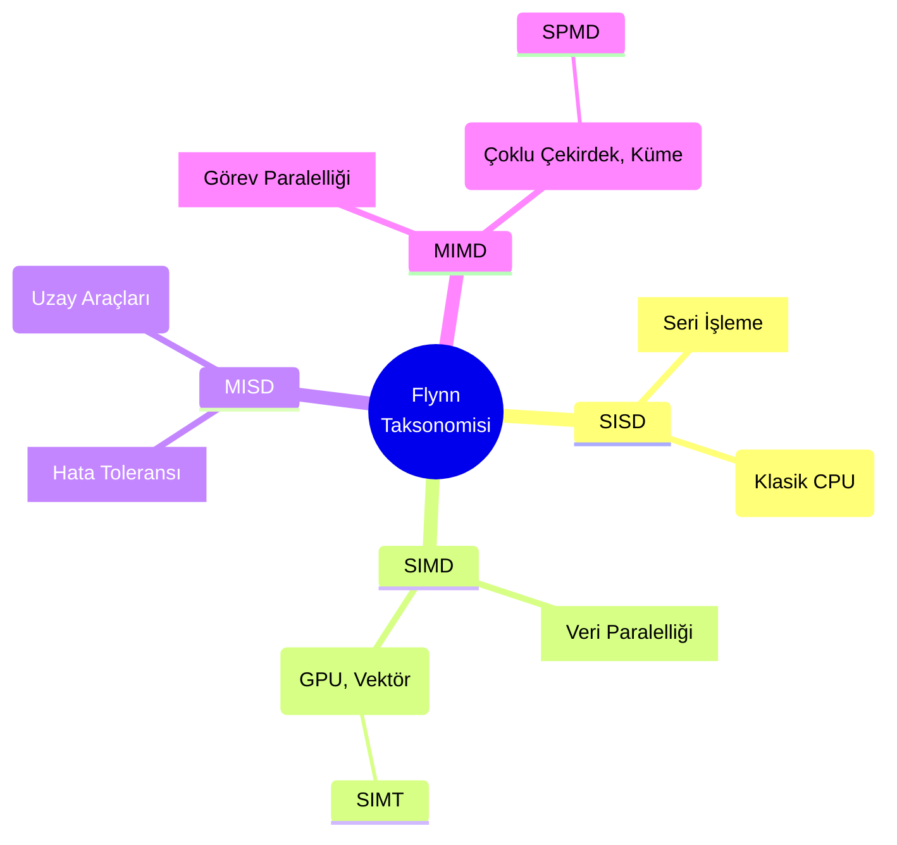

### 2.1 SISD (Single Instruction, Single Data)

Klasik von Neumann mimarisi: tek bir komut tek bir veri üzerinde çalışır — seri, tek çekirdekli sistemleri tanımlar.

Örnek: Sadece bir garsonun, sadece tek bir masanın siparişini alıp mutfağa götürmesidir. Her şey sırayla yapılır.

### 2.2 SIMD (Single Instruction, Multiple Data)

Tek bir kontrol birimi aynı komutu birden çok veri öğesine uygular. Döngü seviyesindeki veri paralelliği için idealdir.
Örnekler: GPU'lar, CPU vektör uzantıları (SSE, AVX). GPU hesaplamalarında bunun türevi olan **SIMT (Single Instruction, Multiple Threads)** mimarisi kullanılır.

Örnek: Bir garsonun kocaman bir tepsiyle 4 farklı müşteriye aynı anda kahve (aynı işlem) götürmesidir. Tek hareketle çok veri işlenmiş olur.

### 2.3 MIMD (Multiple Instruction, Multiple Data)

Birden çok bağımsız işlem birimi farklı komutları ve verileri aynı anda işler. Günümüz büyük paralel sistemlerinin çoğu MIMD'dir.
Alt türler: Paylaşımlı bellek (shared-memory) ve dağıtık bellek (distributed-memory) sistemleri. Pratikte çok sık olarak **SPMD (Single Program, Multiple Data)** modeliyle (ör. MPI) programlanır.

Örnek: Büyük bir peyzaj işinde (bahçecilik), bir bahçıvanın çim biçme makinesiyle çimleri biçmesi, diğerinin makasla ağaçları budaması, bir başkasının ise hortumla çiçekleri sulaması gibidir. Her biri farklı bir aletle (farklı komut), bahçenin farklı bir köşesinde (farklı veri) aynı anda ve bağımsız çalışır.

### 2.4 MISD (Multiple Instruction, Single Data)

Nadir kullanılan bir yapı; aynı veri üzerinde farklı komutların çalıştırıldığı, genellikle yüksek güvenilirlik/yedeklilik gerektiren sistemlerde rastlanır.

Örnek: Aşçının pişirdiği tek bir tabağın (tek veri), hem mutfak şefi hem de bir gurme tarafından aynı anda (farklı talimatlarla) tadılıp puanlanmasıdır. Çift kontrol mekanizmasıdır.

## Bölüm 3 — Paralel Hesaplamanın Temel Metrikleri ve Yasaları

Paralel program performansını değerlendirirken seri çözüme göre sağlanan kazanımı ölçeriz.

### 3.1 Hızlanma (Speedup) ve Verimlilik (Efficiency)

Hızlanma $S$ şu şekilde tanımlanır:

$$
S = \frac{T_{\mathrm{serial}}}{T_{\mathrm{parallel}}}
$$

İdeal durumda $p$ işlemci ile $S=p$ (lineer hızlanma) beklenir; ancak **overhead** (yükleme) bu hedefi engeller.

#### Overhead Nedir?

**Overhead**, paralel hesaplama sırasında asıl işten ziyade koordinasyon ve yönetim görevleri için harcanan gereksiz zamandır. Bu, paralelleştirmenin maliyetidir ve asıl problemi çözmek için doğrudan katkısı olmayan işlemlerdir.

- Yönetim yapması gereken bir aşçıbaşı, 10 aşçıyı koordine etmek (kimse ne yapacağını bilmediğinden), aralarında malzeme akışını sağlamak ve herkesin çalışmasını denetlemek için   harcadığı 2 saat, hiçbir yemeği hazırlamaz. O 2 saat tamamen **overhead**'dir.
- Beş bahçıvan çalışırken, bahçeyi bölümlere ayırma, araçları paylaştırma ve sonunda çalışmaları birleştirme planlaması yapılsa da, bu planlama zamanı bahçeyi biçmemektedir.
- Bir paketi 5 kargo görevlisine dağıtmak isteyebilirsiniz; ancak kimin nereye gideceğini söylemek için 30 dakika harcarsanız, bu 30 dakika paket taşınmamıştır.

Paralel hesaplamada overhead, **senkronizasyon** (tüm işçilerin bir noktada beklenmesi), **iletişim** (veri transferi), **yük dengeleme** (işi eşit dağıtma) ve **program/kontrol maliyeti** olarak geçer.

Örnek: Yüzlerce sayfalık ders notuna tek başına 10 saatte çalışan bir öğrencinin (Seri çalışma) yanına, kendi seviyesinde 4 arkadaşı eklenip notları aralarında paylaştıklarında sürenin 2 saate (Speedup=5) inmesini umarız. Ancak öğrenciler sayfaları kimin çalışacağını planlarken (senkronizasyon) ve çalışma sonunda birbirlerine özet geçerken (iletişim) yarım saat kaybettiklerinde (toplam süre 2.5 saat olur), bu kaybedilen süre **overhead**'dir. Hızlanma 4'te kalır ve verimlilik (Efficiency) %80'e düşer.

Verimlilik $E$ ise:

$$
E = \frac{S}{p} = \frac{T_{\mathrm{serial}}}{p\,T_{\mathrm{parallel}}}
$$

### 3.2 Amdahl Yasası (Amdahl's Law)

Amdahl yasası paralelleştirilemeyen bölümün (oranı $r$) maksimum hızlanmayı sınırladığını söyler.

Örnek: İki şehir arasında çok hızlı bir tren veya uçak (ulaşım araçları) işletmek istediğinizi düşünün. Sadece yolda (havada/raylarda) geçen süreyi hızlandırarak (ör. çok daha güçlü ve hızlı yeni bir taşıt alarak) yolculuğu en aza indirebilirsiniz. Ancak yolcuların terminale gelmesi, güvenlikten geçmesi ve peronlara yürüyerek taşıta binmesi için geçen toplam 1 saatlik süre (Seri kısım) hep aynı kalacaktır. Taşıtınızın hızı limitsiz (sonsuz paralel) bile olsa, o rota asla bu 1 saatlik boarding süresinin altına inemez. Amdahl yasası sisteminizin hızlanma sınırını işte bu seri kısmın belirlediğini söyler.

Genel formülü şu şekildedir ($p$ işlemci sayısı):

$$
S(p) = \frac{1}{r + \frac{1-r}{p}}
$$

Eğer programın $r$ kadarı seri ise, işlemci sayısı $p\to\infty$ olursa hızlanmanın üst sınırı:

$$
S_{\max} = \frac{1}{r}
$$

Örnek: Programın %90'ı paralelleştirilebiliyorsa ($r=0.1$), en fazla $1/0.1=10$ kat hızlanma elde edilir.

### 3.3 Gustafson–Barsis Yasası (Gustafson's Law)

Gustafson ve Barsis, problem boyutu işlemci sayısıyla birlikte artırıldığında (weak scaling) seri kısmın göreli etkisinin küçüldüğünü gösterdiler. Pratikte daha fazla çekirdek mevcutsa problem boyutu büyütülerek toplam hızlanma korunabilir veya artırılabilir.

Ölçeklenmiş hızlanma (scaled speedup) formülü:

$$
S(p) = p - r(p-1)
$$

Sonuç: Amdahl'ın kısıtlayıcı öngörüsü her zaman geçerli olmayabilir; ölçeklendirme stratejisi önemlidir.

## Yüksek Başarımlı Hesaplama (HPC) - Hafta 2 Ders Notları

### Bölüm 1 — İşlemci Mimarisi ve Bellek Hiyerarşisi

Modern işlemciler (CPU), komutları ve hesaplamaları ana bellekten (DRAM) veri getirme hızına kıyasla çok daha hızlı işleyebilir. İşlemci hızı ile bellek hızı arasındaki bu giderek açılan farka von Neumann darboğazı veya DRAM boşluğu (DRAM gap) adı verilir.

Bu performans darboğazını aşmak için bilgisayar mimarları, çok hızlı çalışan işlemci yazmaçları (register) ile görece yavaş olan ana bellek arasına önbellek (cache) adı verilen bir veya birden fazla seviyeden (L1, L2, L3) oluşan, düşük gecikmeli (latency) ve yüksek bant genişlikli (bandwidth) SRAM bellekler yerleştirmiştir.

#### 1.1 Yerellik Prensipleri (Locality of Reference)

Önbelleklerin verimli çalışması, yazılımların genel davranışı olan yerellik prensiplerine dayanır.

Örnek: İşlemciyi bir aşçı (CPU), tezgahı önbellek (Cache) ve kileri de ana bellek (RAM) olarak düşünün. Aşçı her baharat için kilere gitmek istemez.

- **Zamansal Yerellik:** Bir yemeğe tuz atıyorsanız, 5 dakika sonra başka bir yemeğe de tuz atma ihtimaliniz yüksektir. O yüzden tuzu tezgaha (önbelleğe) koyarsınız.
- **Uzamsal Yerellik:** Kilere tuz almaya gittiğinizde, hemen yanındaki karabiberi de tezgaha getirirsiniz; çünkü tuz kullanılan yerde genelde karabiber de kullanılıyordur.

- **Zamansal Yerellik (Temporal Locality):** Yakın zamanda erişilen veriye yakın gelecekte tekrar erişilme olasılığı yüksektir.
- **Uzamsal Yerellik (Spatial Locality):** Bir bellek adresine erişildiğinde, o adrese fiziksel olarak yakın adreslere de yakında erişilme olasılığı yüksektir.

Sistemler uzamsal yerellikten yararlanmak için verileri ana bellekten tek tek değil, önbellek satırları (cache line) adı verilen bitişik bloklar hâlinde (genellikle 64 byte) çeker.

#### 1.2 Önbellek Iskalamaları ve Üç C Kuralı

CPU'nun ihtiyaç duyduğu veri önbellekte bulunamazsa buna önbellek ıskalaması (cache miss) denir. Bu durumda CPU, veri ana bellekten gelene kadar duraklar (stall). Önbellek ıskalamalarının arkasında yatan sebepler donanım mimarisinde "Üç C Kuralı" ile tanımlanır (**Bkz. Şekil 2**). Bu grafikte ıskalamalarının yaygın karşılaşılan temel motivasyon dağılımları verilmiştir.

## Şekil 2: Önbellek Iskalamaları (Üç C Kuralı)

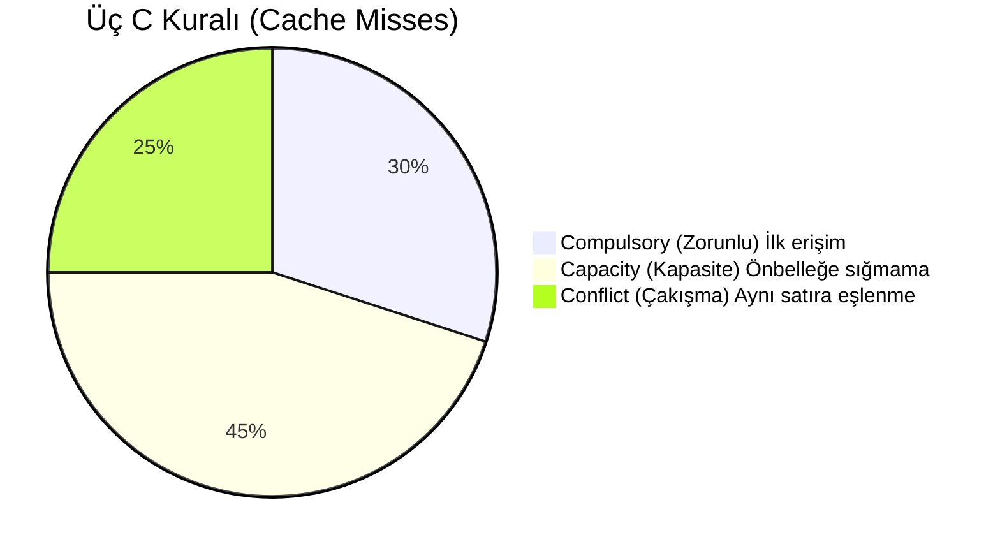

- Zorunlu (Compulsory) ıskalamalar: Veriye ilk erişimden kaynaklanır (cold cache).
- Kapasite (Capacity) ıskalamaları: Çalışma seti önbelleğe sığmadığı için oluşur.
- Çakışma (Conflict) ıskalamaları: Farklı veri bloklarının aynı satıra eşlenip birbirini atmasıyla (thrashing) oluşur.

### Bölüm 2 — Veri Odaklı Tasarım (Data-Oriented Design)

Nesne Yönelimli Programlama (OOP), kod organizasyonunu kolaylaştırsa da çoğu zaman işlemci ve bellek davranışını ikinci plana atar. Çok büyük nesne kümeleri üzerinde yoğun metod çağrıları; dallanma, çağrı zinciri maliyeti ve önbellek ıskalamaları nedeniyle performansı düşürebilir.

Veri Odaklı Tasarım, odağı kod yazma konforundan donanım düzeyinde performansa ve veri yerleşimine (data layout) kaydırır. Temel amaç, veriyi diziler hâlinde düzenleyip toplu ve sıralı işlemektir.

Örnek: AoS mantığında, mutfak için her personelin önüne bir 'set' menüyü (Havuç, Patates, Soğan paketi) eksiksiz koyarsınız. Ancak sadece patates soyması gereken aşçı, kullanmayacağı havuç ve soğanı da kucağında taşımak zorunda kalır. SoA ise endüstriyel mutfak gibidir: Bütün patatesler bir kapta, soğanlar başka bir kaptadır. Patates soyan aşçı, çuvaldan ardışık olarak sürekli patates (sıralı erişim) alır ve çok daha hızlı çalışır.

#### 2.1 AoS (Array of Structures)

AoS yaklaşımında bir varlığa ait alanlar (örneğin X, Y, Z koordinatları) tek bir yapı içinde tutulur ve bu bütün halindeki yapıların dizisi oluşturulur. **Şekil 3'te** görüldüğü gibi, her bir bloğun yan yana kendi bileşenlerini (X1, Y1, Z1) taşıdığı bu bellek serilimi geleneksel Nesne Yönelimli (OOP) kodların varsayılan durumudur.

## Şekil 3: AoS (Array of Structures) Bellek Yerleşimi

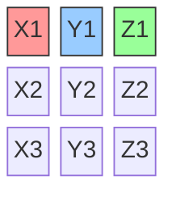

- Avantaj: Aynı varlığın tüm alanları birlikte kullanılıyorsa yerellik iyidir.
- Dezavantaj: Yalnızca tek bir alan işleniyorsa gereksiz veri taşınır; SIMD verimi düşebilir.

### 2.2 SoA (Structure of Arrays)

SoA yaklaşımında, Vektörel işlemciler (SIMD vb.) için uygun veri dizilimidir. Her bir alan kendi ayrı dizisinde tutulur. **Şekil 4'te**, bir varlığın tüm uzaysal alanlarını (Örneğin tüm X değerleri: X1, X2, X3) aynı bellek satırında ardışık saklayan SoA mimarisi sunulmaktadır. Bu yerleşim sayesinde önbellekten alınan bir "Satır" tamamıyla aynı tür ve işlem görecek verilere sahip olur.

## Şekil 4: SoA (Structure of Arrays) Bellek Yerleşimi

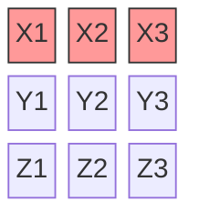

- Avantaj: Sıralı (unit-stride) erişim sayesinde önbellek ve SIMD kullanımı daha verimli olur.
- Dezavantaj: Çok sayıda alan aynı anda kullanıldığında bellek akışları artar ve yönetim zorlaşabilir.

Genel eğilim olarak, büyük veri akışlarının işlendiği yapılarda SoA sıklıkla daha iyi sonuç verir.

### 2.3 AoSoA (Array of Structures of Arrays)

AoSoA, AoS ve SoA'nın güçlü yönlerini birleştiren hibrit bir yerleşimdir. Veriler bloklara (tile) ayrılır; blok boyutu donanımın vektör uzunluğuna uygun seçilerek hem sıralı erişim hem de yönetilebilir akış sayısı hedeflenir.

### Bölüm 3 — Performans Limitleri ve Profil Analizi

Program performansını belirleyen temel sınırlar iki başlıkta toplanır:

- Hesaplama sınırı: İşlemcinin flop kapasitesi.
- Besleme sınırı: Bellek/ağ bant genişliği.

Değerlendirmede sık kullanılan iki metrik:

- Aritmetik Yoğunluk (Arithmetic Intensity): Bellek erişimi başına yapılan flop miktarı.
- Makine Dengesi (Machine Balance): Maksimum flop/s değerinin maksimum bant genişliğine oranı.

#### 3.1 Roofline Modeli

Roofline modeli, uygulamanın donanım sınırlarına ne kadar yakın olduğunu gösteren görsel bir modeldir. Bu model, tabir-i caizse "Hız yapmamıza motor mu izin vermiyor, yoksa yol mu dar?" sorusunun teknik karşılığıdır. **Şekil 5'te** yer alan Roofline çizelgesi, hesaplama (motor gücü) ile bellek (yol genişliği) kısıtlamalarını görselleştirir.

Örnek: Altınızda 300 km/s hız yapabilen bir yarış arabası (Güçlü İşlemci) olabilir. Ancak onu daracık topraklı, tek şeritli bir köy yolunda (Düşük Bellek Bant Genişliği) kullanmaya çalışırsanız, o arabanın gerçek potansiyeline asla ulaşamazsınız. Performansınızı sınırlayan şey motor değil, yoldur (Memory-bound).

## Şekil 5: Örnek Roofline Modeli

```mermaid
%%{init: {'themeVariables': { 'xyChart': {'plotColorPalette': '#e74c3c'} } } }%%
xychart-beta
    x-axis "Aritmetik Yoğunluk (Flop/Byte)" log
    y-axis "Performans (GFlops/s)" log
    line([
        {"x": 0.1, "y": 1},
        {"x": 1, "y": 10},
        {"x": 10, "y": 100},
        {"x": 100, "y": 1000},
        {"x": 1000, "y": 1000}
    ])
```

- Dikey eksen: Performans (flop/s).
- Yatay eksen: Aritmetik yoğunluk (flop/byte).

Yatay çatı çizgisi teorik tepe hesaplama sınırını (peak flops), eğimli çizgi ise bellek bant genişliği sınırını gösterir. Uygulama yatay sınıra yakınsa compute-bound, eğimli sınıra yakınsa memory-bound davranır.

### 3.2 STREAM Benchmark

STREAM Benchmark, sistemin pratik bellek bant genişliğini ölçmek için yaygın kullanılan bir testtir. Genellikle uzun vektörler üzerinde şu çekirdek işlemleri içerir:

- **COPY:** $A(i) = B(i)$ — B dizisinin elemanlarını A dizisine kopyalama işlemi.
- **SCALE:** $A(i) = s \cdot B(i)$ — B dizisinin her elemanını skaler $s$ değeriyle çarpma.
- **ADD:** $A(i) = B(i) + C(i)$ — B ve C dizilerinin karşılık gelen elemanlarını toplayıp A'ya yazma.
- **TRIAD:** $A(i) = B(i) + s \cdot C(i)$ — C'nin elemanlarını $s$ ile çarpıp B ile toplayıp A'ya yazma (en gerçekçi iş yükü).

Bu dört işlem, bellek bant genişliğinin ne kadar verimli kullanıldığını test eder; çünkü hesaplama minimal iken bellek erişimi ön plandadır.

Bu ölçümler, streaming erişimlerde belleğin ulaşabildiği GB/s seviyesini verir. Eğer uygulama bant genişliği verimi STREAM sonucunun belirgin şekilde altında kalıyorsa, olası nedenler önbellek çakışmaları ve yüksek ıskalama oranlarıdır.

## Bölüm 4 — İşlemci Mimarisi, Bellek Hiyerarşisi ve Veri Odaklı Tasarım Notları

Bu ders notları, modern bilgisayar mimarilerindeki paralel işlem kapasitesini, bellek sistemlerinin performans üzerindeki belirleyici rolünü ve paralel algoritmaların tasarım prensiplerini akademik bir titizlikle ele almaktadır. Notlar, Grama ve ark. (2003) tarafından sunulan kuramsal ve pratik temeller üzerine inşa edilmiştir.

### 4.1 Giriş: Modern İşlemci Gelişimi ve Paralelliğin Gerekliliği

Mikroişlemci teknolojisi, Moore Yasası olarak bilinen ve devre karmaşıklığının yaklaşık her 18 ayda bir ikiye katlanacağını öngören ampirik gözlem doğrultusunda devasa bir gelişim göstermiştir. Tarihsel süreçte, 1988'de 40 MHz (MIPS R3000) olan saat hızları, 2002'de 2.0 GHz (Pentium 4) seviyelerine ulaşarak yaklaşık 50 kat artmıştır. Ancak bu gelişim süreci, sistem performansını etkileyen kritik darboğazları da beraberinde getirmiştir.

- **Hesaplama Gücü (FLOPS):** Transistör sayısındaki artış, işlemcilerin saniyede yapabildiği kayan nokta operasyonu sayısını (FLOPS) dramatik şekilde artırmıştır.
- **İşlemci-Bellek Uçurumu:** İşlemci saat hızları yıllık %40 oranında iyileşirken, DRAM erişim süreleri (latency) yalnızca %10 oranında iyileşebilmiştir. Bu asimetri, işlemcinin veri beklerken atıl kalmasına neden olan "bellek duvarı" (memory wall) sorununu doğurmuştur.
- **Veri İletişimi:** Modern sistemlerde performans, sadece verinin ne kadar hızlı işlendiğiyle değil, bellek hiyerarşisi içindeki iletişim maliyetleriyle sınırlıdır.

### 4.2 Mikroişlemci Mimarilerinde Örtük Paralellik (Implicit Parallelism)

Gençler, kodumuzu özel olarak paralelleştirmek için uğraşmasak bile modern donanım ve derleyiciler arka planda işleri hızlandırmak için çeşitli taktikler kullanır. Yazılımcının müdahalesi olmadan donanım ve derleyici (compiler) seviyesinde sağlanan bu yapıya **Örtük Paralellik (Implicit Parallelism)** diyoruz.

#### 4.2.1 Boru Hattı (Pipelining) ve Süper-skaler Yürütme

Bir mikroişlemcinin komutları nasıl işlediğini anlamak için bir otomobil fabrikasındaki montaj hattını düşünelim. Tek bir işçinin bir arabayı baştan sona tek başına üretmesi yerine, işi aşamalara böleriz. Buna donanım mimarisinde **Boru Hattı (Pipelining)** diyoruz. İngilizce *pipe* (boru) kelimesinden türeyen bu terim, verinin bir borudan sürekli akması gibi komutların da işlemciden kesintisiz akmasını ifade eder.

Bir komutun işlenmesi temelde dört aşamadan oluşur:
1. **Fetch (Getirme):** Komutun bellekten alınması.
2. **Decode (Çözme):** Komutun ne anlama geldiğinin çözümlenmesi (Latince *de-* ayrılma ve *codex* şifre kelimelerinden türemiştir, şifreyi/kodu çözmek anlamına gelir).
3. **Execute (Yürütme):** Matematiksel veya mantıksal işlemin yapılması.
4. **Write-back (Geri Yazma):** Sonucun bellek veya yazmaçlara (registers) kaydedilmesi.

Bu aşamaların üst üste bindirildiği yapı aşağıda gösterilmektedir:

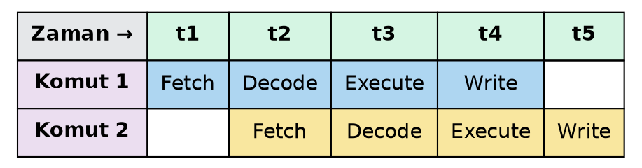

Dikkat ederseniz, komutların tamamlanma süresi kısalmaz; ancak aşamalar üst üste bindiği için birim zamanda tamamlanan komut sayısı (throughput) artırılır. Süper-skaler işlemciler ise, aynı anda birden fazla komutu işleme alabilen birden fazla boru hattına sahiptir. Ancak bu mimaride üç temel bağımlılık (dependency) türü performansı sınırlar:

1. **Gerçek Veri Bağımlılığı (True Data Dependency):** Bir komutun sonucu, bir sonraki komutun girdisi olduğunda ortaya çıkar.
2. **Kaynak Bağımlılığı (Resource Dependency):** İki komutun aynı anda aynı donanım birimine (örn. tek bir kayan nokta ünitesi) erişmek istemesidir.
3. **Yordamsal Bağımlılık (Procedural Dependency):** Dallanma (branch) komutları nedeniyle bir sonraki komutun adresinin belirsiz olmasıdır. Bu durum, yanlış dallanma tahmini yapıldığında boru hattının boşaltılmasına (pipeline flush) ve ciddi performans kaybına yol açar.

#### 4.2.2 VLIW (Çok Uzun Komut Kelimesi) İşlemciler

VLIW mimarisi, süper-skaler mimarinin karmaşık bağımlılık analiz donanımını ortadan kaldırarak bu yükü derleyiciye aktarır. Bağımsız komutlar derleme zamanında tek bir uzun kelime içinde paketlenir.

| Özellik | Süper-skaler Mimari | VLIW Mimari (IA64 vb.) |
| :--- | :--- | :--- |
| **Zamanlama Kararı** | Çalışma zamanı (Donanım) | Derleme zamanı (Yazılım) |
| **Bağımlılık Analizi** | Karmaşık donanım mantığı | Derleyici optimizasyonu |
| **Donanım Karmaşıklığı** | Yüksek | Düşük |
| **Verimlilik Kaybı** | Dinamik stall'lar | Yatay ve Dikey Atık (Waste) |

VLIW sistemlerde, bir çevrimde bazı işlem birimlerinin boş kalması yatay atık (horizontal waste), hiçbir komut paketinin gönderilememesi ise dikey atık (vertical waste) olarak tanımlanır (Şekil 2.1c).

Gençler, işlemciler yıllar içinde muazzam hızlandı; ancak ana belleğin (RAM) veriyi aynı hızda ulaştıramaması, bilgisayar mimarisinde meşhur "von Neumann darboğazı" (von Neumann bottleneck) dediğimiz sorunu yarattı. Modern sistemler bu darboğazı aşmak için katmanlı bir bellek hiyerarşisi inşa ederler.

### 4.3 Bellek Sistemi Performansı ve Sınırlamalar

Donanım verimliliğini konuşurken, performansın sınırlarını çizen iki temel kavramı çok iyi ayırt etmemiz gerekir.

#### 4.3.1 Gecikme (Latency) vs. Bant Genişliği (Bandwidth)

Grama ve ark. (2003), bu ayrımı zihnimizde canlandırmak için oldukça etkili bir "itfaiye hortumu" analojisi kullanır:

- **Gecikme (Latency):** Vanayı açtığınız an ile suyun hortumun diğer ucundan dışarı çıkması arasında geçen süredir. Bilgisayarda bu, işlemcinin bellekten veri istediği an ile verinin işlemciye ulaştığı an arasındaki süredir (genellikle nanosaniye cinsinden ölçülür).
- **Bant Genişliği (Bandwidth):** Su akmaya başladıktan sonra, saniyede kaç litre su aktığıdır. Sistemlerimizde ise birim zamanda aktarılabilen veri miktarıdır (örneğin Gigabayt/saniye - GB/s). 

#### 4.3.2 Önbellek (Cache) Dinamikleri ve Yerellik İlkesi

İşlemci bir veriye ihtiyaç duyduğunda doğrudan çok daha yavaş olan ana belleğe gitmez. Önce hemen yanı başındaki çok hızlı hafızaya bakar. Bu hafızaya **Önbellek** diyoruz. İngilizce terim olan *Cache*, Fransızca "saklamak, gizlemek" anlamına gelen *cacher* fiilinden türemiştir; işlemcinin hemen yanına gizlenmiş küçük ama çok hızlı bir depo anlamı taşır.

Aradığı veri bu depoda mevcutsa buna **Önbellek İsabeti (Cache Hit)** deriz ve veri anında yürütme birimine iletilir. Eğer veri orada yoksa, bu duruma **Önbellek Iskalaması (Cache Miss)** denir. İşlemci bu durumda mecburen uzun yolu seçip ana belleğe (RAM) gitmek zorundadır, ki bu da işlemci için çok ciddi bir boşta bekleme (zaman kaybı) yaratır.

Bu karar mekanizmasını ve veri akışını aşağıdaki şemada görebilirsiniz:

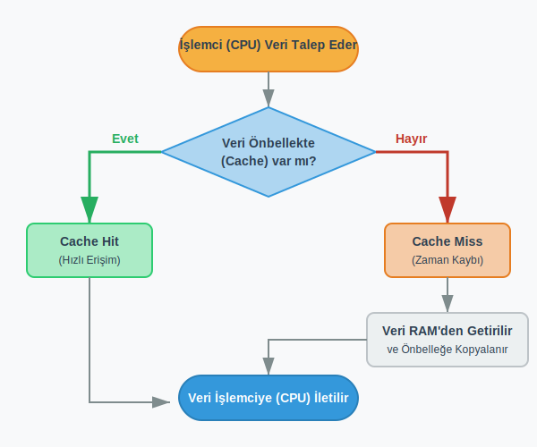

Önbellek performansının yüksek olması donanımsal bir sihir veya rastlantı değildir; yazılımlarımızın genel bir karakteristiği olan **Yerellik İlkesi (Locality of Reference)** üzerine kuruludur. İki tür yerellikten söz ederiz:

- **Zamansal Yerellik (Temporal Locality):** Bir veri öğesine az önce erişildiyse, yakın gelecekte tekrar erişilme olasılığı çok yüksektir. Döngü sayaçları (örneğin `for` döngüsündeki `i` değişkeni) bunun en klasik örneğidir.
- **Mekansal Yerellik (Spatial Locality):** Erişilen bir verinin bellekte bitişiğindeki verilere erişilme olasılığının yüksek olmasıdır. Dizinin (array) bir elemanını `dizi[i]` okuduğumuzda, birazdan muhtemelen `dizi[i+1]`'i de okuyacağımız donanım tarafından varsayılır. Bu yüzden bellekten veriler tek tek değil, her zaman bir blok (cache line) halinde getirilir.

> **Örnek 2.3 (Matris Çarpımı Analizi):** > 1 GHz (saniyede 1 milyar çevrim) hızında çalışan bir işlemcide ve 100 ns (nanosaniye) DRAM gecikmesi olan bir sistemde $32 \times 32$ boyutlarında iki matrisin çarpımını inceleyelim:
> 
> - A ve B matrislerindeki toplam 2K (yaklaşık 2000) kelimenin bellekten önbelleğe getirilmesi yaklaşık $200~\mu s$ (mikrosaniye) sürer.
> - Bu verilerle yapılacak 64K operasyonun (işlemcinin çevrim başına 4 komut işleyebildiği varsayımıyla) icrası sadece $16~\mu s$ sürer.
> - **Toplanan Süre:** $216~\mu s$. Ortaya çıkan performans yaklaşık 303 MFLOPS seviyesindedir.
> - **Önbellek Olmasaydı (No-Cache):** Her bir veri erişiminde işlemci 100 çevrim boyunca ana belleği bekleyeceği için, aynı işlemcinin performansı 10 MFLOPS seviyesine kadar çakılacaktı. Bu analiz, önbelleğin varlığının performansı nasıl 30 kat artırdığını açıkça kanıtlar.


### 4.4 Veri Odaklı Tasarım: Veri Erişim Desenleri ve Optimizasyon

İşlemciler bellekten veriyi tek tek baytlar halinde değil, önbellek satırları (cache line) dediğimiz bloklar halinde çeker. Bu nedenle veriye ardışık olarak erişmek daima en verimli yöntemdir.

#### 4.4.1 Adımlı Erişim (Strided Access) Problemi

C ve C++ gibi dillerde iki boyutlu matrisler bellekte satır satır (Row-Major Order) dizilir. Eğer siz yazılımınızda bir matrisi okurken iç içe döngülerde satır yerine sütun bazlı (Column-Major) ilerlemeye çalışırsanız, bellekte ardışık olmayan, atlamalı (strided) adreslere gitmiş olursunuz. 

Bu durumu, devasa bir ansiklopediden bir bilgi ararken her seferinde kütüphaneye gidip raftan koca bir cilt alıp masanıza getirdiğinizi, içinden sadece tek bir kelime okuyup cildi geri götürdüğünüzü düşünerek somutlaştırabilirsiniz. Getirdiğiniz sayfadaki diğer kelimeleri (yanındaki verileri) okumadığınız için mekansal yerelliği (spatial locality) yok edersiniz.

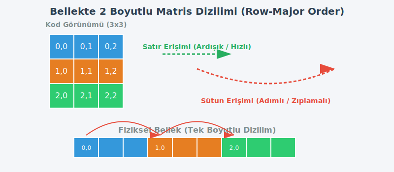

```c
// Kötü Mekansal Yerellik (Sütun Öncelikli Erişim / Column-Major Access)
for (int i = 0; i < 1000; i++) {
    for (int j = 0; j < 1000; j++) {
        // 'j' iç döngüde hızla artarken, bellekte matrisin sütunları boyunca zıplıyoruz.
        // Her erişimde mecburen yeni bir cache line bellekten yüklenir.
        column_sum[i] += b[j][i]; 
    }
}
```

#### 4.4.2 Döngü Döşeme (Loop Tiling / Blocking)

İşlediğimiz matrisler veya veri setleri çok büyük olduğunda, verinin tamamını işlemcinin önbelleğinde (cache) tutmamız imkansızlaşır. Bu sorunu çözmek için veriyi küçük bloklara (fayans veya karo anlamına gelen "tile"lara) böleriz. Tiling tekniği, büyük veri setlerini önbelleğe tam olarak sığacak alt matrislere ayırarak bellek bant genişliği (bandwidth) gereksinimini minimize eder. Kütüphaneden alabildiğimiz kadar kitabı masamıza yığıp, o kitaplarla yapılabilecek tüm işi bitirmeden yenilerini almamak gibidir.

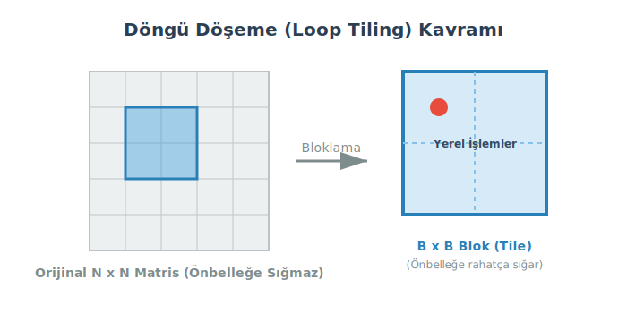

```c
// Tiling (Bloklama) Mantığı
// N boyutlu matrisi, önbelleğe sığacak B boyutlu bloklara (tile) bölüyoruz
for (int ii = 0; ii < n; ii += B) {
    for (int jj = 0; jj < n; jj += B) {
        // Alt blok (tile) içindeki işlemler
        for (int i = ii; i < min(ii + B, n); i++) {
            for (int j = jj; j < min(jj + B, n); j++) {
                // Veri bir kez cache'e alındıktan sonra blok bitene kadar orada kalır
                c[i][j] += a[i][k] * b[k][j]; 
            }
        }
    }
}
```

#### 4.4.3 AoS vs. SoA (Bellek Dizilim Stratejileri)

Programlama yaparken nesnelerimizi bellekte iki farklı yaklaşımla tutabiliriz:

- **AoS (Array of Structures - Yapı Dizileri):** Verinin nesne tabanlı dizilimidir. Örneğin parçacık fiziği simülasyonunda her parçacığın x, y, z koordinatları paket halinde tutulur: `[x1, y1, z1, x2, y2, z2]`. Nesne yönelimli programlama doğasına çok uygundur.
- **SoA (Structure of Arrays - Dizi Yapıları):** Verinin öznitelik tabanlı dizilimidir. Tüm parçacıkların x'leri bir arada, y'leri bir arada tutulur: `[x1, x2, x3], [y1, y2, y3]`.

**Teknik Not:** Bilimsel hesaplamalarda ve yüksek performanslı yazılımlarda çoğunlukla SoA tercih edilir. Çünkü SIMD (Single Instruction, Multiple Data - Tek Komut, Çoklu Veri) işlemci birimleri, hesaplama yaparken aynı özniteliği (örneğin sadece x koordinatlarını) birden fazla parçacık için bitişik bellekten tek bir saat vuruşunda, blok halinde (contiguous loading) çekmek ister. AoS düzeninde x'lerin arasında y ve z'ler olduğu için SIMD birimleri tam kapasiteyle çalışamaz.

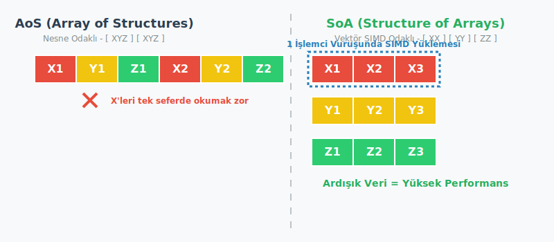

### 4.5 Bellek Gecikmesini Gizleme Teknikleri

Veriyi ne kadar iyi dizerseniz dizin, işlemciniz bazen mecburen ana bellekten veri gelmesini bekleyecektir. İşlemcinin bu bekleme süresinde boş durmasını (stall) önlemek için gecikmeyi gizleme (latency hiding) mekanizmaları kullanırız.

#### 4.5.1 Çoklu İş Parçacığı (Multithreading)

Bir iş parçacığı (thread) bellekten veri talep edip beklemeye geçtiğinde, donanım derhal beklemeyen diğer bir iş parçacığını işlemci çekirdeğine alır ve çalıştırmaya başlar. Buna bağlam değişimi (context switch) deriz. Yürütme birimleri sürekli dolu tutularak fiziksel gecikme zamanı maskelenmiş olur.

#### 4.5.2 Önceden Getirme (Prefetching)

Latince *prae* (öncesi) kökünden gelir. Verinin, işlemci tam olarak ona ihtiyaç duymadan biraz önce donanım veya derleyici tarafından sezilerek önbelleğe arka planda getirilmesidir. Tıpkı siz bir makaleyi okurken, asistanınızın birazdan geçeceğiniz diğer sayfayı önünüze hazır etmesi gibidir. 

Ancak prefetching çift ağızlı bir kılıçtır. Eğer yazılım veya donanım hangi veriye ihtiyaç duyacağınızı yanlış tahmin ederse veya bunu aşırı yaparsa, bellek bant genişliğini hiç kullanılmayacak verilerle doldurarak sistemi daha da yavaşlatabilir.

> **Vurgu Kutusu: Bant Genişliği ve Trade-off (Dengeleme)**
> 
> Multithreading mekanizması işlemcinin boş durmasını engelleyip gecikmeyi gizlese de, sistemden talep edilen toplam bant genişliğini dramatik şekilde artırır. 
> 
> Tek bir iş parçacığı çalışırken, önbelleği rahatça kullanır (örneğin %90 önbellek isabet - hit rate - oranıyla) ve ana bellekten saniyede 400 MB veri çekmesi yetebilir. Ancak aynı çekirdekte 32 iş parçacığını birden çalıştırdığınızda, hepsi kısıtlı önbellek alanını paylaşmak zorunda kalır. Her birinin önbellek payı daralacağından isabet oranı örneğin %25'lere düşer. Bu durum, sürekli ana belleğe başvuru yapılmasına sebep olur (cache thrashing) ve sistemin toplam bant genişliği ihtiyacı aniden 3 GB/s seviyelerine fırlayabilir. Gecikmeyi gizlerken darboğazı bant genişliğine kaydırmamaya dikkat edilmelidir.

### 4.6 Performans Limitleri ve Analiz Modelleri

Bir işlemci tek başına ne kadar hızlı olursa olsun, veriye ulaşamadığı sürece beklemek zorundadır. İşlemci ile ana bellek arasındaki bu veri getirme süresine **gecikme** (latency) diyoruz.

**STREAM Benchmark Analizi (Örnek 2.4):** Bir vektör nokta çarpımı (dot-product) işlemini ele alalım. Sistemimizde belleğe erişim gecikmesinin $100 \text{ ns}$ (nanosaniye) olduğunu varsayalım.

- **Blok boyutu 1 kelime ise:** İşlemci belleğe gider, sadece 1 kelimelik veri alır ve bunun için $100 \text{ ns}$ harcar. Bu durumda işlemcimiz saniyede sadece 10 milyon işlem yapabilir, yani performansı 10 MFLOPS (Million Floating-Point Operations Per Second - Saniyede Milyon Kayan Noktalı İşlem) seviyesinde kalır. Bunu kütüphaneden her seferinde tek bir sayfa okuyup masanıza geri dönmek gibi düşünebilirsiniz. Oldukça verimsizdir.

- **Blok boyutu 4 kelime (cache line) ise:** Bellekten veriler tek tek değil, arka arkaya sıralanmış "bloklar" halinde çekilir. $100 \text{ ns}$ gecikme ile 4 kelime birden getirildiğinde, işlemci ilk veriyi beklerken zaman kaybeder ancak sonraki 3 işlem için gerekli veri zaten elinin altındadır (önbellektedir). İlk gecikme, sonraki 4 operasyona dağıtılmış, yani amortize edilmiştir. Bu duruma **Mekansal Yerellik** (Spatial Locality) denir. Aynı kütüphane örneğinde olduğu gibi, bir sayfa için gitmişken tüm kitabı masanıza alırsınız. Bu sayede performansımız 40 MFLOPS seviyesine çıkar.

### 4.7 Paralel Platformlar ve Kontrol Yapıları

Veriyi hızlı getirmeyi çözdükten sonra, işlemcilerin bu veriyi nasıl işleyeceğini organize etmemiz gerekir. Bilgisayar bilimlerinde mimariler, komut (instruction) ve veri (data) akışlarına göre sınıflandırılır.

- **SIMD (Single Instruction, Multiple Data - Tek Komut, Çoklu Veri):** Tek bir komut yayınlanır ve birden fazla işlem birimi bu komutu kendi verisi üzerinde aynı anda uygular. Vektör işlemciler ve günümüz grafik kartları (GPU - Graphics Processing Unit) bu mantıkla çalışır.
  > **Maskeleme (Masking) Durumu (Örnek 2.11):** SIMD mimarisinde her birim aynı emri uygulamak zorunda olduğu için, kodun içinde bir `if-else` koşulu varsa performans ciddi şekilde düşer. `if` şartını sağlayan işlemciler çalışırken, `else` şartına uyan işlemciler hiçbir şey yapmadan beklemek (maskelenmek) zorundadır. Komutlar ayrıştığı an sistemin bir kısmı atıl kalır.

- **MIMD (Multiple Instruction, Multiple Data - Çoklu Komut, Çoklu Veri):** Her işlemcinin bağımsız bir beyni vardır. Kendi programlarını kendi veri akışları üzerinden birbirinden tamamen bağımsız olarak yürütebilirler. Günümüzdeki çok çekirdekli standart işlemciler (CPU - Central Processing Unit) bu yapıdadır.

**Paylaşılan Adres Uzayı (Shared Address Space) Modelleri:**

İşlemciler belleği ortak kullanıyorsa, bu belleğe fiziksel olarak nasıl eriştikleri performansı doğrudan etkiler.

- **UMA (Uniform Memory Access - Eşbiçimli Bellek Erişimi):** Latince *unus* (tek/bir) ve *forma* (biçim) kelimelerinden gelir. Sistemdeki tüm işlemcilerin, belleğin herhangi bir noktasına erişim süresi tamamen aynıdır.
- **NUMA (Non-Uniform Memory Access - Eşbiçimsiz Bellek Erişimi):** İşlemci sayısının çok arttığı sistemlerde belleği tek bir merkeze koymak darboğaz yaratır. Bu yüzden bellek, işlemcilere (veya işlemci düğümlerine) paylaştırılır. Kendi masanızdaki (yerel) bellekten veri okumak çok hızlıyken, ağ üzerinden yan odadaki (uzak) işlemcinin belleğinden veri okumak yavaştır.

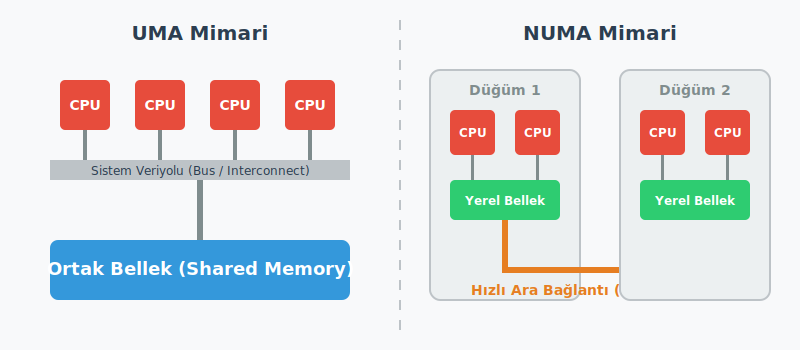

### 4.8 Algoritma Tasarım Prensipleri ve Görev Bağımlılıkları

Kod yazarken her şeyi aynı anda çalıştıramayız. Bazı görevler diğerlerinin ürettiği veriye ihtiyaç duyar. Problemi daha küçük alt görevlere böldüğümüzde, bu görevler arasındaki zorunlu sırayı **Görev Bağımlılık Grafiği** (DAG - Directed Acyclic Graph, Yönlü Döngüsüz Grafik) ile gösteririz.

#### 4.8.1 Temel Formülasyonlar

Grama ve ark. (2003) metodolojisine göre, yazdığımız bir paralel kodun ne kadar iyi ölçeklenebileceğini şu temel metriklerle ölçeriz:

- **Toplam İş (W - Work):** Eğer bu programı tek bir işlemcide çalıştırsaydık ne kadar süre alırdı? Tüm görevlerin harcadığı zamanın veya işlem yükünün toplamıdır.
- **Kritik Yol Uzunluğu (L - Critical Path):** Grafikteki başlangıçtan bitişe giden en uzun, birbirine bağımlı görevler zinciridir. Sisteme sonsuz sayıda işlemci bile koysanız, programınızın bitme süresi kritik yolun altına inemez. İnşaat yaparken, temel atılmadan duvar çıkılamaz, duvar çıkılmadan çatı yapılamaz. Bu ardışık sıralama sizin kritik yolunuzdur.
- **Ortalama Paralellik Derecesi (Average Concurrency):** Latince *concurrere* (birlikte koşmak) kökünden gelir. Sistemde aynı anda ortalama kaç görevin aktif olarak yürütüldüğünü gösterir.
  $$\text{Avg Concurrency} = \frac{W}{L}$$

#### 4.8.2 Veritabanı Sorgu İşleme Analizi

Büyük bir veritabanı sorgusunu (örneğin birden fazla tablonun birleştirilmesi işlemi) iki farklı algoritmik stratejiyle böldüğümüzü varsayalım. Bu stratejilerin ağaç yapıları performansı nasıl etkiler inceleyelim.

**1. Strateji (a): Dengeli Dağılım**

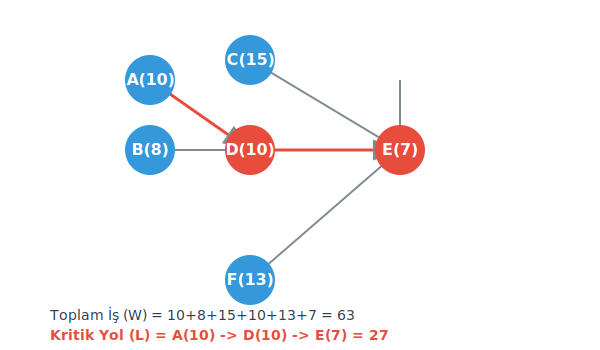

- Toplam İş (W): Çizgedeki tüm birimlerin toplamı, $10 + 8 + 15 + 13 + 10 + 7 = \mathbf{63 \text{ birim}}$.
- Kritik Yol (L): En uzun bağımlılık zinciri ($A \rightarrow D \rightarrow E$), $10 + 10 + 7 = \mathbf{27 \text{ birim}}$.
- Ortalama Paralellik: $63 / 27 \approx \mathbf{2.33}$

**2. Strateji (b): Ardışık (Dengesiz) Dağılım**

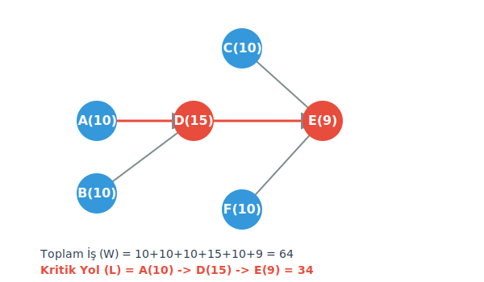

- Toplam İş (W): $10 + 10 + 10 + 10 + 15 + 9 = \mathbf{64 \text{ birim}}$.
- Kritik Yol (L): En uzun bağımlılık zinciri ($A \rightarrow D \rightarrow E$), $10 + 15 + 9 = \mathbf{34 \text{ birim}}$.
- Ortalama Paralellik: $64 / 34 \approx \mathbf{1.88}$

**Akademik Sonuç:** Her iki stratejide de bilgisayarın yapması gereken toplam iş miktarı neredeyse aynıdır (63'e 64). Ancak Strateji (a), daha kısa bir kritik yola (27) ve doğal olarak daha yüksek bir ortalama paralellik derecesine (2.33) sahiptir. Algoritma tasarımında temel hedefimiz sadece işi küçük parçalara bölmek değil, bu parçalar arasındaki bağımlılığı (kritik yolu) minimize ederek donanımdaki işlemci kaynaklarını aynı anda, en yüksek verimle çalıştırabilmektir.

## Bölüm 5 — Paylaşımlı Bellek Programlama ve OpenMP Temelleri

Gençler, bilgisayar bilimlerinde hesaplama gerektiren büyük bir işi kısa sürede bitirmenin temel kuralı, o işi parçalara bölüp eldeki işlemcilere dağıtmaktır. Bu kavramı zihnimizde somutlaştırmak için büyük bir restoran mutfağını düşünelim. Her bir mutfak, kendine ait dolapları, ocağı ve tezgahı olan kapalı bir kutudur. Bilgisayar sistemlerinde bu mutfakların her birine süreç (Process) diyoruz. Farklı mutfaklardaki (süreçlerdeki) aşçılar birbirlerinin malzemelerini doğrudan kullanamazlar. 

Ancak aynı mutfağın içindeki aşçıları düşünürsek, durum değişir. Bu aşçılar aynı tezgahı, aynı buzdolabını ve aynı malzemeleri ortaklaşa kullanırlar; sadece her birinin elinde o an üzerinde çalıştığı işin kendi tarifi veya kendi bıçağı vardır. İşte aynı süreç (Process) içinde, ortak bellek alanını (heap memory) paylaşan ancak kendi yürütme sırasına ve kendi özel çağrı yığınına (stack) sahip olan bu hafif sıklet alt birimlere **İş Parçacığı (Thread)** diyoruz. İngilizcede "iplik" veya "sicim" anlamına gelen bu kelime, program içindeki bağımsız yürütme ipliklerini ifade eder. Paylaşımlı bellek (Shared-Memory) programlamanın temeli, bu iş parçacıklarının ortak bir hafıza üzerinde uyum içinde çalışmasını sağlamaktır.

### 5.1 Açık Çoklu İşleme: OpenMP ve Pragma Mantığı

Paylaşımlı bellek mimarilerinde iş parçacıklarını yönetmek için kullanılan en yaygın standartlardan biri **OpenMP (Open Multi-Processing - Açık Çoklu İşleme)**'dir. OpenMP, C, C++ ve Fortran gibi dillerde yazılmış programlara sonradan eklenerek, derleyiciye (compiler) kodun hangi kısımlarının paralel çalıştırılacağını söyleyen bir Uygulama Programlama Arayüzü (API - Application Programming Interface) sunar.

OpenMP kullanırken doğrudan karmaşık iş parçacığı oluşturma (thread creation) fonksiyonları yazmak yerine, **Pragma** adı verilen yapıları kullanırız. Pragma, Yunanca "eylem, iş, kural" anlamına gelen *pragma* kelimesinden gelir (günlük dildeki *pragmatik* kelimesi de buradan türemiştir). Programlamada pragma, derleyiciye verilen özel bir talimat veya kuraldır. C ve C++ dillerinde bu komutlar her zaman `#pragma omp` ifadesiyle başlar. Derleyici OpenMP'yi desteklemiyorsa bu satırları sadece bir yorum satırı olarak görüp görmezden gelir, böylece kodunuz tek işlemcili (seri) sistemlerde de hatasız çalışmaya devam eder.


### 5.2 Fork-Join (Dallanma-Birleşme) Modeli

OpenMP, iş parçacıklarını yönetmek için **Fork-Join** (Dallanma-Birleşme) adı verilen güçlü ve sezgisel bir model kullanır. Bu model, programın seri ve paralel bölümleri arasındaki geçişi açıkça tanımlar.

Aşağıdaki interaktif şema, tek bir ana iş parçacığının nasıl çoğaldığını, paralel bir görevi nasıl yerine getirdiğini ve ardından tekrar tek bir izlek halinde nasıl birleştiğini görselleştirmektedir.

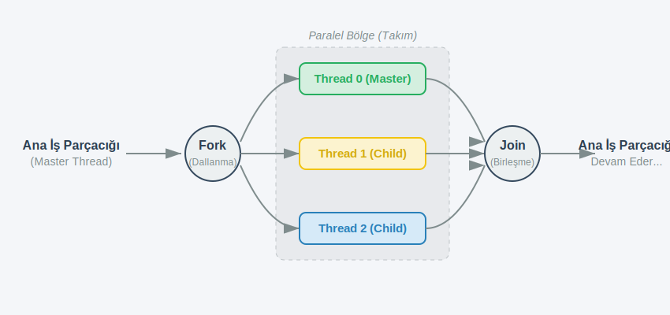


Ana iş parçacığı tarafından oluşturulan bu yeni iş parçacığı kümesine "takım" (team) adı verilir. Takımdaki her bir çocuk (child) iş parçacığı, belirtilen kod bloğunu aynı anda çalıştırır. Blok bittiğinde ise tüm iş parçacıkları görünmez bir bariyerde (implicit barrier) birbirini bekler, birleşir (Join) ve sadece ana iş parçacığı kodu sırayla yürütmeye devam eder.

#### Modelin Çalışma Mantığı

1.  **Seri Başlangıç:** Program çalışmaya başladığında, sadece tek bir ana iş parçacığı (**Master Thread**) aktiftir. Bu iş parçacığı, kodu sırayla yürütür.
2.  **Dallanma (Fork):** Ana iş parçacığı, paralelleştirilmesi gereken bir kod bloğuna (`#pragma omp parallel`) ulaştığında, kendini çoğaltır. Bu işleme **Dallanma (Fork)** adı verilir.
3.  **Paralel Bölge ve Takım:** Dallanma sonucunda oluşan bu yeni iş parçacığı kümesine "**takım**" (team) adı verilir. Takımdaki her bir iş parçacığı (**Thread 0 (Master), Thread 1 (Child), ...**) belirtilen paralel kod bloğunu aynı anda, ancak kendi veri kümeleri üzerinde çalıştırır. Şemada bu bölge açıkça vurgulanmıştır.
4.  **Birleşme (Join) ve Bariyer:** Paralel kod bloğu sona erdiğinde, tüm iş parçacıkları bir **Örtük Bariyerde** (implicit barrier) birbirini bekler. Tüm takım işini bitirmeden birleşme gerçekleşemez. Sonunda iş parçacıkları birleşir (**Join**) ve sadece ana iş parçacığı (Master Thread) kodu sırayla yürütmeye devam eder.

Ana iş parçacığı tarafından oluşturulan bu yeni iş parçacığı kümesine "takım" (team) adı verilir. Takımdaki her bir çocuk (child) iş parçacığı, belirtilen kod bloğunu aynı anda çalıştırır. Blok bittiğinde ise tüm iş parçacıkları görünmez bir bariyerde (implicit barrier) birbirini bekler, birleşir (Join) ve sadece ana iş parçacığı kodu sırayla yürütmeye devam eder.

### 5.3 Döngü Seviyesinde (Loop-level) Paralelleştirme

Bilimsel hesaplamalarda zamanın çok büyük bir kısmı `for` döngülerinde harcanır. Döngü içindeki adımlar (iterasyonlar) birbirine bağımlı değilse, bu döngüleri paralelleştirmek işlem süresini ciddi oranda kısaltır. OpenMP'de bir `for` döngüsünü iş parçacıklarına paylaştırmak için döngünün hemen öncesine şu yönergeyi yazarız:

```c
#pragma omp parallel for
for (int i = 0; i < N; i++) {
    // Yapılacak işlemler
}
```
Bu OpenMP kodunun çalışma mantığını, iterasyonların bölünmesini (**work-sharing**) ve eşzamanlı çalışmayı (fork-join modelini) gösterir. Bu kodda `reduction` olmadığı için veri birleştirme adımı yoktur; sadece işin bölüşülmesi ve paralel yürütülmesi vurgulanmıştır.

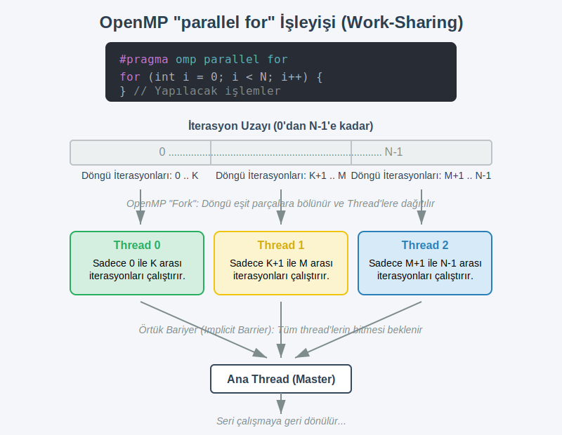


### Adımlar:
1. **İterasyon Uzayının Bölünmesi (Work-Sharing):** Programınız `0`'dan `N`'e kadar bir döngü tanımladığında, OpenMP döngünün iterasyon uzayını sistemdeki iş parçacığı (thread) sayısına böler. Her thread dizinin veya işlemin sadece belirli bir bölgesinden sorumlu olur.
2. **Çatallanma (Fork):** Ana (master) thread `parallel for` komutuna geldiğinde, işi yapmak üzere yardımcı thread'leri devreye sokar.
3. **Bağımsız Paralel İşlemler:** Her thread, diğerinden tamamen bağımsız bir şekilde kendi aralığındaki (`0` - `K`, `K+1` - `M` vb.) `i` değerleri için `// Yapılacak işlemler` kısmını çalıştırır. *(Önceki örnekteki gibi bir global değişkeni birleştirmek gerekmediği için lokal kopya açmalarına gerek yoktur.)*
4. **Örtük Bariyer ve Birleşme (Implicit Barrier & Join):** Döngü tamamlandığında, işini erken bitiren thread'ler diğerlerinin de işini bitirmesini bekler (Örtük Bariyer). Herkes işini bitirdikten sonra ana thread kontrolü tekrar eline alır ve seri kod bir sonraki satırdan itibaren çalışmaya devam eder.
   
Bu komut sayesinde sistem, döngü sayısını (N) aktif iş parçacığı sayısına böler. Örneğin 1000 adet patatesin soyulması (`for` döngüsü) gerektiğini ve mutfakta 4 aşçının (thread) bulunduğunu varsayalım. Döngü seviyesinde paylaştırma (Worksharing) mantığı, ilk 250 patatesi birinci aşçıya, ikinci 250'yi ikinci aşçıya verecek şekilde işi bloklar halinde dağıtır. Böylece her aşçı kendi patates kümesine odaklanır ve iş dört katına yakın bir hızla tamamlanır.

### 5.4 Veri Paylaşım Kuralları (Data Scoping)

Paylaşımlı bellek programlamanın en hassas noktası, hangi verinin ortak kullanılacağı, hangisinin iş parçacıklarına özel kalacağıdır. Bu veri kapsamı (Data Scoping) kurallarını dikkatli belirlemezsek, aynı hafıza bölgesine aynı anda yazmaya çalışan iş parçacıkları yarış durumu (Race Condition) dediğimiz ölümcül hatalara sebep olur.

OpenMP'de üç temel veri paylaşım sınıfı vardır:

**1. Shared (Paylaşılan):** 
Paralel bölgeden önce tanımlanmış değişkenler, varsayılan olarak paylaşılan kabul edilir. Bellekte sadece tek bir kopyaları vardır ve tüm iş parçacıkları bu değişkeni görebilir, değiştirebilir. Mutfaktaki tek bir tuzluk gibi düşünülebilir; iki aşçı aynı anda tuzluğu almaya çalışırsa elleri çarpışır (Race Condition). Bu yüzden `shared` değişkenlere aynı anda yazma işlemi yapılırken dikkatli olunmalı veya koruma mekanizmaları (örn. *critical section*) kullanılmalıdır.

**2. Private (Özel):**
Her iş parçacığının kendi yığınında (stack) tuttuğu, sadece kendine ait olan değişkenlerdir. OpenMP yönergesinde `private(degisken)` şeklinde belirtilir. Her aşçının kendi tezgahındaki kendi özel bıçağı gibi düşünebilirsiniz. Bir iş parçacığı bu değişkenin değerini değiştirdiğinde, diğer iş parçacıklarındaki aynı isimli değişkenler bu durumdan etkilenmez. Döngü değişkenleri (örneğin `for` içindeki `i` indeksi) kendi kendine birbirine karışmasın diye OpenMP tarafından otomatik olarak `private` yapılır.

**3. Reduction (İndirgeme):**
Kökeni Latince *reducere* (geri getirmek, daha sade bir hale döndürmek, küçültmek) fiiline dayanan bu kavram, büyük bir veri kümesini belirli bir matematiksel işlemden geçirip tek bir skaler sonuca bağlamak demektir. 

Örneğin, tüm aşçıların soyduğu toplam patates sayısını bulmak istiyoruz. Eğer herkes aynı "toplam" (shared) değişkenine bir eklemeye kalkarsa yarış durumu oluşur. Bunun yerine her aşçı önce kendi özel sayacında (private) kendi soyduğu patatesleri sayar. Mesai bitiminde (döngü sonunda) herkes kendi sonucunu güvenli bir şekilde ana toplama ekler. OpenMP'de bunu tek satırda halledebiliriz:

```c
int toplam = 0;
#pragma omp parallel for reduction(+:toplam)
for (int i = 0; i < N; i++) {
    toplam += dizi[i];
}
```


### Çizimin Açıkladığı Adımlar:
1. **İş Paylaşımı (Work-sharing):** `#pragma omp parallel for` komutu, `N` boyutlu diziyi var olan *thread* (iş parçacığı) sayısına göre (örnekte 3'e bölünmüş olarak) paylaştırır. Herkes dizinin farklı bir kısmını (örneğin Thread 0: `0..K` arasını) hesaplar.
2. **Yerel Değişkenler (Local Copies):** `reduction(+:toplam)` sayesinde, global olan `toplam` değişkeni üzerine eşzamanlı yazma (race condition) olmaması için her *thread* kendi içinde `lokal_toplam` adında özel bir kopya yaratır ve bunu `0` (toplama işlemi için etkisiz eleman) ile başlatır.
3. **Paralel Hesaplama:** Her thread kendisine düşen dizi elemanlarını *sadece kendi lokal toplam* değişkenine ekler.
4. **İndirgeme / Birleştirme (Reduction):** Bütün thread'ler kendi işlerini bitirdiğinde (senkronizasyon noktası), yerel sonuçlar belirtilen `+` operatörü ile otomatik olarak toplanır ve global ana bellek üzerindeki asıl `toplam` değişkenine yazılır. Böylece güvenli ve hızlı bir hesaplama elde edilir.

Bu yapı, toplama (+), çarpma (*), mantıksal VE/VEYA (&, |) gibi işleçleri (operator) destekler. Her bir iş parçacığı arka planda o işlecin etkisiz elemanıyla (toplama için 0, çarpma için 1) başlayan gizli bir yerel değişken oluşturur ve döngü bitiminde sonuçları güvenle ana değişkende birleştirir.