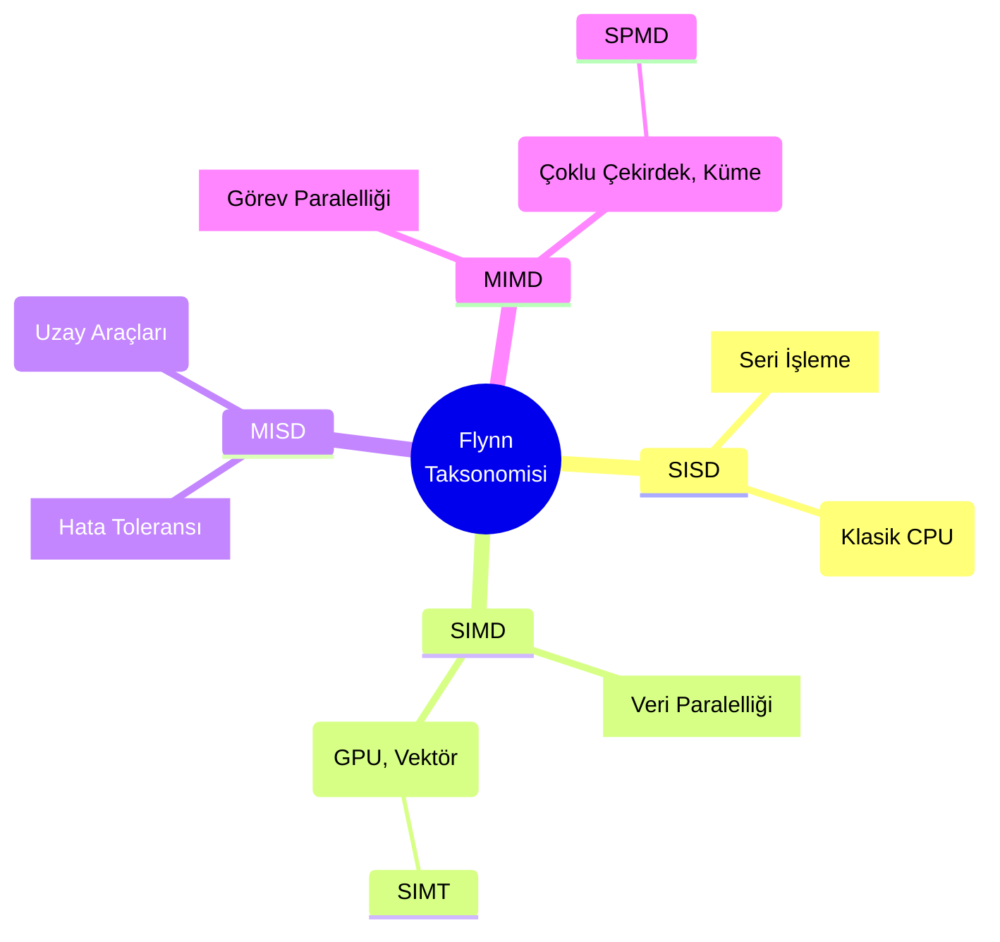
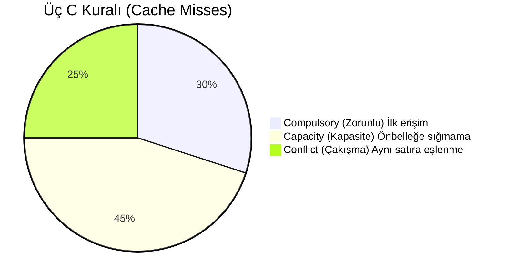
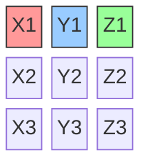
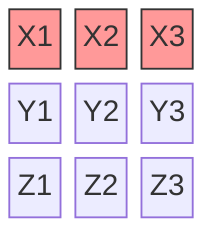
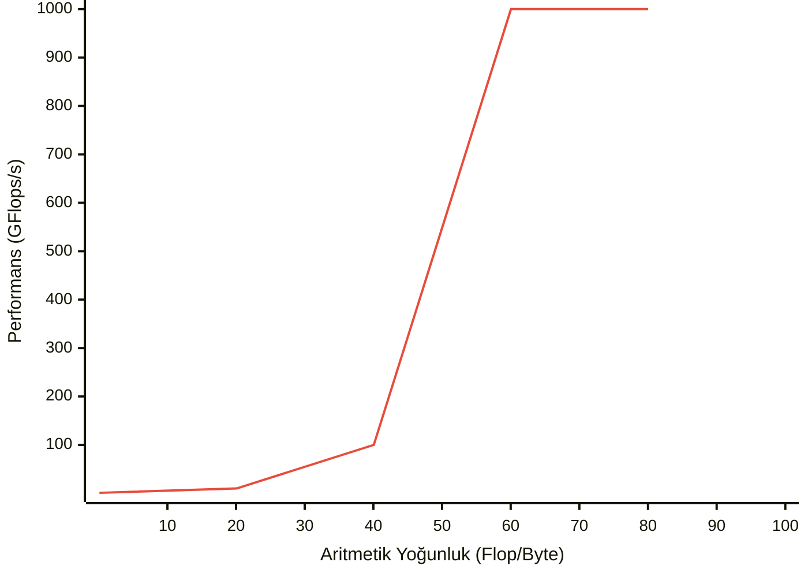

Yüksek Başarımlı Hesaplama (HPC) - Hafta 1 Ders Notları

## Bölüm 1 — Modern Donanım ve Paralel Hesaplamaya Giriş

### 1.1 Paralel Hesaplamaya Neden İhtiyaç Duyarız?
Bilgisayar bilimlerinin ilk yıllarından itibaren işlemci performansındaki artış donanım mimarisindeki ilerlemelerle paralellik göstermiştir. 1986'dan 2003 yılına kadar standart mikroişlemcilerin performansı yılda ortalama %50'den fazla artmıştır; bu artış yazılımcıların yeni donanımı kullanarak uygulamaları hızlandırmasını kolaylaştırmıştır. Bu yükselişin itici gücü Moore Yasasıdır.

2003'ten itibaren tek çekirdekli performans artışı yavaşlamış ve yıllık %4'lerin altına düşmüştür. Bunun temel nedeni **Güç Duvarı (Power Wall)** olarak anılan fiziksel sınırlardır. Bu sınırlamaların akademik literatürdeki temel nedeni **Dennard Ölçeklemesinin (Dennard Scaling)** çöküşüdür: transistörler küçüldükçe uygulanan voltajın aynı oranda düşürülememesi güç yoğunluğunu fırlatmıştır.

- **Güç ve ısı:** Transistörler küçüldükçe saat frekansı artırılabilse de güç tüketimi frekansın küpü oranında artar; ortaya çıkan ısı soğutma sınırlarına takılır.
- Bu yüzden çip üreticileri monolitik tek hızlı çekirdekler yerine aynı çipte birden fazla çekirdek (multicore) tasarımlarına yönelmiştir.

Sonuç: Artık donanım ekleyerek eski seri yazılımları otomatik hızlandırmak mümkün değil; programcıların hesaplamaları paralel alt parçalara bölmesi gerekir.

## Bölüm 2 — Paralel Mimariler ve Flynn Taksonomisi

Paralel bilgisayar donanımları, aynı anda yönetebildikleri komut ve veri akışlarının sayısına göre sınıflandırılır (Flynn Taksonomisi, 1966).

**Şekil 1: Flynn Taksonomisi**

### 2.1 SISD (Single Instruction, Single Data)
Klasik von Neumann mimarisi: tek bir komut tek bir veri üzerinde çalışır — seri, tek çekirdekli sistemleri tanımlar.

### 2.2 SIMD (Single Instruction, Multiple Data)
Tek bir kontrol birimi aynı komutu birden çok veri öğesine uygular. Döngü seviyesindeki veri paralelliği için idealdir.
Örnekler: GPU'lar, CPU vektör uzantıları (SSE, AVX). GPU hesaplamalarında bunun türevi olan **SIMT (Single Instruction, Multiple Threads)** mimarisi kullanılır.

### 2.3 MIMD (Multiple Instruction, Multiple Data)
Birden çok bağımsız işlem birimi farklı komutları ve verileri aynı anda işler. Günümüz büyük paralel sistemlerinin çoğu MIMD'dir.
Alt türler: Paylaşımlı bellek (shared-memory) ve dağıtık bellek (distributed-memory) sistemleri. Pratikte çok sık olarak **SPMD (Single Program, Multiple Data)** modeliyle (ör. MPI) programlanır.

### 2.4 MISD (Multiple Instruction, Single Data)
Nadir kullanılan bir yapı; aynı veri üzerinde farklı komutların çalıştırıldığı, genellikle yüksek güvenilirlik/yedeklilik gerektiren sistemlerde rastlanır.

## Bölüm 3 — Paralel Hesaplamanın Temel Metrikleri ve Yasaları

Paralel program performansını değerlendirirken seri çözüme göre sağlanan kazanımı ölçeriz.

### 3.1 Hızlanma (Speedup) ve Verimlilik (Efficiency)
Hızlanma $S$ şu şekilde tanımlanır:

$$
S = \frac{T_{\mathrm{serial}}}{T_{\mathrm{parallel}}}
$$

İdeal durumda $p$ işlemci ile $S=p$ (lineer hızlanma) beklenir; ancak iletişim ve senkronizasyon overhead'i buna engel olur.

Verimlilik $E$ ise:

$$
E = \frac{S}{p} = \frac{T_{\mathrm{serial}}}{p\,T_{\mathrm{parallel}}}
$$

### 3.2 Amdahl Yasası (Amdahl's Law)
Amdahl yasası paralelleştirilemeyen bölümün (oranı $r$) maksimum hızlanmayı sınırladığını söyler.

Genel formülü şu şekildedir ($p$ işlemci sayısı):

$$
S(p) = \frac{1}{r + \frac{1-r}{p}}
$$

Eğer programın $r$ kadarı seri ise, işlemci sayısı $p\to\infty$ olursa hızlanmanın üst sınırı:

$$
S_{\max} = \frac{1}{r}
$$

Örnek: Programın %90'ı paralelleştirilebiliyorsa ($r=0.1$), en fazla $1/0.1=10$ kat hızlanma elde edilir.

### 3.3 Gustafson–Barsis Yasası (Gustafson's Law)
Gustafson ve Barsis, problem boyutu işlemci sayısıyla birlikte artırıldığında (weak scaling) seri kısmın göreli etkisinin küçüldüğünü gösterdiler. Pratikte daha fazla çekirdek mevcutsa problem boyutu büyütülerek toplam hızlanma korunabilir veya artırılabilir. 

Ölçeklenmiş hızlanma (scaled speedup) formülü:

$$
S(p) = p - r(p-1)
$$

Sonuç: Amdahl'ın kısıtlayıcı öngörüsü her zaman geçerli olmayabilir; ölçeklendirme stratejisi önemlidir.

## Yüksek Başarımlı Hesaplama (HPC) - Hafta 2 Ders Notları

### Bölüm 1 — İşlemci Mimarisi ve Bellek Hiyerarşisi
Modern işlemciler (CPU), komutları ve hesaplamaları ana bellekten (DRAM) veri getirme hızına kıyasla çok daha hızlı işleyebilir. İşlemci hızı ile bellek hızı arasındaki bu giderek açılan farka von Neumann darboğazı veya DRAM boşluğu (DRAM gap) adı verilir.

Bu performans darboğazını aşmak için bilgisayar mimarları, çok hızlı çalışan işlemci yazmaçları (register) ile görece yavaş olan ana bellek arasına önbellek (cache) adı verilen bir veya birden fazla seviyeden (L1, L2, L3) oluşan, düşük gecikmeli (latency) ve yüksek bant genişlikli (bandwidth) SRAM bellekler yerleştirmiştir.

#### 1.1 Yerellik Prensipleri (Locality of Reference)
Önbelleklerin verimli çalışması, yazılımların genel davranışı olan yerellik prensiplerine dayanır.

- Zamansal Yerellik (Temporal Locality): Yakın zamanda erişilen veriye yakın gelecekte tekrar erişilme olasılığı yüksektir.
- Uzamsal Yerellik (Spatial Locality): Bir bellek adresine erişildiğinde, o adrese fiziksel olarak yakın adreslere de yakında erişilme olasılığı yüksektir.

Sistemler uzamsal yerellikten yararlanmak için verileri ana bellekten tek tek değil, önbellek satırları (cache line) adı verilen bitişik bloklar hâlinde (genellikle 64 byte) çeker.

#### 1.2 Önbellek Iskalamaları ve Üç C Kuralı
CPU'nun ihtiyaç duyduğu veri önbellekte bulunamazsa buna önbellek ıskalaması (cache miss) denir. Bu durumda CPU, veri ana bellekten gelene kadar duraklar (stall). Önbellek ıskalamaları genelde Üç C (Three Cs) kuralı ile sınıflandırılır:

**Şekil 2: Önbellek Iskalamaları (Üç C Kuralı)**

- Zorunlu (Compulsory) ıskalamalar: Veriye ilk erişimden kaynaklanır (cold cache).
- Kapasite (Capacity) ıskalamaları: Çalışma seti önbelleğe sığmadığı için oluşur.
- Çakışma (Conflict) ıskalamaları: Farklı veri bloklarının aynı satıra eşlenip birbirini atmasıyla (thrashing) oluşur.

### Bölüm 2 — Veri Odaklı Tasarım (Data-Oriented Design)
Nesne Yönelimli Programlama (OOP), kod organizasyonunu kolaylaştırsa da çoğu zaman işlemci ve bellek davranışını ikinci plana atar. Çok büyük nesne kümeleri üzerinde yoğun metod çağrıları; dallanma, çağrı zinciri maliyeti ve önbellek ıskalamaları nedeniyle performansı düşürebilir.

Veri Odaklı Tasarım, odağı kod yazma konforundan donanım düzeyinde performansa ve veri yerleşimine (data layout) kaydırır. Temel amaç, veriyi diziler hâlinde düzenleyip toplu ve sıralı işlemektir.

#### 2.1 AoS (Array of Structures)
AoS yaklaşımında bir varlığa ait alanlar tek bir yapı içinde tutulur ve bu yapıların dizisi oluşturulur.

**Şekil 3: AoS (Array of Structures) Bellek Yerleşimi**

- Avantaj: Aynı varlığın tüm alanları birlikte kullanılıyorsa yerellik iyidir.
- Dezavantaj: Yalnızca tek bir alan işleniyorsa gereksiz veri taşınır; SIMD verimi düşebilir.

#### 2.2 SoA (Structure of Arrays)
SoA yaklaşımında her alan kendi ayrı dizisinde tutulur.

**Şekil 4: SoA (Structure of Arrays) Bellek Yerleşimi**

- Avantaj: Sıralı (unit-stride) erişim sayesinde önbellek ve SIMD kullanımı daha verimli olur.
- Dezavantaj: Çok sayıda alan aynı anda kullanıldığında bellek akışları artar ve yönetim zorlaşabilir.

Genel eğilim olarak, büyük veri akışlarının işlendiği yapılarda SoA sıklıkla daha iyi sonuç verir.

#### 2.3 AoSoA (Array of Structures of Arrays)
AoSoA, AoS ve SoA'nın güçlü yönlerini birleştiren hibrit bir yerleşimdir. Veriler bloklara (tile) ayrılır; blok boyutu donanımın vektör uzunluğuna uygun seçilerek hem sıralı erişim hem de yönetilebilir akış sayısı hedeflenir.

### Bölüm 3 — Performans Limitleri ve Profil Analizi
Program performansını belirleyen temel sınırlar iki başlıkta toplanır:

- Hesaplama sınırı: İşlemcinin flop kapasitesi.
- Besleme sınırı: Bellek/ağ bant genişliği.

Değerlendirmede sık kullanılan iki metrik:

- Aritmetik Yoğunluk (Arithmetic Intensity): Bellek erişimi başına yapılan flop miktarı.
- Makine Dengesi (Machine Balance): Maksimum flop/s değerinin maksimum bant genişliğine oranı.

#### 3.1 Roofline Modeli
Roofline modeli, uygulamanın donanım sınırlarına ne kadar yakın olduğunu gösteren görsel bir modeldir.

**Şekil 5: Örnek Roofline Modeli**

- Dikey eksen: Performans (flop/s).
- Yatay eksen: Aritmetik yoğunluk (flop/byte).

Yatay çatı çizgisi teorik tepe hesaplama sınırını (peak flops), eğimli çizgi ise bellek bant genişliği sınırını gösterir. Uygulama yatay sınıra yakınsa compute-bound, eğimli sınıra yakınsa memory-bound davranır.

#### 3.2 STREAM Benchmark
STREAM Benchmark, sistemin pratik bellek bant genişliğini ölçmek için yaygın kullanılan bir testtir. Genellikle uzun vektörler üzerinde şu çekirdek işlemleri içerir:

- COPY: $A(i) = B(i)$
- SCALE: $A(i) = s \cdot B(i)$
- ADD: $A(i) = B(i) + C(i)$
- TRIAD: $A(i) = B(i) + s \cdot C(i)$

Bu ölçümler, streaming erişimlerde belleğin ulaşabildiği GB/s seviyesini verir. Eğer uygulama bant genişliği verimi STREAM sonucunun belirgin şekilde altında kalıyorsa, olası nedenler önbellek çakışmaları ve yüksek ıskalama oranlarıdır.