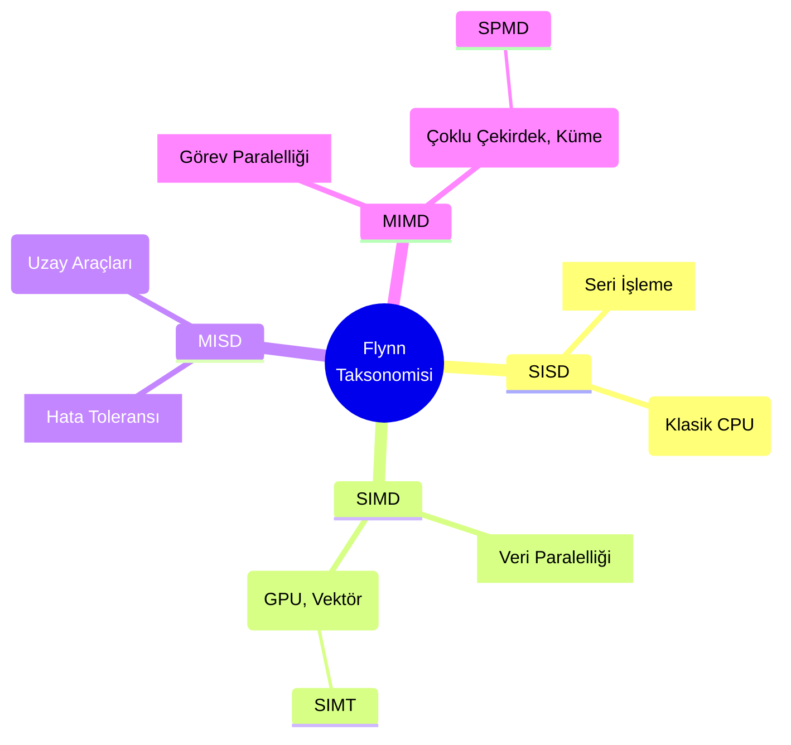
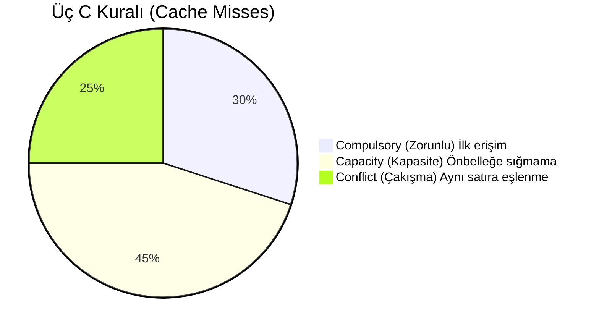
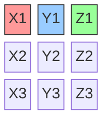
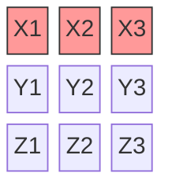
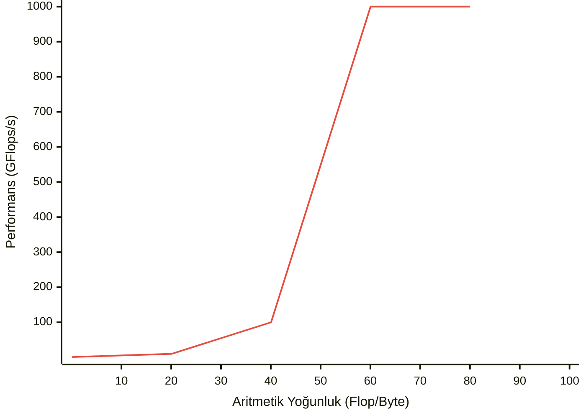

# Yüksek Başarımlı Hesaplama (HPC) - Ders Notları
1.	Modern İşlemciler

Konrad Zuse ve Bilgisayarların Etkisi
1941 yılında Konrad Zuse, dünyanın ilk tam otomatik, serbest programlanabilir ve ikili kayan noktalı aritmetiğe  sahip bilgisayarını inşa ettiğinde, bu devrimci cihazın sadece bilim ve mühendislikte değil, yaşamın her alanındaki potansiyelini öngörmüştü. Bugün, Zuse'nin hayali gerçeğe dönüşmüş durumda: Bilgisayarlar, onun zamanından beri hayatımızı ve araştırmalarımızı kökten değiştirmiştir. Hesaplamaları, görselleştirmeleri ve genel veri işlemeyi inanılmaz ve sürekli artan bir hızda gerçekleştirebilmeleri sayesinde artık vazgeçilmez hale gelmişlerdir.

Zuse'nin Vizyonu ve Gerçeklik
Zuse, bilgisayarların sadece bilimsel ve mühendislik problemlerini çözmek için değil, günlük yaşamın her alanına nüfuz edeceğini hayal etti.
Bugün, bilgisayarlar bankacılıktan tıpa, eğitimden eğlenceye kadar her sektörde kritik rol oynamaktadır.

Bilgisayarların Etkileri
Hız: Hesaplamalar ve veri işleme inanılmaz derecede hızlı hale geldi. Bu da karmaşık problemleri çözmemizi ve daha önce mümkün olmayan keşifler yapmamızı sağlıyor.
Verimlilik: Rutin ve tekrarlayan görevler otomasyona tabi tutularak zamandan ve emekten tasarruf sağlanıyor.
İletişim: Gecikmesiz iletişim ve bilgi paylaşımı mümkün hale geldi.
Karmaşık Araştırma: Karmaşık modeller ve simülasyonlar kullanılarak bilimsel araştırmalar yeni bir boyut kazandı.


*Kayan Noktalı Aritmetik ve Sayı Temsili*
Bilgisayar bilimlerinde, kayan noktalı aritmetik (Floating Point-FP), gerçek sayıların alt kümelerini, sabit bir hassasiyete sahip bir tamsayı (signifikand) olarak, sabit bir tabanın tamsayı üssü ile çarpılarak gösteren bir aritmetiktir. Bu formdaki sayılara kayan noktalı sayılar denir.

### Kayan Noktalı Sayıların Görsel Anatomisi (IEEE 754 32-bit Standartı)

İlk olarak, sabit noktalı (fixed-point) sayılarla kayan noktalı sayıların farkını göstermek için basit bir blok çizimi yapabilirsiniz:

**1. Sabit Noktalı Sistem (Sorunlu Yapı):**
Noktanın yeri sabittir. Çok büyük sayılarda tam sayı kısmı taşar, çok küçük sayılarda kesir kısmı yetersiz kalır.

```text
[ Tam Sayı Kısmı (16 bit) ] . [ Kesir Kısmı (16 bit) ]
                            ^
                     Nokta hep buradadır

```

**2. Kayan Noktalı Sistem (Çözüm):**
Sayıyı bilimsel gösterime çevirip parçalara ayırırız. Noktanın nerede "duracağı" bilgisini ayrı bir kutuda (Üs) tutarız.

```text
  1 Bit       8 Bit                  23 Bit
  +---+ +----------------+ +-----------------------------------------+
  | S | |       Üs       | |                 Mantis                  |
  |   | |   (Exponent)   | |      (Significand / Anlamlı Kısım)      |
  +---+ +----------------+ +-----------------------------------------+
   31    30            23   22                                      0

```

* **S (Sign - 1 bit):** İşaret biti. $0$ ise pozitif, $1$ ise negatif.
* **Üs (Exponent - 8 bit):** Noktanın ne kadar sağa veya sola kaydığını tutar. (Bias/Sapma değeri eklenerek saklanır).
* **Mantis (Mantissa - 23 bit):** Sayının asıl anlamlı basamaklarını tutar.

---

### $5.75$ Sayısını Bilgisayar Nasıl Görür?

Bu işlemi tahtada adım adım şu şekilde görselleştirebilirsiniz:

**Adım 1: Sayıyı İkili (Binary) Sisteme Çevirme**
Tam sayı ve kesir kısmını ayrı ayrı çeviriyoruz:

* Tam sayı kısmı: $5_{10} = 101_2$
* Kesir kısmı: $0.75_{10} = 0.5 + 0.25 = 11_2$
* **Birleşim:** $101.11_2$

**Adım 2: Sayıyı Normalize Etme (Noktayı Kaydırma)**
Bilimsel gösterimde olduğu gibi, noktayı en baştaki $1$'in yanına kadar kaydırıyoruz. Nokta $2$ basamak sola kayıyor.

* **Orijinal:** $101.11$
* **Kayan Noktalı Hali:** $1.0111 \times 2^2$

**Adım 3: Blokları Doldurma (Şema Üzerinde)**

**A) İşaret (S):**
Sayı pozitif olduğu için kutuya **0** yazılır.

**B) Üs (Exponent):**
Noktayı $2$ basamak kaydırdık. Ancak IEEE 754 standardında negatif üslerle uğraşmamak için sabit bir sapma (bias) değeri olan $127$ eklenir.

* Hesap: $2 + 127 = 129$
* $129$'un ikili karşılığı: **10000001**

**C) Mantis (Mantissa):**
Virgülden sonraki kısmı (`0111`) alırız. Standarda göre baştaki "1." kısmı her zaman var kabul edildiği için (Gizli bit / Hidden bit kuralı) hafızaya yazılmaz, bu sayede 1 bit yer kazanılır.

* Geriye kalan 23 biti doldurmak için sonuna sıfırlar eklenir: **01110000000000000000000**

**Sonuç: Bilgisayarın Hafızasındaki Görünüm**
Öğrencilere nihai yapıyı şu şema ile birleştirerek gösterebilirsiniz:

```text
   S       ÜS (Exponent)             MANTİS (Mantissa)
 +---+ +------------------+ +---------------------------------------+
 | 0 | | 1 0 0 0 0 0 0 1  | | 0 1 1 1 0 0 0 0 0 0 0 0 0 0 0 0 0 0 0 |
 +---+ +------------------+ +---------------------------------------+

```


## Bölüm 1 — Modern Donanım ve Paralel Hesaplamaya Giriş

### 1.1 Paralel Hesaplamaya Neden İhtiyaç Duyarız?

Bilgisayar bilimlerinin ilk yıllarından itibaren işlemci performansındaki artış donanım mimarisindeki ilerlemelerle paralellik göstermiştir. 1986'dan 2003 yılına kadar standart mikroişlemcilerin performansı yılda ortalama %50'den fazla artmıştır; bu artış yazılımcıların yeni donanımı kullanarak uygulamaları hızlandırmasını kolaylaştırmıştır. Bu yükselişin itici gücü Moore Yasasıdır.

2003'ten itibaren tek çekirdekli performans artışı yavaşlamış ve yıllık %4'lerin altına düşmüştür. Bunun temel nedeni **Güç Duvarı (Power Wall)** olarak anılan fiziksel sınırlardır. Bu sınırlamaların akademik literatürdeki temel nedeni **Dennard Ölçeklemesinin (Dennard Scaling)** çöküşüdür: transistörler küçüldükçe uygulanan voltajın aynı oranda düşürülememesi güç yoğunluğunu fırlatmıştır.

- **Güç ve ısı:** Transistörler küçüldükçe saat frekansı artırılabilse de güç tüketimi frekansın küpü oranında artar; ortaya çıkan ısı soğutma sınırlarına takılır.
- Bu yüzden çip üreticileri monolitik tek hızlı çekirdekler yerine aynı çipte birden fazla çekirdek (multicore) tasarımlarına yönelmiştir. Örnek: Mutfakta çok hızlı çalışan ama ısıdan bayılmak üzere olan tek bir şefe yüklenmek yerine, işi normal hızda çalışan 4 ayrı şefe dağıtmak gibidir.

Sonuç: Artık donanım ekleyerek eski seri yazılımları otomatik hızlandırmak mümkün değil; programcıların hesaplamaları paralel alt parçalara bölmesi gerekir.

## Bölüm 2 — Paralel Mimariler ve Flynn Taksonomisi

Paralel bilgisayar donanımları, eşzamanlı olarak yönetebildikleri komut (instruction) ve veri (data) akışlarının sayısına göre sınıflandırılır (Flynn Taksonomisi, 1966). Bu sınıflandırma, **Şekil 1'de** de özetlendiği gibi temelde donanımın veriyi ve talimatı nasıl işlediğine odaklanan dört farklı kategoriden (SISD, SIMD, MISD, MIMD) oluşur.

## Şekil 1: Flynn Taksonomisi



### 2.1 SISD (Single Instruction, Single Data)

Klasik von Neumann mimarisi: tek bir komut tek bir veri üzerinde çalışır — seri, tek çekirdekli sistemleri tanımlar.

Örnek: Sadece bir garsonun, sadece tek bir masanın siparişini alıp mutfağa götürmesidir. Her şey sırayla yapılır.

### 2.2 SIMD (Single Instruction, Multiple Data)

Tek bir kontrol birimi aynı komutu birden çok veri öğesine uygular. Döngü seviyesindeki veri paralelliği için idealdir.
Örnekler: GPU'lar, CPU vektör uzantıları (SSE, AVX). GPU hesaplamalarında bunun türevi olan **SIMT (Single Instruction, Multiple Threads)** mimarisi kullanılır.

Örnek: Bir garsonun kocaman bir tepsiyle 4 farklı müşteriye aynı anda kahve (aynı işlem) götürmesidir. Tek hareketle çok veri işlenmiş olur.

### 2.3 MIMD (Multiple Instruction, Multiple Data)

Birden çok bağımsız işlem birimi farklı komutları ve verileri aynı anda işler. Günümüz büyük paralel sistemlerinin çoğu MIMD'dir.
Alt türler: Paylaşımlı bellek (shared-memory) ve dağıtık bellek (distributed-memory) sistemleri. Pratikte çok sık olarak **SPMD (Single Program, Multiple Data)** modeliyle (ör. MPI) programlanır.

Örnek: Büyük bir peyzaj işinde (bahçecilik), bir bahçıvanın çim biçme makinesiyle çimleri biçmesi, diğerinin makasla ağaçları budaması, bir başkasının ise hortumla çiçekleri sulaması gibidir. Her biri farklı bir aletle (farklı komut), bahçenin farklı bir köşesinde (farklı veri) aynı anda ve bağımsız çalışır.

### 2.4 MISD (Multiple Instruction, Single Data)

Nadir kullanılan bir yapı; aynı veri üzerinde farklı komutların çalıştırıldığı, genellikle yüksek güvenilirlik/yedeklilik gerektiren sistemlerde rastlanır.

Örnek: Aşçının pişirdiği tek bir tabağın (tek veri), hem mutfak şefi hem de bir gurme tarafından aynı anda (farklı talimatlarla) tadılıp puanlanmasıdır. Çift kontrol mekanizmasıdır.

## Bölüm 3 — Paralel Hesaplamanın Temel Metrikleri ve Yasaları

Paralel program performansını değerlendirirken seri çözüme göre sağlanan kazanımı ölçeriz.

### 3.1 Hızlanma (Speedup) ve Verimlilik (Efficiency)

Hızlanma $S$ şu şekilde tanımlanır:

$$
S = \frac{T_{\mathrm{serial}}}{T_{\mathrm{parallel}}}
$$

İdeal durumda $p$ işlemci ile $S=p$ (lineer hızlanma) beklenir; ancak **overhead** (yükleme) bu hedefi engeller.

#### Overhead Nedir?

**Overhead**, paralel hesaplama sırasında asıl işten ziyade koordinasyon ve yönetim görevleri için harcanan gereksiz zamandır. Bu, paralelleştirmenin maliyetidir ve asıl problemi çözmek için doğrudan katkısı olmayan işlemlerdir.

- Yönetim yapması gereken bir aşçıbaşı, 10 aşçıyı koordine etmek (kimse ne yapacağını bilmediğinden), aralarında malzeme akışını sağlamak ve herkesin çalışmasını denetlemek için   harcadığı 2 saat, hiçbir yemeği hazırlamaz. O 2 saat tamamen **overhead**'dir.
- Beş bahçıvan çalışırken, bahçeyi bölümlere ayırma, araçları paylaştırma ve sonunda çalışmaları birleştirme planlaması yapılsa da, bu planlama zamanı bahçeyi biçmemektedir.
- Bir paketi 5 kargo görevlisine dağıtmak isteyebilirsiniz; ancak kimin nereye gideceğini söylemek için 30 dakika harcarsanız, bu 30 dakika paket taşınmamıştır.

Paralel hesaplamada overhead, **senkronizasyon** (tüm işçilerin bir noktada beklenmesi), **iletişim** (veri transferi), **yük dengeleme** (işi eşit dağıtma) ve **program/kontrol maliyeti** olarak geçer.

Örnek: Yüzlerce sayfalık ders notuna tek başına 10 saatte çalışan bir öğrencinin (Seri çalışma) yanına, kendi seviyesinde 4 arkadaşı eklenip notları aralarında paylaştıklarında sürenin 2 saate (Speedup=5) inmesini umarız. Ancak öğrenciler sayfaları kimin çalışacağını planlarken (senkronizasyon) ve çalışma sonunda birbirlerine özet geçerken (iletişim) yarım saat kaybettiklerinde (toplam süre 2.5 saat olur), bu kaybedilen süre **overhead**'dir. Hızlanma 4'te kalır ve verimlilik (Efficiency) %80'e düşer.

Verimlilik $E$ ise:

$$
E = \frac{S}{p} = \frac{T_{\mathrm{serial}}}{p\,T_{\mathrm{parallel}}}
$$

### 3.2 Amdahl Yasası (Amdahl's Law)

Amdahl yasası paralelleştirilemeyen bölümün (oranı $r$) maksimum hızlanmayı sınırladığını söyler.

Örnek: İki şehir arasında çok hızlı bir tren veya uçak (ulaşım araçları) işletmek istediğinizi düşünün. Sadece yolda (havada/raylarda) geçen süreyi hızlandırarak (ör. çok daha güçlü ve hızlı yeni bir taşıt alarak) yolculuğu en aza indirebilirsiniz. Ancak yolcuların terminale gelmesi, güvenlikten geçmesi ve peronlara yürüyerek taşıta binmesi için geçen toplam 1 saatlik süre (Seri kısım) hep aynı kalacaktır. Taşıtınızın hızı limitsiz (sonsuz paralel) bile olsa, o rota asla bu 1 saatlik boarding süresinin altına inemez. Amdahl yasası sisteminizin hızlanma sınırını işte bu seri kısmın belirlediğini söyler.

Genel formülü şu şekildedir ($p$ işlemci sayısı):

$$
S(p) = \frac{1}{r + \frac{1-r}{p}}
$$

Eğer programın $r$ kadarı seri ise, işlemci sayısı $p\to\infty$ olursa hızlanmanın üst sınırı:

$$
S_{\max} = \frac{1}{r}
$$

Örnek: Programın %90'ı paralelleştirilebiliyorsa ($r=0.1$), en fazla $1/0.1=10$ kat hızlanma elde edilir.

### 3.3 Gustafson–Barsis Yasası (Gustafson's Law)

Gustafson ve Barsis, problem boyutu işlemci sayısıyla birlikte artırıldığında (weak scaling) seri kısmın göreli etkisinin küçüldüğünü gösterdiler. Pratikte daha fazla çekirdek mevcutsa problem boyutu büyütülerek toplam hızlanma korunabilir veya artırılabilir.

Ölçeklenmiş hızlanma (scaled speedup) formülü:

$$
S(p) = p - r(p-1)
$$

Sonuç: Amdahl'ın kısıtlayıcı öngörüsü her zaman geçerli olmayabilir; ölçeklendirme stratejisi önemlidir.

## Yüksek Başarımlı Hesaplama (HPC) - Hafta 2 Ders Notları

### Bölüm 1 — İşlemci Mimarisi ve Bellek Hiyerarşisi

Modern işlemciler (CPU), komutları ve hesaplamaları ana bellekten (DRAM) veri getirme hızına kıyasla çok daha hızlı işleyebilir. İşlemci hızı ile bellek hızı arasındaki bu giderek açılan farka von Neumann darboğazı veya DRAM boşluğu (DRAM gap) adı verilir.

Bu performans darboğazını aşmak için bilgisayar mimarları, çok hızlı çalışan işlemci yazmaçları (register) ile görece yavaş olan ana bellek arasına önbellek (cache) adı verilen bir veya birden fazla seviyeden (L1, L2, L3) oluşan, düşük gecikmeli (latency) ve yüksek bant genişlikli (bandwidth) SRAM bellekler yerleştirmiştir.

#### 1.1 Yerellik Prensipleri (Locality of Reference)

Önbelleklerin verimli çalışması, yazılımların genel davranışı olan yerellik prensiplerine dayanır.

Örnek: İşlemciyi bir aşçı (CPU), tezgahı önbellek (Cache) ve kileri de ana bellek (RAM) olarak düşünün. Aşçı her baharat için kilere gitmek istemez.

- **Zamansal Yerellik:** Bir yemeğe tuz atıyorsanız, 5 dakika sonra başka bir yemeğe de tuz atma ihtimaliniz yüksektir. O yüzden tuzu tezgaha (önbelleğe) koyarsınız.
- **Uzamsal Yerellik:** Kilere tuz almaya gittiğinizde, hemen yanındaki karabiberi de tezgaha getirirsiniz; çünkü tuz kullanılan yerde genelde karabiber de kullanılıyordur.

- Zamansal Yerellik (Temporal Locality): Yakın zamanda erişilen veriye yakın gelecekte tekrar erişilme olasılığı yüksektir.
- Uzamsal Yerellik (Spatial Locality): Bir bellek adresine erişildiğinde, o adrese fiziksel olarak yakın adreslere de yakında erişilme olasılığı yüksektir.

Sistemler uzamsal yerellikten yararlanmak için verileri ana bellekten tek tek değil, önbellek satırları (cache line) adı verilen bitişik bloklar hâlinde (genellikle 64 byte) çeker.

#### 1.2 Önbellek Iskalamaları ve Üç C Kuralı

CPU'nun ihtiyaç duyduğu veri önbellekte bulunamazsa buna önbellek ıskalaması (cache miss) denir. Bu durumda CPU, veri ana bellekten gelene kadar duraklar (stall). Önbellek ıskalamalarının arkasında yatan sebepler donanım mimarisinde "Üç C Kuralı" ile tanımlanır (**Bkz. Şekil 2**). Bu grafikte ıskalamalarının yaygın karşılaşılan temel motivasyon dağılımları verilmiştir.

## Şekil 2: Önbellek Iskalamaları (Üç C Kuralı)



- Zorunlu (Compulsory) ıskalamalar: Veriye ilk erişimden kaynaklanır (cold cache).
- Kapasite (Capacity) ıskalamaları: Çalışma seti önbelleğe sığmadığı için oluşur.
- Çakışma (Conflict) ıskalamaları: Farklı veri bloklarının aynı satıra eşlenip birbirini atmasıyla (thrashing) oluşur.

### Bölüm 2 — Veri Odaklı Tasarım (Data-Oriented Design)

Nesne Yönelimli Programlama (OOP), kod organizasyonunu kolaylaştırsa da çoğu zaman işlemci ve bellek davranışını ikinci plana atar. Çok büyük nesne kümeleri üzerinde yoğun metod çağrıları; dallanma, çağrı zinciri maliyeti ve önbellek ıskalamaları nedeniyle performansı düşürebilir.

Veri Odaklı Tasarım, odağı kod yazma konforundan donanım düzeyinde performansa ve veri yerleşimine (data layout) kaydırır. Temel amaç, veriyi diziler hâlinde düzenleyip toplu ve sıralı işlemektir.

Örnek: AoS mantığında, mutfak için her personelin önüne bir 'set' menüyü (Havuç, Patates, Soğan paketi) eksiksiz koyarsınız. Ancak sadece patates soyması gereken aşçı, kullanmayacağı havuç ve soğanı da kucağında taşımak zorunda kalır. SoA ise endüstriyel mutfak gibidir: Bütün patatesler bir kapta, soğanlar başka bir kaptadır. Patates soyan aşçı, çuvaldan ardışık olarak sürekli patates (sıralı erişim) alır ve çok daha hızlı çalışır.

#### 2.1 AoS (Array of Structures)

AoS yaklaşımında bir varlığa ait alanlar (örneğin X, Y, Z koordinatları) tek bir yapı içinde tutulur ve bu bütün halindeki yapıların dizisi oluşturulur. **Şekil 3'te** görüldüğü gibi, her bir bloğun yan yana kendi bileşenlerini (X1, Y1, Z1) taşıdığı bu bellek serilimi geleneksel Nesne Yönelimli (OOP) kodların varsayılan durumudur.

## Şekil 3: AoS (Array of Structures) Bellek Yerleşimi



- Avantaj: Aynı varlığın tüm alanları birlikte kullanılıyorsa yerellik iyidir.
- Dezavantaj: Yalnızca tek bir alan işleniyorsa gereksiz veri taşınır; SIMD verimi düşebilir.

### 2.2 SoA (Structure of Arrays)

SoA pendekatanında, Vektörel işlemciler (SIMD vb.) için uygun veri dizilimidir. Her bir alan kendi ayrı dizisinde tutulur. **Şekil 4'te**, bir varlığın tüm uzaysal alanlarını (Örneğin tüm X değerleri: X1, X2, X3) aynı bellek satırında ardışık saklayan SoA mimarisi sunulmaktadır. Bu yerleşim sayesinde önbellekten alınan bir "Satır" tamamıyla aynı tür ve işlem görecek verilere sahip olur.

## Şekil 4: SoA (Structure of Arrays) Bellek Yerleşimi



- Avantaj: Sıralı (unit-stride) erişim sayesinde önbellek ve SIMD kullanımı daha verimli olur.
- Dezavantaj: Çok sayıda alan aynı anda kullanıldığında bellek akışları artar ve yönetim zorlaşabilir.

Genel eğilim olarak, büyük veri akışlarının işlendiği yapılarda SoA sıklıkla daha iyi sonuç verir.

### 2.3 AoSoA (Array of Structures of Arrays)

AoSoA, AoS ve SoA'nın güçlü yönlerini birleştiren hibrit bir yerleşimdir. Veriler bloklara (tile) ayrılır; blok boyutu donanımın vektör uzunluğuna uygun seçilerek hem sıralı erişim hem de yönetilebilir akış sayısı hedeflenir.

### Bölüm 3 — Performans Limitleri ve Profil Analizi

Program performansını belirleyen temel sınırlar iki başlıkta toplanır:

- Hesaplama sınırı: İşlemcinin flop kapasitesi.
- Besleme sınırı: Bellek/ağ bant genişliği.

Değerlendirmede sık kullanılan iki metrik:

- Aritmetik Yoğunluk (Arithmetic Intensity): Bellek erişimi başına yapılan flop miktarı.
- Makine Dengesi (Machine Balance): Maksimum flop/s değerinin maksimum bant genişliğine oranı.

#### 3.1 Roofline Modeli

Roofline modeli, uygulamanın donanım sınırlarına ne kadar yakın olduğunu gösteren görsel bir modeldir. Bu model, tabir-i caizse "Hız yapmamıza motor mu izin vermiyor, yoksa yol mu dar?" sorusunun teknik karşılığıdır. **Şekil 5'te** yer alan Roofline çizelgesi, hesaplama (motor gücü) ile bellek (yol genişliği) kısıtlamalarını görselleştirir.

Örnek: Altınızda 300 km/s hız yapabilen bir yarış arabası (Güçlü İşlemci) olabilir. Ancak onu daracık topraklı, tek şeritli bir köy yolunda (Düşük Bellek Bant Genişliği) kullanmaya çalışırsanız, o arabanın gerçek potansiyeline asla ulaşamazsınız. Performansınızı sınırlayan şey motor değil, yoldur (Memory-bound).

## Şekil 5: Örnek Roofline Modeli



- Dikey eksen: Performans (flop/s).
- Yatay eksen: Aritmetik yoğunluk (flop/byte).

Yatay çatı çizgisi teorik tepe hesaplama sınırını (peak flops), eğimli çizgi ise bellek bant genişliği sınırını gösterir. Uygulama yatay sınıra yakınsa compute-bound, eğimli sınıra yakınsa memory-bound davranır.

### 3.2 STREAM Benchmark

STREAM Benchmark, sistemin pratik bellek bant genişliğini ölçmek için yaygın kullanılan bir testtir. Genellikle uzun vektörler üzerinde şu çekirdek işlemleri içerir:

- **COPY:** $A(i) = B(i)$ — B dizisinin elemanlarını A dizisine kopyalama işlemi.
- **SCALE:** $A(i) = s \cdot B(i)$ — B dizisinin her elemanını skaler $s$ değeriyle çarpma.
- **ADD:** $A(i) = B(i) + C(i)$ — B ve C dizilerinin karşılık gelen elemanlarını toplayıp A'ya yazma.
- **TRIAD:** $A(i) = B(i) + s \cdot C(i)$ — C'nin elemanlarını $s$ ile çarpıp B ile toplayıp A'ya yazma (en gerçekçi iş yükü).

Bu dört işlem, bellek bant genişliğinin ne kadar verimli kullanıldığını test eder; çünkü hesaplama minimal iken bellek erişimi ön plandadır.

Bu ölçümler, streaming erişimlerde belleğin ulaşabildiği GB/s seviyesini verir. Eğer uygulama bant genişliği verimi STREAM sonucunun belirgin şekilde altında kalıyorsa, olası nedenler önbellek çakışmaları ve yüksek ıskalama oranlarıdır.