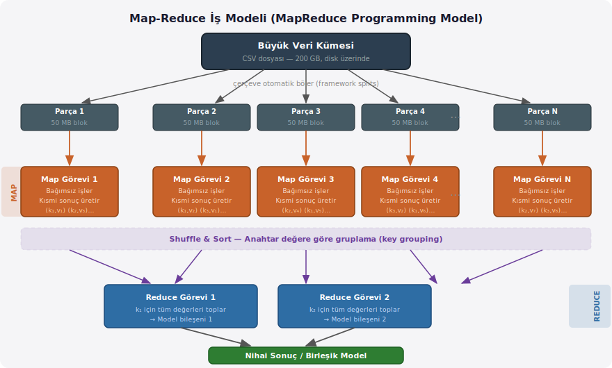
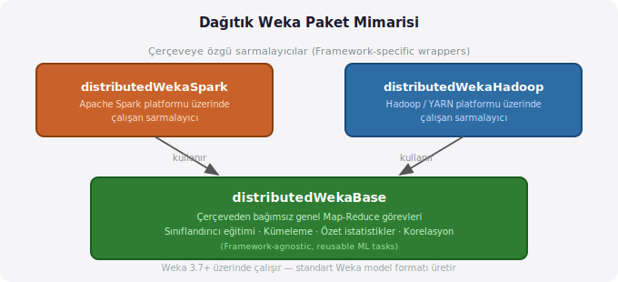
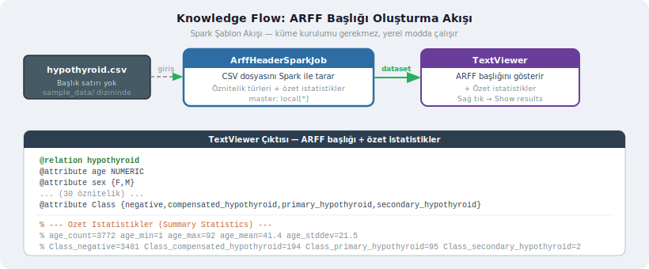
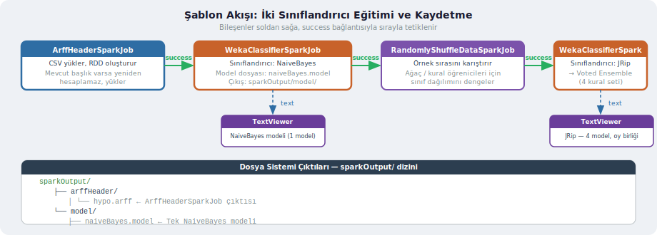
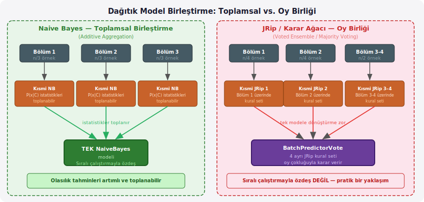
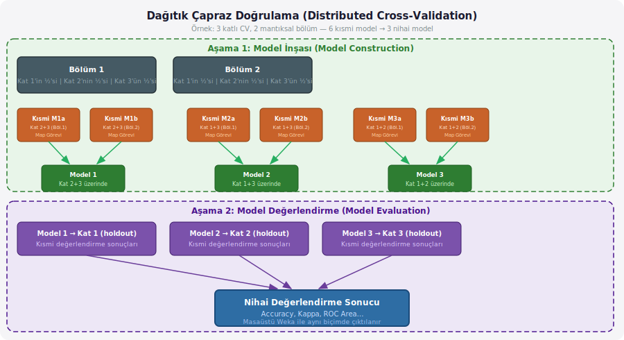

# Dağıtık Weka ile Apache Spark: Temel Kavramlar ve İlk Adımlar

## Sorun: Veri Masaüstüne Sığmıyor

Bir veri kümesi 200 GB büyüklüğündeyse ve makinenizin RAM'i 32 GB ise, tek bir Weka oturumunda o veriyle çalışmak mümkün değildir. Bu, kolayca görülebilen ama çözümü biraz düşünce gerektiren bir mühendislik problemidir.

İki farklı çözüm yolu açılır. Birincisi daha güçlü bir makine almak, yani dikey büyümek. Bu yol bir noktada teknik ve ekonomik sınıra çarpar; hiçbir masaüstü yüz terabaytlık veriyi belleğe sığdıramaz. İkincisi veriyi birden fazla makineye dağıtmak ve hesabı paralel yürütmek: yatay büyüme. İşte Dağıtık Weka (Distributed Weka), bu ikinci yolun Weka ekosistemindeki uygulamasıdır.

Aynı zamanda, bir algoritmanın tek makinede çok uzun sürdüğü durumlarda da dağıtık işleme devreye girer. Büyük bir Random Forest modelini yüz milyon örnek üzerinde eğitmek, tek çekirdekli bir süreçte saatlerce sürebilir; aynı iş paralel makinelerde dakikalara indirilebilir.

---

## Veri Akışı Madenciliği ile Fark

Daha önceki derslerde MOA (Massive Online Analysis — Büyük Ölçekli Çevrimiçi Analiz) çerçevesini ve Weka içinde veri akışı madenciliğini (data stream mining) gördünüz. O yaklaşımda algoritmalar sıralı (sequential) ve çevrimiçi (online) çalışır: veri gelirken bir örnek işlenir, model güncellenir, sıradaki örnek işlenir. Bellek taşmaz çünkü veri hiçbir zaman toplu olarak yüklenmez.

Dağıtık Weka farklı bir kullanım senaryosunu hedefler. Burada veri büyük ama **sabit** (offline, batch): diske yazılmış devasa bir CSV dosyası. Amacınız bu verinin tamamını işleyerek bir model elde etmektir. MOA'nın akış yaklaşımı bu duruma uymaz; dağıtık toplu işleme (distributed batch processing) gerekir. Bu, fabrikada konveyör bantla gelen parçaları tek tek işlemek ile büyük bir depodan gelen tüm parçaları aynı anda birden fazla tezgâhta işlemek arasındaki fark gibidir.

---

## Map-Reduce: İki Aşamalı İş Modeli

Dağıtık hesaplama çerçevelerinin büyük çoğunluğu — hem Hadoop hem Spark — **Map-Reduce** (Harita-Küçültme) programlama modelini kullanır. İsim Latince *mappa* (harita, plan) ve *reducere* (geri götürmek, birleştirmek) köklerinden gelir; ancak buradaki anlamı daha basit: veriyi dağıt ve işle (map), ardından sonuçları topla ve birleştir (reduce).



### Map Aşaması

Çerçeve, büyük veri kümesini birbirinden bağımsız parçalara (split) böler ve her parçayı ayrı bir işlem düğümüne gönderir. Her **map görevi** (map task), yalnızca kendi parçasını görür ve diğer görevlerin ne yaptığından habersizdir. Bu bağımsızlık önemlidir: map görevleri tam anlamıyla paralel çalışabilir, birbirini beklemez.

Map görevlerinin ürettiği çıktı, **anahtar-değer çiftleri** (key-value pairs) biçimindedir. Örneğin her map görevi kendi parçasındaki örneklerden kısmi bir model parametresi ya da özet istatistik hesaplar ve bunu belirli bir anahtarla etiketler.

Mutfak benzetmesiyle: büyük bir restoranda yüz masalık siparişi karşılamak için hazırlık işini birden fazla aşçıya bölersiniz. Her aşçı kendi bölümündeki malzemeleri bağımsız olarak doğrar, pişirir ve tepsilere koyar. Bir aşçı diğerinin ne hazırladığını bilmek zorunda değildir.

### Shuffle (Karıştırma) ve Sort (Sıralama)

Map aşamasının çıktıları, çerçeve tarafından anahtarlarına göre gruplandırılır ve sıralanır. Aynı anahtara ait tüm kısmi sonuçlar bir araya getirilir. Bu adıma **shuffle** (karıştırma, Türkçede bazen "veri dağıtımı" olarak da geçer) denir ve ağ üzerinden gerçekleştiği için en maliyetli adımdır.

### Reduce Aşaması

**Reduce görevi** (reduce task), belirli bir anahtara ait tüm kısmi sonuçları alır ve bunları birleştirir: toplar, ortalar, ya da başka bir birleştirme (aggregation) işlemi yapar. Çıktı, nihai sonuçtur — makine öğrenmesinde bu bir model, bir istatistik ya da bir değerlendirme raporu olabilir.

Restoran benzetmesiyle devam edersek: her aşçının hazırladığı tepsileri şef birleştirerek nihai yemeği tabakla servis eder.

Çerçevenin kendi üstlendiği görevler şunlardır: veriyi bölmek, görevleri başlatmak ve izlemek, ve hata durumunda görevleri yeniden başlatmak. Bir düğüm çökse, o düğümün işini başka bir düğüm devralır. Bu **hata toleransı** (fault tolerance) Map-Reduce'un temel güçlerinden biridir.

### Spark'ın Farkı

Hadoop MapReduce, her iki aşama arasındaki ara sonuçları diske (HDFS'e) yazar. Makine öğrenimi algoritmaları genellikle aynı veri üzerinde defalarca geçiş yapar; her geçişte diskten okumak performansı ciddi biçimde düşürür. Spark, ara sonuçları mümkün olduğunca bellekte tutar. Bu yüzden iteratif öğrenme algoritmalarında Spark, Hadoop MapReduce'dan çok daha hızlıdır.

---

## Dağıtık Weka Paket Yapısı

Dağıtık Weka, iki katmanlı bir paket mimarisinden oluşur.



**`distributedWekaBase`**, çerçeveden bağımsız genel makine öğrenimi görevlerini barındırır: sınıflandırıcı eğitimi, kümeleme, özet istatistik hesaplama, korelasyon. Bu görevler belirli bir dağıtık sisteme bağlı değildir; bir soyutlama katmanı işlevi görür.

**`distributedWekaSpark`**, bu temel görevleri Apache Spark platformunda çalıştırmak için bir sarmalayıcıdır (wrapper). Spark'a özgü veri yapılarını ve iletişim mekanizmalarını yönetir. Benzer biçimde, farklı Hadoop dağıtımları için `distributedWekaHadoop` paketleri de mevcuttur.

Bu ayrımın pratik anlamı şudur: temel algoritmalar bir kez yazılır, farklı çerçeveler için ayrı ayrı yeniden yazılmaz. Eğer ileride yeni bir dağıtık platform için destek eklemek isteseydiniz, yalnızca yeni bir sarmalayıcı yazmanız yeterli olurdu.

---

## Tasarım Hedefleri

Dağıtık Weka tasarlanırken birkaç temel hedef gözetilmiştir.

**Tanıdık deneyim:** Standart masaüstü Weka'yı biliyorsanız, dağıtık versiyonunun çıktısı da tanıdık görünür. Değerlendirme raporları, model dosyaları — hepsi aynı biçimdedir. Dağıtık Weka'nın ürettiği modeller standart Weka modelleridir: dosya sistemine kaydedebilir, masaüstü Weka'ya yükleyebilir ve tahmin yapmak için kullanabilirsiniz.

**Her sınıflandırıcı çalışabilir:** Weka'daki herhangi bir sınıflandırıcı veya regresyon yöntemini dağıtık ortamda kullanabilirsiniz. Bunun nasıl mümkün olduğunu ileride ayrıca inceleyeceğiz; kısa cevap, her parça üzerinde bağımsız bir model eğitip ardından bunları birleştirmektir.

**İlk hedef değil ama dikkate değer:** Her algoritmanın dağıtık uygulamasını yazmak başlangıç hedefleri arasında değildi. Bunun bir istisnası K-Means kümeleme algoritmasıdır; bu algoritma doğası gereği iteratif olduğundan, Spark ve Hadoop üzerinde çalışacak biçimde özel olarak yazılmıştır.

---

## Kurulum

### Paket Yöneticisinden Kurulum

Weka GUI Chooser → **Tools → Package Manager** yolunu izleyin. Liste içinde `distributedWekaSpark` paketini bulun.

```text
Package Manager → distributedWekaSpark → Install
```

Kurulum sırasında Weka, `distributedWekaBase` paketinin de gerekli olduğunu bildirir ve birlikte kurulmasını önerir. İkisini birden onaylayın.

> Paketin indirme boyutu büyüktür; indirme tamamlanana kadar bekleyin.

### Yeniden Başlatma

Kurulumun ardından Weka'yı kapatıp yeniden açmanız gerekir. Yeni kurulan paketler, ancak yeniden başlatma sonrası yüklenir.

### Kurulumu Doğrulama

Knowledge Flow ortamını açın. Sol paneldeki Design Palette'te **"Spark"** adlı yeni bir kategori görünüyorsa kurulum başarılıdır. Bu kategori içinde şu bileşenler bulunmalıdır:

- `ArffHeaderSparkJob`
- `WekaClassifierSparkJob`
- `WekaClassifierEvaluationSparkJob`
- `WekaClustererSparkJob`
- ve diğerleri.

---

## Neden CSV? ARFF Değil?

Bu sorunun cevabı, dağıtık sistemlerin veri depolamayı nasıl ele aldığını anlamakla doğrudan ilgilidir.

Hadoop ve Spark, büyük dosyaları **bloklara** (block) bölerek küme üzerindeki farklı disklere dağıtır. Bu yaklaşımın iki amacı vardır: büyük dosyaların dağıtık olarak depolanması ve **veri yerelliliği** (data locality) — yani hesabı verinin yanına götürmek, veriyi ağ üzerinden taşımak yerine. Her düğüm, kendi diskindeki bloğu işler.

Bu noktada ARFF formatı bir sorun çıkarır. Bir ARFF dosyasının **başlık bilgisi** (header) — öznitelik adları, türleri, kategorik değerlerin listesi — yalnızca dosyanın başındadır. Dosya bloklara bölündüğünde, bu başlık bilgisi yalnızca **ilk blokta** bulunur. Diğer bloklar başlıksızdır ve ne tür veri içerdiklerini bilmezler.

Gazetenin tüm içindekiler tablosunu yalnızca ilk sayfaya koyup gazeteyi kırk parçaya böldüğünüzü düşünün. Kırk okuyucudan otuz dokuzu hangi haberin hangi bölümde olduğunu bilemez.

Bu sorunu çözmek için ya ARFF'e özgü özel bir okuyucu (reader) yazmak gerekir ya da farklı bir format kullanılır. CSV (Comma-Separated Values — Virgülle Ayrılmış Değerler) dosyaları bu sorunu yaşamaz: her satır kendi başına bir kayıttır, başlık bilgisi içermez (ya da bazen sadece ilk satırda sütun adları bulunur ama bu olmadan da çalışılabilir). Spark ve Hadoop'ta CSV için hazır okuyucular mevcuttur.

Bu nedenle Dağıtık Weka, CSV dosyaları üzerinde çalışır ve ARFF başlık bilgisini ayrı bir iş adımında (ArffHeaderSparkJob) oluşturur. Bu başlık bir kez oluşturulup saklanır; sonraki işler bu bilgiyi yeniden hesaplamadan kullanır.

---

## Örnek Veri Kümesi: Hypothyroid

Bu derste kullanacağımız veri kümesi, UCI Machine Learning Repository'den alınan **hypothyroid** (hipotiroid — tiroid bezi yetersizliği) verisidir. Klinik amaçlı bir sınıflandırma problemidir: hastanın yaşı, cinsiyeti ve çeşitli tıbbi ölçümleri kullanılarak tiroid hastalığı türü tahmin edilmeye çalışılır.

| Özellik          | Değer |
| ---------------- | ----- |
| Örnek sayısı     | 3.772 |
| Öznitelik sayısı | 30    |
| Sınıf sayısı     | 4     |

Sınıf dağılımı dengesizdir — bu, gerçek dünya verilerinde son derece sık karşılaşılan bir durumdur:

| Sınıf                     | Sayı  |
| ------------------------- | ----- |
| `negative` (hastalık yok) | 3.481 |
| `compensated_hypothyroid` | 194   |
| `primary_hypothyroid`     | 95    |
| `secondary_hypothyroid`   | 2     |

Verinin CSV versiyonu (başlık satırı olmadan), kurduğunuz `distributedWekaSpark` paketinin `sample_data/` dizininde bulunur:

```text
~/wekafiles/packages/distributedWekaSpark/sample_data/hypothyroid.csv
```

ARFF versiyonuna Weka kurulum dizinindeki `data/` klasöründen de ulaşabilirsiniz; veriyi Weka Explorer'da incelemek istiyorsanız bu versiyonu kullanın.

---

## Knowledge Flow ile İlk İş: ARFF Başlığı Oluşturma

### Şablon Akışlar

`distributedWekaSpark` paketi, hazır şablon akışlar (template flows) ile birlikte gelir. Knowledge Flow araç çubuğundaki **Templates** düğmesine tıklayın. Listede "Spark" ön ekiyle başlayan akışları göreceksiniz. Bu akışlar, herhangi bir Spark kümesi kurulumu gerektirmeden doğrudan çalıştırılabilir; Spark'ın **yerel modu** (local mode) devreye girerek makinenizin tüm CPU çekirdeklerini işlem düğümü olarak kullanır.

İlk adım olarak **"Spark — Create ARFF header"** şablonunu açın.

### Akış Yapısı



Bu akış yalnızca iki bileşenden oluşur:

1. **`ArffHeaderSparkJob`** — CSV dosyasını Spark üzerinden tarayarak ARFF başlık bilgisini ve özet istatistikleri hesaplar.
2. **`TextViewer`** — Sonucu metin olarak görüntüler.

Bu iki bileşen arasındaki bağlantı tipi **`dataset`**tir: bir bileşen veri ürettiğinde, diğerine aktarır.

### Akışı Çalıştırma

Knowledge Flow araç çubuğundaki **▶ Başlat** düğmesine tıklayın. Log alanını genişletin; Spark çok sayıda log satırı üretir ve iş durumunu buradan izleyebilirsiniz.

İş tamamlandığında log'da şuna benzer bir satır görünür:

```text
INFO: Successfully stopped SparkContext
```

`SparkContext`, Spark'ın bir işi koordine etmek için başlattığı merkezi nesnedir. Bu satır, işin başarıyla tamamlandığını gösterir.

### Sonuçları Okumak

`TextViewer` bileşenine sağ tıklayın → **Show results**. Şuna benzer bir çıktı görürsünüz:

```arff
@relation hypothyroid

@attribute age NUMERIC
@attribute sex {F,M}
@attribute on_thyroxine {f,t}
... (diğer öznitelikler) ...
@attribute Class {negative,compensated_hypothyroid,primary_hypothyroid,secondary_hypothyroid}

@data

% === Ozet Istatistikler (Summary Statistics) ===
%
% age_count=3772 age_sum=156223 age_sumofsquares=8291047
% age_min=1 age_max=92 age_mean=41.43 age_stddev=21.52
%
% sex_F=2480 sex_M=1292
%
% Class_negative=3481 Class_compensated_hypothyroid=194
% Class_primary_hypothyroid=95 Class_secondary_hypothyroid=2
```

Çıktı iki bölümden oluşur. İlk bölüm standart bir ARFF başlığıdır: öznitelik adları, türleri ve nominal özniteliklerin olası değerleri. İkinci bölüm, `%` ile başlayan yorum satırları biçiminde eklenmiş özet istatistiklerdir.

**Sayısal öznitelikler için:** adet (count), toplam (sum), karelerin toplamı (sum of squares), minimum, maksimum, ortalama (mean) ve standart sapma (standard deviation) hesaplanır.

**Nominal öznitelikler için:** her olası değerin kaç kez geçtiği, yani frekans dağılımı (frequency distribution) hesaplanır. Sınıf özniteliğine bakıldığında, `negative` sınıfının baskın olduğu hemen görülür — 3.481 örnek.

### Bu İş Neden Önemli?

ARFF başlığı, sonraki tüm Spark işleri için bir **ön koşul** niteliğindedir. Sınıflandırıcı eğitimi ya da değerlendirme işleri, CSV verisini işleyebilmek için öznitelik meta bilgisine ihtiyaç duyar. Bu başlık bir kez üretilip diske kaydedildiğinde, sonraki işler onu yeniden hesaplamak zorunda kalmaz. Bu, özellikle büyük veri kümelerinde önemli bir zaman tasarrufudur.

---

## İşlerin Yapılandırılması

Knowledge Flow'daki her bileşen, bağımsız olarak yapılandırılabilir. Herhangi bir Spark bileşenine **çift tıklarsanız** ya da sağ tıklayıp **Configure...** seçerseniz iki sekmeli bir diyalog açılır.

### Spark Yapılandırma Sekmesi

İlk sekme, Spark altyapısına ait genel ayarları barındırır:

| Parametre            | Açıklama                                                                                           |
| -------------------- | -------------------------------------------------------------------------------------------------- |
| **InputFile**        | İşlenecek CSV dosyasının yolu                                                                      |
| **masterHost**       | Spark master sürecinin çalıştığı makine. Yerel çalışma için `localhost` ve `(*)` — tüm çekirdekler |
| **masterPort**       | Gerçek küme kullanımında master'ın dinlediği port                                                  |
| **outputDirectory**  | İşin sonuçlarını yazacağı dizin (yerel ya da HDFS yolu)                                            |
| **minInputSlices**   | Veri kümesinin kaç mantıksal parçaya bölüneceği                                                    |

`minInputSlices` parametresi paralellik derecesini belirler. 25 makineli, her biri 4 çekirdekli bir kümede en verimli çalışma için 100 veya daha az parça yeterlidir; bu, tüm veriyi tek bir görev dalgasında işler.

### ArffHeaderSparkJob Sekmesi

İkinci sekme, o bileşene özgü ayarları içerir. `ArffHeaderSparkJob` için bu sekme CSV ayrıştırma seçeneklerini kapsar:

- **Alan ayırıcı** (field separator), tarih formatı vb.
- **Öznitelik adları:** Başlıksız CSV için öznitelik adlarını iki yoldan girebilirsiniz — virgülle ayrılmış liste ya da bir dosyadan okuma. Örnekte `hypothyroid.names` adlı dosya kullanılır; bu dosya her satırda bir öznitelik adı içerir.
- **pathToExistingHeader:** Başlık dosyası daha önce oluşturulduysa bu alana yolunu girin. Weka dosyayı yeniden hesaplamaz, doğrudan yükler. Bu, büyük veri kümelerinde önemli bir zaman tasarrufudur.
- **ARFF başlık dosyasının adı:** Oluşturulacak başlık dosyasına verilecek ad (ör. `hypo.arff`).

---

## İki Sınıflandırıcı Eğitmek

Templates menüsünden **"Spark — Train and save two classifiers"** şablonunu açın.



Akış şu bileşenlerden oluşur:

1. **`ArffHeaderSparkJob`** — CSV verisini yükler ve RDD'ye dönüştürür. Daha önce oluşturulmuş bir başlık dosyası varsa (`pathToExistingHeader` dolu ise) yeniden analiz yapmaz.
2. **`WekaClassifierSparkJob`** (Naive Bayes) — İlk sınıflandırıcıyı eğitir.
3. **`RandomlyShuffleDataSparkJob`** — Veri sıralamasını karıştırır (aşağıda ayrıca ele alınıyor).
4. **`WekaClassifierSparkJob`** (JRip) — İkinci sınıflandırıcıyı eğitir.

Her iki `WekaClassifierSparkJob` bileşeni de bir `TextViewer`'a `text` bağlantısıyla bağlıdır; model açıklaması ekranda görüntülenir.

### WekaClassifierSparkJob Yapılandırması

Bileşene çift tıklandığında açılan diyalogda:

- **Sınıf özniteliği adı** — hangi sütunun tahmin hedefi olduğu
- **Model dosyası adı** — serileştirilmiş model dosyasının çıkış dizinine yazılacak adı
- **Sınıflandırıcı seçimi** — masaüstü Weka'daki gibi herhangi bir sınıflandırıcı seçilir ve parametreleri ayarlanır
- **Filtre seçeneği** — isteğe bağlı olarak bir ön işleme filtresi tanımlanabilir; birden fazla filtre için `MultiFilter` kullanılır

### Akışı Çalıştırmak ve Sonuçları Okumak

▶ Başlat düğmesine tıklayın. İki sınıflandırıcı sırayla eğitilir. Akış tamamlandığında `TextViewer`'da iki giriş görünür:

**Naive Bayes çıktısı:** Beklediğiniz gibi, tek bir Naive Bayes modeli — masaüstü Weka çıktısıyla neredeyse özdeş.

**JRip çıktısı:** Beklenmedik bir şey: tek bir kural seti yerine dört ayrı JRip kural seti, `weka.classifiers.meta.BatchPredictorVote` adlı bir meta-sınıflandırıcı içinde birleştirilmiş olarak gelir. Bu neden böyle?

---

## Sınıflandırıcı Sonuçları: Neden Farklı Model Yapıları?



Cevap, Dağıtık Weka'nın modelleri nasıl birleştirdiğinde yatar.

`ArffHeaderSparkJob`, CSV verisini bellekte N bölümlü bir RDD olarak temsil eder. Her bölüm bir worker tarafından (ya da yerel modda bir CPU çekirdeği tarafından) işlenir. Her map görevi, kendi bölümü üzerinde **kısmi bir model** (partial model) eğitir.

**Naive Bayes durumu:** Bu algoritma, olasılık tahminlerini (probability estimators) artımlı ve toplanabilir biçimde hesaplar. Bölüm 1 üzerinde hesaplanan istatistikler ile bölüm 2 üzerinde hesaplananlar doğrudan toplanabilir; sonuç, tüm veri üzerinde sıralı çalıştırmayla elde edilen modelle **özdeştir**. Bu nedenle reduce aşaması tek ve tam bir Naive Bayes modeli üretir.

**JRip ve karar ağacı durumu:** Kural setlerini ya da ağaçları matematiksel olarak birleştirmek çok daha karmaşıktır; kısmi modeller doğrudan toplanamaz. Dağıtık Weka burada pratik bir yol seçer: kısmi modelleri olduğu gibi alır ve bunları **oy birliğiyle çalışan bir topluluk modeline** (voted ensemble) dönüştürür. Dört bölüm varsa dört ayrı JRip kural seti elde edilir ve tahmin zamanında çoğunluk oyu kullanılır.

Bu yaklaşım, sıralı eğitimle özdeş bir sonuç vermez; ancak pratikte makul doğruluk değerleri üretir ve büyük veri kümelerinde uygulanabilir tek seçenektir. Algoritmanın bu konuda ne yapacağını bilmek, sonuçları yorumlarken yanılgıya düşmemizi önler.

---

## Çıktılar Dosya Sisteminde

Akış tamamlandığında çıktılar, yapılandırmada belirtilen dizine yazılır (`outputDirectory`, varsayılan `sparkOutput`):

```text
sparkOutput/
├── arffHeader/
│   └── hypo.arff          ← ArffHeaderSparkJob çıktısı
└── model/
    ├── naiveBayes.model    ← Tek Naive Bayes modeli
    └── jripVoted.model     ← BatchPredictorVote (4 JRip modeli)
```

Bu model dosyaları standart Weka formatındadır. Masaüstü Weka'ya yüklenip tahmin yapmak için kullanılabilir; sanki masaüstünde eğitilmiş gibi davranırlar.

---

## Veriyi Karıştırmak: RandomlyShuffleDataSparkJob

Bu bileşen, adından anlaşıldığı gibi, RDD içindeki örneklerin sırasını dağıtık biçimde rastgele karıştırır.

Peki bu neden gerekli?

Bir veri kümesi sistematik biçimde toplanmışsa — örneğin önce tüm negatif vakalar, ardından pozitif vakalar sıralanmışsa — Spark'ın oluşturduğu bölümler sınıf dağılımı açısından dengesiz olabilir. En kötü durumda bir bölümde belirli bir sınıf hiç temsil edilmez. Bu, o bölüm üzerinde eğitilen kısmi modelin ilgili sınıfı hiç öğrenmemesi anlamına gelir.

Naive Bayes bu sorundan etkilenmez: olasılık tahminleri örnek sırasından bağımsız hesaplanır. Ancak karar ağaçları ve kural öğrenicileri gibi algoritmalar sınıf dağılımına duyarlıdır. Bu nedenle `RandomlyShuffleDataSparkJob`, ağaç ve kural tabanlı sınıflandırıcılardan önce akışa eklenir.

---

## Dağıtık Çapraz Doğrulama

Templates menüsünden **"Spark — Cross-validate two classifiers"** şablonunu açın. Bu akışta iki `WekaClassifierEvaluationSparkJob` bileşeni bulunur: biri Naive Bayes için, diğeri Random Forest için. Her ikisi de 10 katlı çapraz doğrulama (10-fold cross-validation) gerçekleştirir.

Dağıtık çapraz doğrulama iki ayrı aşamadan oluşur.



### Aşama 1: Model İnşası

3 katlı bir çapraz doğrulama düşünelim ve veri setinin 2 mantıksal bölüme ayrıldığını varsayalım. Her bölüm, her katın yarısını içerir. Bu durumda:

- Model 1: Kat 2 ve Kat 3 üzerinde eğitilir → 2 bölüm × 1 model = 2 kısmi model
- Model 2: Kat 1 ve Kat 3 üzerinde eğitilir → 2 kısmi model
- Model 3: Kat 1 ve Kat 2 üzerinde eğitilir → 2 kısmi model

Toplamda **6 kısmi model** üretilir. Reduce aşaması bu 6 kısmi modeli birleştirerek beklenen **3 nihai modeli** oluşturur. Her reducer bir modeli birleştirir; paralellik burada da devreye girer.

### Aşama 2: Model Değerlendirme

Her nihai model, kendi holdout katına (eğitimde kullanılmayan kat) uygulanır. Map görevleri kısmi değerlendirme sonuçları üretir; reduce görevi bunları birleştirerek tek bir nihai değerlendirme raporu oluşturur.

Çıktı, masaüstü Weka'nın ürettiğiyle birebir aynı biçimdedir: doğruluk (accuracy), Kappa istatistiği, ROC alanı, sınıf başına TP/FP oranları ve karışıklık matrisi (confusion matrix).

---

## Korelasyon Matrisi ve Temel Bileşenler Analizi

Templates menüsünden **"Spark — Compute a correlation matrix and run PCA"** şablonunu açın.

Bu akış üç bileşenden oluşur:

```text
ArffHeaderSparkJob → CorrelationMatrixSparkJob → TextViewer
                                               → ImageViewer
```

`CorrelationMatrixSparkJob` (Korelasyon Matrisi Spark İşi) yapılandırma diyaloğu iki temel seçenek sunar:

- **Matris türü:** Korelasyon matrisi (correlation matrix) ya da kovaryans matrisi (covariance matrix)
- **PCA:** Temel Bileşenler Analizi (Principal Components Analysis — PCA) seçeneği açılabilir; giriş olarak hesaplanan matris kullanılır

Yalnızca sayısal öznitelikler bu analize dahil edilir; nominal öznitelikler atlanır.

`TextViewer` korelasyon matrisini ve PCA sonuçlarını metin olarak gösterir. `ImageViewer` ise korelasyon matrisini bir ısı haritası (heat map) olarak görselleştirir: renk yoğunluğu korelasyonun büyüklüğünü temsil eder.

---

## Paralel K-Means

Templates menüsündeki **"Spark — Run K-means||"** şablonu, K-Means algoritmasının paralel versiyonunu çalıştırır. K-Means|| (K-Means paralel, çift dikey çizgi paralel anlamında) özellikle büyük veri kümelerinde başlangıç küme merkezi seçimini dağıtık hale getirir.

Kümeleme için dağıtık Weka neden yalnızca K-Means sunar? Çünkü sınıflandırmada kullanılan oy birliği (voted ensemble) hilesi kümeleme için çalışmaz: birbirinden bağımsız bölümler üzerinde eğitilen kümeleme modelleri, küme etiketleri tutarsız olduğu için doğrudan birleştirilemez. K-Means, iteratif bir algoritma olduğundan yeniden yazılarak dağıtık hale getirilmiştir.

Yerel modda küçük bir veri kümesiyle çalıştırıldığında K-Means|| **masaüstü Weka'dan yavaş** çalışabilir. Bunun nedeni Spark'ın RDD yapılarını oluşturma ve düğümler arası iletişim maliyetinin, paralel işlemenin kazandırdığı hızı geçmesidir. Bu durum normaldir ve yerel modun sınırlılığını gösterir. Gerçek bir kümede büyük veriyle çalışıldığında denklem tersine döner.

Çıktı, masaüstü Weka'nın K-Means çıktısıyla aynı biçimdedir.

---

## Gerçek Kümeye Geçmek

Yerel mod, Dağıtık Weka'yı öğrenmek ve denemek için doğal bir başlangıç noktasıdır: kurulum gerektirmez, JVM'in kendisi tüm Spark süreçlerini barındırır. Ancak gerçek büyük veri senaryolarında bir kümeye ihtiyaç vardır.

Spark için en basit seçenek **bağımsız küme modu** (standalone cluster mode)'dur. Bu modda ayrı Java süreçleri olarak çalışan bir master ve bir ya da birden fazla worker başlatılır; birbirlerinden farklı makinelerdeymiş gibi ağ üzerinden iletişim kurarlar.

Daha ileri seçenekler olarak **Apache Mesos** ve **YARN** (Yet Another Resource Negotiator) kullanılabilir. YARN, mevcut bir Hadoop kümesi üzerinde Spark'ı çalıştırmanın standart yoludur. Hangi mod seçilirse seçilsin, `masterHost` parametresi Knowledge Flow bileşenlerinde o kümenin adresine güncellenir; geri kalan her şey yerel moda göre aynı kalır.

---

## Özet

- **Ne zaman kullanılır:** Veri RAM'e sığmıyorsa ya da tek makinede işlem çok yavaş kalıyorsa.
- **Veri akışı madenciliğinden fark:** Toplu, çevrimdışı işleme — MOA'nın çevrimiçi yaklaşımından farklı.
- **Map-Reduce:** Veriyi böl → bağımsız işle → anahtara göre grupla → birleştir.
- **Paket yapısı:** `distributedWekaBase` + `distributedWekaSpark` (ya da Hadoop varyantları).
- **Neden CSV:** ARFF başlığı yalnızca ilk blokta bulunur; CSV bloklara bölünmeye uygundur.
- **İlk iş:** `ArffHeaderSparkJob` — CSV'yi tarar, başlık + özet istatistik üretir; sonraki işler bunu yeniden kullanır.
- **Model birleştirme:** Toplamsal algoritmalar (Naive Bayes) tek model üretir; ağaç/kural tabanlı algoritmalar voted ensemble oluşturur.
- **RandomlyShuffleDataSparkJob:** Ağaç/kural öğrenicilerinden önce sınıf dengesizliğini gidermek için kullanılır.
- **Dağıtık CV:** İki aşama — model inşası (kısmi modeller → reduce → nihai modeller) ve değerlendirme.
- **Korelasyon / PCA:** `CorrelationMatrixSparkJob` hem metin hem ısı haritası çıktısı üretir.
- **K-Means||:** Kümeleme için tek mevcut dağıtık algoritma; yerel modda küçük veriyle yavaş olabilir.
- **Küme:** Öğrenme için yerel mod; üretim için standalone, Mesos veya YARN.

---

## Kaynaklar

- Weka Dağıtık Paket Deposu: [waikato.github.io/weka-wiki/packages/list](https://waikato.github.io/weka-wiki/packages/list/)
- UCI ML Repository — Hypothyroid: [archive.ics.uci.edu/ml/datasets/Thyroid+Disease](https://archive.ics.uci.edu/ml/datasets/Thyroid+Disease)
- Apache Spark Belgeleri — Küme Modu: [spark.apache.org/docs/latest/cluster-overview.html](https://spark.apache.org/docs/latest/cluster-overview.html)
- Apache Spark — Standalone Mod: [spark.apache.org/docs/latest/spark-standalone.html](https://spark.apache.org/docs/latest/spark-standalone.html)
- Dean, J. ve Ghemawat, S. (2008). *MapReduce: Simplified Data Processing on Large Clusters.* Communications of the ACM, 51(1), 107–113.
- Zaharia ve ark. (2012). *Resilient Distributed Datasets.* NSDI'12.
