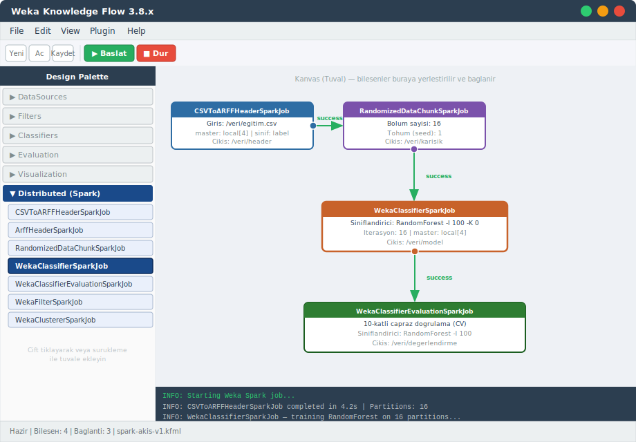
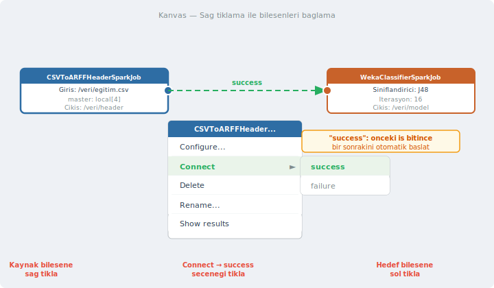
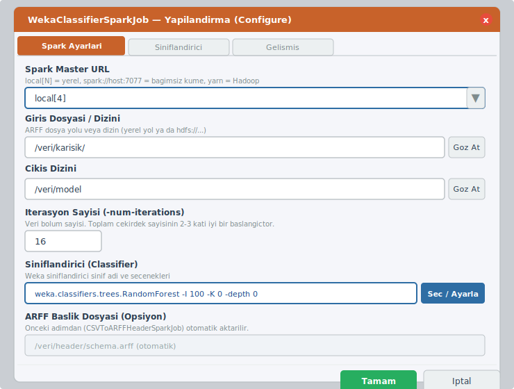

# Weka Knowledge Flow ile Dağıtık Spark İşlemleri

Önceki bölümde aynı işlemleri komut satırından yaptık. Şimdi aynı akışı Weka'nın görsel ortamında kuruyoruz: Knowledge Flow (KF). Fikir aynı, araç farklı. Komut satırında parametreleri elle yazdığınız her şeyi burada form alanlarına dolduruyorsunuz ve bileşenleri bağlantı çizgileriyle birleştiriyorsunuz. Özellikle akışı başkasına göstermek, belgelemek ya da farklı veri kümeleri için yeniden kullanmak istediğinizde KF daha pratiktir.

> **Not:** Aşağıdaki ekran görüntüleri Weka 3.8.x arayüzünü temsil eden SVG mockup'larıdır. İşletim sisteminize ve Weka sürümünüze göre renk ve düzen küçük farklılıklar gösterebilir; ancak bileşen adları ve menü yapısı aynıdır.

---

## Knowledge Flow Nedir?

Knowledge Flow (Bilgi Akışı), Weka'nın görsel iş akışı (workflow) tasarım ortamıdır. Veri kaynakları, filtreler, sınıflandırıcılar ve değerlendirme araçlarını temsil eden bileşenleri bir tuval üzerine yerleştirir, aralarında bağlantı kurarsınız. Akış soldan sağa ya da yukarıdan aşağıya doğru ilerler: her bileşen işini bitirince bağlı olduğu bir sonrakini tetikler.

Komut satırı ile kıyaslamak gerekirse: komut satırında her iş için ayrı bir `java -cp ...` komutu çalıştırıyordunuz ve parametreleri kendiniz sıralıyordunuz. KF'de bu adımların her biri bir kutu (bileşen), parametreler ise bir form alanı haline gelir. Akış da görsel olarak ortada durur.

---

## Knowledge Flow'u Açmak

İki yoldan açılabilir:

**Yol 1 — Weka GUI Chooser'dan:**

```
Weka GUI Chooser → "Knowledge Flow" düğmesine tıkla
```

**Yol 2 — Komut satırından:**

```bash
java -cp weka.jar weka.gui.knowledgeflow.KnowledgeFlowApp
```

`distributedWekaSparkDev` paketi kuruluysa Design Palette'te "Distributed (Spark)" kategorisi otomatik olarak görünür. Paket kurulu değilse bu kategori listede yer almaz.

---

## Arayüzü Tanımak



Yukarıdaki görselde arayüzün ana bölümleri görülmektedir:

| Bölge | İşlev |
|---|---|
| **Design Palette** (sol panel) | Kullanılabilir bileşenlerin kategorize listesi |
| **Kanvas** (ortada) | Bileşenlerin yerleştirildiği ve bağlandığı çalışma alanı |
| **Araç Çubuğu** (üstte) | Yeni / Aç / Kaydet ve ▶ Başlat / ■ Dur düğmeleri |
| **Log Penceresi** (altta) | İş sürerken çıkan bilgi ve hata mesajları |

---

## Design Palette: Spark Bileşenlerini Bulmak

Sol panelde kategoriler halinde bileşenler listelenir. Spark bileşenlerine ulaşmak için **"Distributed (Spark)"** kategorisini genişletin. Aşağıdaki bileşenler burada görünür:

| Bileşen | Komut Satırı Karşılığı |
|---|---|
| `CSVToARFFHeaderSparkJob` | `CSVToARFFHeaderSparkJob` |
| `ArffHeaderSparkJob` | `ArffHeaderSparkJob` |
| `RandomizedDataChunkSparkJob` | `RandomizedDataChunkSparkJob` |
| `WekaClassifierSparkJob` | `WekaClassifierSparkJob` |
| `WekaClassifierEvaluationSparkJob` | `WekaClassifierEvaluationSparkJob` |
| `WekaFilterSparkJob` | `WekaFilterSparkJob` |
| `WekaClustererSparkJob` | `WekaClustererSparkJob` |

---

## Adım Adım: Bir Spark Sınıflandırma Akışı Kurmak

Bu bölümde şu akışı adım adım kuruyoruz:

```
CSVToARFFHeaderSparkJob
        ↓ success
RandomizedDataChunkSparkJob
        ↓ success
WekaClassifierSparkJob
        ↓ success
WekaClassifierEvaluationSparkJob
```

### 1. Bileşenleri Tuvale Yerleştirme

Palette'te bir bileşen üzerine **çift tıklayın**; bileşen tuvale eklenir. Alternatif olarak bileşeni tuvalüzerine sürükleyip bırakabilirsiniz (drag & drop).

Şu sırayla dört bileşeni tuvale ekleyin:

1. `CSVToARFFHeaderSparkJob`
2. `RandomizedDataChunkSparkJob`
3. `WekaClassifierSparkJob`
4. `WekaClassifierEvaluationSparkJob`

Bileşenleri tuval üzerinde mantıklı bir düzene göre konumlandırın: üstten alta ya da soldan sağa doğru. Tuval üzerinde bileşeni taşımak için üstüne tıklayıp sürükleyin.

### 2. Bileşenleri Bağlama

Bileşenler arasındaki bağlantı akışı belirler: hangi bileşen bitince hangisi başlar. Bağlantı kurmak için şu üç tıklama yeterlidir:



**Adımlar:**

1. **Kaynak** bileşene (örneğin `CSVToARFFHeaderSparkJob`) **sağ tıklayın.**
2. Açılan menüden **Connect** → **success** seçin.
3. Fare imleci bir ok haline gelir; şimdi **hedef** bileşene (`RandomizedDataChunkSparkJob`) **sol tıklayın.**

Bağlantı yeşil bir ok olarak tuvalде görünür. Aynı işlemi kalan bileşen çiftleri için tekrarlayın:

- `RandomizedDataChunkSparkJob` → success → `WekaClassifierSparkJob`
- `WekaClassifierSparkJob` → success → `WekaClassifierEvaluationSparkJob`

> `success` bağlantısı, önceki bileşen başarıyla tamamlandığında bir sonrakini otomatik başlatır. `failure` bağlantısı ise hata durumunda alternatif bir yol tanımlamak için kullanılır.

### 3. Bileşenleri Yapılandırma

Her bileşene **sağ tıklayın → Configure...** seçin. Bir diyalog açılır.



#### CSVToARFFHeaderSparkJob Yapılandırması

| Alan | Değer |
|---|---|
| Spark Master URL | `local[4]` |
| Giriş Dosyası | `/veri/egitim.csv` |
| Sınıf özniteliği adı | `label` (hedef sütunun adı) |
| Çıkış Dizini | `/veri/header` |

#### RandomizedDataChunkSparkJob Yapılandırması

| Alan | Değer |
|---|---|
| Spark Master URL | `local[4]` |
| Giriş Dizini | `/veri/egitim.csv` |
| Bölüm sayısı (chunks) | `16` |
| Tohum (seed) | `1` |
| Çıkış Dizini | `/veri/karisik` |

#### WekaClassifierSparkJob Yapılandırması

| Alan | Değer |
|---|---|
| Spark Master URL | `local[4]` |
| Giriş Dizini | `/veri/karisik` |
| Çıkış Dizini | `/veri/model` |
| İterasyon sayısı | `16` |
| Sınıflandırıcı | `weka.classifiers.trees.RandomForest -I 100 -K 0` |

Sınıflandırıcıyı seçmek için **Seç / Ayarla** düğmesine tıklayın. Açılan pencerede Weka'nın tüm sınıflandırıcıları ağaç yapısında görünür; istediğinizi seçip seçeneklerini (örneğin ağaç sayısı `-I`) aynı diyalogdan ayarlayabilirsiniz.

#### WekaClassifierEvaluationSparkJob Yapılandırması

| Alan | Değer |
|---|---|
| Spark Master URL | `local[4]` |
| Giriş Dizini | `/veri/karisik` |
| Çıkış Dizini | `/veri/degerlendirme` |
| Kat sayısı (folds) | `10` |
| Sınıflandırıcı | `weka.classifiers.trees.RandomForest -I 100 -K 0` |

---

### 4. Akışı Çalıştırma

Araç çubuğundaki **▶ Başlat** düğmesine tıklayın. Akış, bağlantı zincirini takip ederek bileşenleri sırayla çalıştırır.

Alternatif olarak herhangi bir bileşene sağ tıklayıp **Start loading** seçebilirsiniz; bu seçenek yalnızca o bileşeni ve devamını çalıştırır.

İş sürerken log penceresinde şuna benzer çıktılar görürsünüz:

```
INFO: CSVToARFFHeaderSparkJob — reading /veri/egitim.csv (16 partitions)
INFO: CSVToARFFHeaderSparkJob completed in 3.8s
INFO: RandomizedDataChunkSparkJob — randomizing and chunking...
INFO: RandomizedDataChunkSparkJob completed in 2.1s
INFO: WekaClassifierSparkJob — training RandomForest on 16 partitions
INFO: WekaClassifierSparkJob completed in 41.3s
INFO: WekaClassifierEvaluationSparkJob — 10-fold CV...
INFO: WekaClassifierEvaluationSparkJob completed in 88.7s
```

---

### 5. Sonuçları Görüntüleme

Değerlendirme bileşenine sağ tıklayın → **Show results**. Bir metin penceresi açılır ve şuna benzer bir özet görünür:

```
=== Stratified cross-validation ===
=== Summary ===

Correctly Classified Instances    87432   91.2834 %
Incorrectly Classified Instances   8368    8.7166 %
Kappa statistic                       0.8901
Mean absolute error                   0.0921
Root mean squared error               0.2134
...

=== Detailed Accuracy By Class ===

              TP Rate  FP Rate  Precision  Recall   F-Measure  ROC Area  Class
              0.941    0.044    0.932      0.941    0.936      0.982     pozitif
              0.956    0.059    0.963      0.956    0.959      0.982     negatif
```

Sonuçları bir dosyaya kaydetmek için metin penceresindeki **Save** düğmesini kullanın.

---

## Akışı Kaydetme ve Yeniden Kullanma

**File → Save** ile akışı kaydedin. Weka, akışı `.kfml` (Knowledge Flow Markup Language — Bilgi Akışı İşaretleme Dili) uzantılı bir XML dosyası olarak kaydeder. Dosyanın içeriğine bakıldığında her bileşen ve yapılandırması XML etiketleri olarak görünür.

```xml
<!-- kfml dosyasından bir kesit -->
<flow>
  <component class="weka.knowledgeflow.steps.CSVToARFFHeaderSparkJob"
             name="CSVToARFFHeaderSparkJob">
    <properties>
      <property name="masterURL" value="local[4]"/>
      <property name="inputFile" value="/veri/egitim.csv"/>
      <property name="classAttribute" value="label"/>
    </properties>
  </component>
  ...
</flow>
```

Kaydedilen akışı **File → Open** ile yükleyerek farklı bir veri kümesine uygulamak için yalnızca giriş dosyası yolunu değiştirmeniz yeterlidir.

---

## Akışı Komut Satırından Çalıştırma

Kaydedilmiş bir `.kfml` dosyasını kullanıcı arayüzü açmadan komut satırından da çalıştırabilirsiniz:

```bash
java -cp weka.jar:$WEKA_SPARK_CP \
  weka.knowledgeflow.KnowledgeFlowApp \
  -headless \
  -flow spark-akis-v1.kfml
```

`-headless` bayrağı GUI'yi devre dışı bırakır; bu sayede akışı bir sunucu üzerinde cron job ya da betik olarak zamanlayabilirsiniz.

---

## Komut Satırı ile Karşılaştırma

| Konu | Komut Satırı | Knowledge Flow |
|---|---|---|
| Öğrenme eğrisi | Parametre adlarını bilmek gerekir | Formlar rehberlik eder |
| Tekrar kullanım | Betik dosyası (`.sh`) | `.kfml` akış dosyası |
| Esneklik | Tüm parametrelere erişim | Çoğu parametre mevcut; bazıları yok |
| Görsellik | Yok | Akış şeması kanvasta görünür |
| Hata ayıklama | Log çıktısı terminalde | Log penceresi + bileşen üzerinde vurgu |
| Sunucuda çalıştırma | Doğrudan | `-headless` bayrağı gerekir |
| Büyük akışlar | Betik dosyasında zincir | Kanvas karmaşıklaşabilir |

Knowledge Flow, özellikle akışı tasarlarken ve başkalarına gösterirken değerlidir. Üretim ortamında ya da çok sayıda parametre denemesi yapıyorsanız komut satırı daha hızlı ve esnek kalır.

---

## Sık Yapılan Hatalar

**"Distributed (Spark)" kategorisi görünmüyor.**
`distributedWekaSparkDev` paketi kurulu değil demektir. Weka Package Manager'dan kurun, ardından Knowledge Flow'u yeniden başlatın.

**Bileşene çift tıklayınca tuvale eklenmiyor.**
Bazı Weka sürümlerinde çift tıklama yerine sürükle-bırak (drag & drop) çalışır. Her iki yöntemi de deneyin.

**Bağlantı oku görünmüyor.**
Kaynak bileşene sağ tıklayıp Connect → success seçtikten sonra fare imleci değişir; bu sırada yalnızca hedef bileşene tıklamanız gerekir. Boş bir tuvale tıklamak işlemi iptal eder.

**Akış başlatılıyor ama hiçbir şey olmuyor.**
İlk bileşende giriş dosyasının yolunu ve Spark master URL'ini kontrol edin. Log penceresindeki hata mesajını okuyun; genellikle sorunun kaynağı burada açıkça belirtilir.

**`OutOfMemoryError` log penceresinde görünüyor.**
Knowledge Flow, JVM heap limitiyle kısıtlıdır. Weka'yı başlatırken `-Xmx` ile heap artırın:

```bash
java -Xmx4g -cp weka.jar:$WEKA_SPARK_CP \
  weka.knowledgeflow.KnowledgeFlowApp
```
