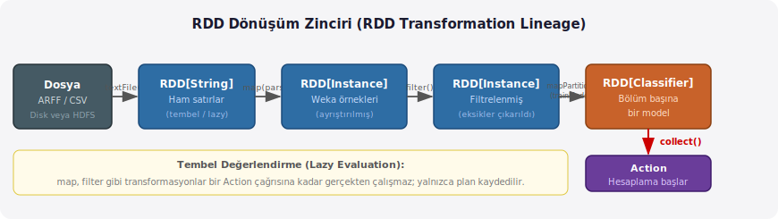
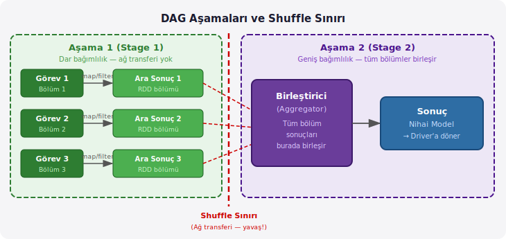
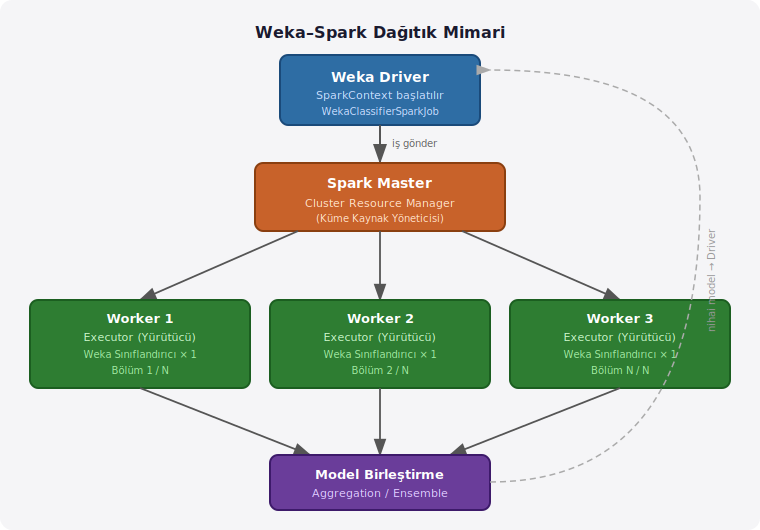

# Weka ile Apache Spark Kullanımı

## Tek Makinenin Sınırları

Elinizdeki veri kümesi 200 GB, makinenizin RAM (Random Access Memory — Rastgele Erişimli Bellek) kapasitesi ise 32 GB. Tek bir Weka oturumunda bu veriyi yüklemek mümkün değildir; bellek taşar, süreç çöker. Daha ölçülü bir örnek verelim: milyonlarca satır içeren tıbbi kayıtlar, müşteri işlem geçmişleri ya da uydu görüntüsü meta verileri. Bunların her birinde aynı sorunla karşılaşabilirsiniz.

Bu noktada iki geleneksel çıkış yolu açılır. Birincisi **dikey ölçekleme** (vertical scaling): daha güçlü, daha fazla RAM'li bir tek makine satın almak. Bu yol bir noktadan sonra hem ekonomik hem teknik bir tavana çarpar. İkincisi **yatay ölçekleme** (horizontal scaling): hesabı birden fazla makineye dağıtmak. Büyük veri (big data) altyapılarının büyük çoğunluğu bu fikir üzerine kurulmuştur.

Dağıtımı koordine etmek için bir çerçeveye ihtiyaç vardır. Hangi makine hangi parçayı işler? Bir makine çökerse ne olur? İş bölüşümünü ve sonuç birleştirmeyi kim yönetir? Apache Spark bu soruları yanıtlamak üzere tasarlanmıştır.

---

## Apache Spark

Apache Spark, 2009 yılında UC Berkeley'deki AMP Lab'da Matei Zaharia liderliğinde geliştirilmiş açık kaynaklı bir dağıtık hesaplama çerçevesidir (distributed computing framework). Bugün Apache Software Foundation bünyesinde sürdürülmektedir.

Spark'ın tasarım motivasyonu, önceki nesil sistemin —Hadoop MapReduce (Harita-Küçültme)— bir zayıflığını gidermektir. MapReduce, her işlem adımı arasındaki ara sonuçları HDFS'e (Hadoop Distributed File System — Hadoop Dağıtık Dosya Sistemi) diske yazar. Makine öğrenimi gibi aynı veriyi defalarca okuyan iteratif algoritmalar bu disk döngüsü nedeniyle yavaş kalır. Spark, ara sonuçları mümkün olduğunca bellekte tutarak bu darboğazı aşar.

---

## Temel Kavramlar

### RDD: Resilient Distributed Dataset

Spark'ın temel veri soyutlaması **RDD**'dir (Resilient Distributed Dataset — Dayanıklı Dağıtılmış Veri Kümesi). Adındaki üç sözcük, bu yapının üç temel özelliğini doğrudan anlatır:

- **Resilient (Dayanıklı):** Bir makine arızalanırsa Spark, kaybolan veri bölümünü yeniden hesaplayabilir. Bunun için RDD, nasıl oluşturulduğunu —soy ağacını (lineage)— kaydeder; bu bilgiyi kullanarak veriyi yeniden üretir.
- **Distributed (Dağıtılmış):** Veri, kümedeki birden fazla makinenin belleğine bölümler (partition) halinde yayılır.
- **Dataset (Veri Kümesi):** Sıradan bir koleksiyon gibi düşünebilirsiniz; ancak paralel, dağıtılmış ve hata toleranslı biçimde.

Bunu somutlaştırmak için bir üretim hattı düşünün. Büyük bir siparişi tek bir tezgâhta bitirmeye çalışmak yerine, siparişi parçalara böler ve her parçayı farklı bir tezgâha verirsiniz. Tezgâhlar eş zamanlı çalışır; biri dursa diğerleri etkilenmez, duran tezgâhın işi yeniden atanır. RDD de tam olarak bu mantıkla veriyi bölümler ve her bölümü bir çalışan düğüme (worker node) gönderir.

```
RDD Bölümleme (3 worker örneği):

  Kaynak Veri (7,5 Milyon Satır)
  ┌───────────────────────────────┐
  │  Bölüm 1  (2,5 M satır)      │ ──► Worker 1
  │  Bölüm 2  (2,5 M satır)      │ ──► Worker 2
  │  Bölüm 3  (2,5 M satır)      │ ──► Worker 3
  └───────────────────────────────┘
```



### Tembel Değerlendirme (Lazy Evaluation)

Spark işlemleri iki kategoriye ayrılır:

**Transformasyonlar (Transformations):** Bir RDD'den yeni bir RDD üretir. `map()`, `filter()`, `flatMap()`, `groupBy()` birer transformasyondur. Transformasyonlar **tembel** (lazy) çalışır: çağrıldıklarında hesaplama başlamaz, yalnızca "şu dönüşümü uygula" kaydı tutulur.

**Eylemler (Actions):** Birikmiş transformasyon planını tetikler ve somut bir sonuç döndürür. `collect()`, `count()`, `reduce()`, `saveAsTextFile()` birer eylemdir. Bir eylem çağrıldığında Spark tüm planı derler, optimize eder ve çalıştırır.

Bu tasarım sayesinde Spark, gereksiz hesaplamalardan kaçınır ve işlem sırasını yeniden düzenleyerek performansı artırabilir.

### DAG: Directed Acyclic Graph

Spark, transformasyon zincirini bir DAG'a (Directed Acyclic Graph — Yönlü Döngüsüz Çizge) dönüştürür. Çizgedeki her düğüm bir işlemi, her kenar ise veri akışını temsil eder. "Acyclic" sözcüğü Yunanca *kyklos* (çember) köküne dayanır; olumsuzluk eki *a-* ile birlikte döngüsüz anlamını verir. Bu özellik, bir işlemin çıktısının kendisine geri dönememesini garanti eder; deterministik çalışmayı ve kolay hata kurtarmayı sağlar.

Spark, DAG'ı **aşamalara** (stage) böler. Bir aşama içindeki görevler ağ üzerinden veri taşımadan (shuffle olmadan) paralel çalışabilir. `groupBy()` veya `reduceByKey()` gibi operasyonlar tüm bölümler arasında veri karışımı (shuffle) gerektirir ve bir aşama sınırı oluşturur. Bu sınır, ağ trafiği gerektirdiğinden performansın en kırılgan noktasıdır.



---

## Weka–Spark Entegrasyonu

**Weka** (Waikato Environment for Knowledge Analysis — Waikato Bilgi Analizi Ortamı), Yeni Zelanda'daki Waikato Üniversitesi'nden gelen Java tabanlı bir makine öğrenimi kütüphanesi ve araç setidir. Tasarımı gereği tek bir JVM (Java Virtual Machine — Java Sanal Makinesi) üzerinde çalışır. Algoritma zenginliği açısından oldukça kapsamlı olsa da büyük veri kümelerinde bu tek-makine sınırıyla karşılaşılır.

Bu kısıtı aşmak için Weka ekibi **`distributedWekaSparkDev`** paketini geliştirmiştir. Paket, Weka'nın öğrenme algoritmalarını Spark kümesi üzerinde çalıştırmanın altyapısını sağlar. İşleyiş şu adımlarda özetlenebilir:

1. Veri kümesi Spark RDD'lerine yüklenerek N bölüme ayrılır.
2. Her bölümde bağımsız bir Weka sınıflandırıcı (ya da kümeleyici) eğitilir.
3. Bölüm modelleri bir toplama adımında (aggregation) birleştirilir.
4. Birleşik model sürücü programa (driver) geri döner.

Bu yaklaşım, özellikle Random Forest gibi topluluk (ensemble) yöntemleriyle doğal bir uyum içindedir: zaten birden fazla bağımsız model birleştirilmektedir. Weka'nın mevcut sınıflandırıcılarını, dışarıya neredeyse hiçbir değişiklik yapmadan dağıtık ortamda kullanabilirsiniz.



---

## Kurulum

### 1. Java Ortamı

Hem Weka hem Spark Java'ya dayanır. JDK (Java Development Kit — Java Geliştirme Kiti) 8 veya 11 önerilir. Spark 3.x sürümleri Java 11'i tam olarak destekler.

```bash
java -version
# openjdk version "11.0.x" 2024-...
```

### 2. Apache Spark İndirme ve Yapılandırma

[spark.apache.org/downloads](https://spark.apache.org/downloads.html) adresinden Spark'ı indirin. Hadoop entegrasyonu gerekmiyorsa "Pre-built without Hadoop" seçeneği yeterlidir.

```bash
tar -xzf spark-3.5.0-bin-without-hadoop.tgz -C /opt/
export SPARK_HOME=/opt/spark-3.5.0
export PATH=$SPARK_HOME/bin:$PATH
```

Kurulumu doğrulamak için:

```bash
spark-shell --version
# Spark version 3.5.0
```

### 3. Weka Paket Yöneticisi ile Entegrasyon Paketinin Kurulumu

Weka GUI üzerinden: **Tools → Package Manager** → `distributedWekaSparkDev` araması → Install.

Komut satırından:

```bash
java -cp weka.jar weka.core.WekaPackageManager \
  -install-package distributedWekaSparkDev
```

Kurulumun ardından `~/wekafiles/packages/distributedWekaSparkDev/` dizininde Spark entegrasyon jar'ları oluşur.

### 4. Classpath Yapılandırması

Weka-Spark işlerini terminalden çalıştırmak için Spark jar'larını classpath'e eklemeniz gerekir. Bu değişkeni `~/.bashrc` dosyanıza ekleyerek kalıcı hale getirin:

```bash
export WEKA_SPARK_CP=\
$SPARK_HOME/jars/*:\
$HOME/wekafiles/packages/distributedWekaSparkDev/distributedWekaSparkDev.jar:\
$HOME/wekafiles/packages/distributedWekaSparkDev/lib/*
```

---

## Temel Kullanım

Weka-Spark işlerinin tipik akışı üç adımdan oluşur: şema oluşturma, eğitim, değerlendirme. Bunları sırasıyla inceleyelim.

### Adım 1: ARFF Başlığının Oluşturulması

Weka, dağıtık işleme başlamadan önce veri kümesinin şemasını bilmek ister; öznitelik (attribute) adları, türleri, kategorik değerlerin listesi ve sınıf etiketi (class label). `CSVToARFFHeaderSparkJob`, bu şemayı Spark üzerinden paralel tarama ile oluşturur. Milyonlarca satırlık bir CSV'de tek makinede dakikalar sürebilecek bu tarama, paralel yapıda çok daha kısa sürer.

```bash
java -cp weka.jar:$WEKA_SPARK_CP \
  weka.distributed.spark.CSVToARFFHeaderSparkJob \
  -master local[4] \
  -input /veri/egitim.csv \
  -output /veri/cikti/header \
  -names-file /veri/oznik-adlari.txt \
  -class-attribute-name sinif \
  -header-file-name schema.arff
```

| Parametre | Açıklama |
|---|---|
| `-master local[4]` | Yerel modda 4 iş parçacığı (thread) kullan |
| `-input` | Kaynak CSV dosyası (yerel yol ya da `hdfs://…`) |
| `-output` | Oluşturulan şemanın yazılacağı dizin |
| `-class-attribute-name` | Hedef değişkenin (bağımlı değişken) sütun adı |

Veri ARFF formatında geliyorsa bu adımın yerine `ArffHeaderSparkJob` kullanılır:

```bash
java -cp weka.jar:$WEKA_SPARK_CP \
  weka.distributed.spark.ArffHeaderSparkJob \
  -master local[4] \
  -input /veri/egitim.arff \
  -output /veri/cikti/header
```

### Adım 2: Sınıflandırıcı Eğitimi

```bash
java -cp weka.jar:$WEKA_SPARK_CP \
  weka.distributed.spark.WekaClassifierSparkJob \
  -master local[4] \
  -input /veri/egitim.arff \
  -output /veri/cikti/model \
  -num-iterations 16 \
  -W weka.classifiers.trees.RandomForest \
  -- -I 100 -K 0 -depth 0
```

`-num-iterations` parametresi veriyi kaç bölüme ayıracağını belirtir; her bölümde bağımsız bir RandomForest eğitilir ve bölüm modelleri daha sonra bir ensemble oluşturmak üzere birleştirilir. `--` işaretinden sonra gelen argümanlar doğrudan Weka sınıflandırıcısına iletilir.

İyi bir başlangıç noktası olarak `-num-iterations` değerini kümedeki toplam CPU çekirdeğinin 2–3 katına ayarlayın. 8 çekirdekli bir kümede 16–24 makul bir başlangıçtır.

J48 karar ağacı ile aynı işlem:

```bash
java -cp weka.jar:$WEKA_SPARK_CP \
  weka.distributed.spark.WekaClassifierSparkJob \
  -master local[4] \
  -input /veri/egitim.arff \
  -output /veri/cikti/model-j48 \
  -num-iterations 16 \
  -W weka.classifiers.trees.J48 \
  -- -C 0.25 -M 2
```

### Adım 3: Değerlendirme

```bash
java -cp weka.jar:$WEKA_SPARK_CP \
  weka.distributed.spark.WekaClassifierEvaluationSparkJob \
  -master local[4] \
  -input /veri/egitim.arff \
  -output /veri/cikti/degerlendirme \
  -num-folds 10 \
  -W weka.classifiers.trees.J48 \
  -- -C 0.25 -M 2
```

Bu komut 10 katlı çapraz doğrulama (10-fold cross-validation) gerçekleştirir. Standart Weka'da çapraz doğrulama tek çekirdek üzerinde sırayla yürütülürken, burada her kat Spark üzerinde paralel işlenir. Sonuçlar doğruluk (accuracy), F-ölçütü (F-measure), ROC alanı gibi metrikleri içerir.

---

## Veri Ön İşleme: Dağıtık Filtreler

`WekaFilterSparkJob`, Weka'nın mevcut filtrelerini dağıtık biçimde uygular. Filtreler her bölüme ayrı ayrı uygulanır; Weka'nın tüm `unsupervised` ve birçok `supervised` filtresi bu şekilde çalışabilir.

`Normalize` filtresiyle tüm sayısal öznitelikleri [0, 1] aralığına çekmek:

```bash
java -cp weka.jar:$WEKA_SPARK_CP \
  weka.distributed.spark.WekaFilterSparkJob \
  -master local[4] \
  -input /veri/ham.arff \
  -output /veri/normalize \
  -filter "weka.filters.unsupervised.attribute.Normalize -S 1.0 -T 0.0"
```

Eksik değerleri ortalama/mod ile doldurmak için:

```bash
  -filter "weka.filters.unsupervised.attribute.ReplaceMissingValues"
```

Normalleştirme gibi global istatistik gerektiren filtreler iki aşamada çalışır: önce her bölüm kendi min/max değerlerini hesaplar, ardından bu değerler bir reduce adımında birleştirilerek gerçek normalleştirme uygulanır. Bu, Weka-Spark'ın arka planda yönettiği bir süreçtir.

---

## Küme Modları

### Yerel Mod (Local Mode)

Geliştirme ve hata ayıklama için idealdir; ağ iletişimi olmadığından en hızlı başlangıçtır.

```
-master local        # tek iş parçacığı — sıralı test
-master local[4]     # 4 iş parçacığı
-master local[*]     # mevcut tüm çekirdekler
```

### Bağımsız Küme (Standalone Cluster)

Spark'ın kendi yöneticisiyle birden fazla makineyi koordine etmek için master ve worker hizmetlerini başlatın:

```bash
# Master makinesinde:
$SPARK_HOME/sbin/start-master.sh

# Her worker makinesinde (master-sunucu adresini kendi ortamınıza göre güncelleyin):
$SPARK_HOME/sbin/start-worker.sh spark://master-sunucu:7077
```

İşi kümeye gönderirken `-master` ve `-input` parametrelerini güncelleyin:

```bash
java -cp weka.jar:$WEKA_SPARK_CP \
  weka.distributed.spark.WekaClassifierSparkJob \
  -master spark://master-sunucu:7077 \
  -input hdfs://master-sunucu:9000/veri/egitim.arff \
  -output hdfs://master-sunucu:9000/veri/cikti/model \
  -num-iterations 48 \
  -W weka.classifiers.trees.RandomForest \
  -- -I 200 -K 0
```

### YARN (Yet Another Resource Negotiator — Bir Başka Kaynak Yöneticisi)

Mevcut bir Hadoop kümesinde YARN'ı kaynak yöneticisi olarak kullanmak için:

```bash
-master yarn
```

Uzun süreli üretim işlerinde `--deploy-mode cluster` seçeneği önerilir: bu modda Spark sürücüsü de YARN üzerinde çalışır, terminal kapansa bile iş devam eder.

---

## Java API ile Doğrudan Entegrasyon

Komut satırı araçlarının yanı sıra Weka-Spark'ı doğrudan Java kodundan çağırabilirsiniz. Bu yaklaşım, dağıtık öğrenme adımını daha büyük bir Java uygulamasına gömmek istediğinizde kullanışlıdır.

```java
import weka.distributed.spark.WekaClassifierSparkJob;
import weka.core.Utils;

public class DagitikEgitim {
    public static void main(String[] args) throws Exception {

        WekaClassifierSparkJob job = new WekaClassifierSparkJob();

        String[] options = Utils.splitOptions(
            "-master local[8] " +
            "-input /veri/egitim.arff " +
            "-output /veri/model " +
            "-num-iterations 16 " +
            "-W weka.classifiers.bayes.NaiveBayes"
        );

        job.setOptions(options);
        job.runJob();
    }
}
```

Derleme ve çalıştırma:

```bash
javac -cp weka.jar:$WEKA_SPARK_CP DagitikEgitim.java
java  -cp .:weka.jar:$WEKA_SPARK_CP DagitikEgitim
```

Birden fazla işi art arda zincirlemek istiyorsanız — örneğin önce `WekaFilterSparkJob`, ardından `WekaClassifierSparkJob` — her birini ayrı bir nesne olarak örnekleyin ve sırayla çalıştırın.

---

## Sık Karşılaşılan Sorunlar

### `ClassNotFoundException` — Spark jar'ları bulunamıyor

`WEKA_SPARK_CP` değişkeninin `$SPARK_HOME/jars/*` yolunu içerdiğinden ve bu dizinin gerçekten dolu olduğundan emin olun:

```bash
ls $SPARK_HOME/jars/ | wc -l
# 200'den fazla satır beklenir
```

### Serileştirme Hatası (Serialization Error)

Spark, nesneleri ağ üzerinden taşımak için serileştirir. `distributedWekaSparkDev` paketi standart Weka sınıflandırıcıları için bu uyumluluğu sağlar. Özel yazılmış sınıflandırıcılar `java.io.Serializable` arayüzünü uygulamalıdır.

### Worker'larda Bellek Yetersizliği (OutOfMemoryError)

Bölüm boyutu fazla büyükse executor heap'i taşar. `-num-iterations` değerini artırarak bölüm başına düşen veri miktarını azaltın. Executor belleğini de açıkça belirtebilirsiniz:

```bash
java -Dspark.executor.memory=6g \
     -Dspark.driver.memory=3g \
     -cp weka.jar:$WEKA_SPARK_CP \
     weka.distributed.spark.WekaClassifierSparkJob \
     -master local[4] \
     -input /veri/egitim.arff \
     -output /veri/cikti/model \
     -num-iterations 32 \
     -W weka.classifiers.trees.RandomForest
```

### ARFF Şeması ile Veri Uyumsuzluğu

`CSVToARFFHeaderSparkJob` ile üretilen şema, eğitim verisinin tamamından türetilir. Test verisinde bu şemada yer almayan yeni kategorik değerler varsa Weka hata verir. Şemayı eğitim ve test verisini birlikte içeren bir örnek üzerinde oluşturmak bu sorunu önler.

---

## Performans İpuçları

**Bölüm sayısı:** İyi bir başlangıç noktası, kümedeki toplam CPU çekirdeğinin 2–4 katıdır. 24 çekirdekli bir kümede 48–96 bölüm makul bir aralıktır. Çok az bölüm paralelliği düşürür; çok fazla bölüm ise overhead'i artırır.

**Kryo serileştirme:** Varsayılan Java serileştirmesi yerine Kryo kullanmak ağ trafiğini ve CPU yükünü azaltır:

```bash
-Dspark.serializer=org.apache.spark.serializer.KryoSerializer
```

**Spark UI:** İş çalışırken `http://localhost:4040` adresinden DAG görselleştirmesini, aşama (stage) sürelerini ve görev başarısızlıklarını izleyebilirsiniz. Hangi aşamanın darboğaz oluşturduğunu buradan görmek, optimizasyonun en hızlı yoludur.

**Veri yerelliliği (Data Locality):** Hesaplamayı verinin bulunduğu makineye taşımak ağ trafiğini ortadan kaldırır. HDFS kullanan yapılandırmalarda Spark bunu otomatik olarak optimize eder; mümkün olduğunca veriyi HDFS'e koyun.

**Önbellekleme (Caching):** Aynı veri üzerinde birden fazla geçiş yapan işlerde (çapraz doğrulama gibi) RDD'yi bellekte tutmak tekrarlı disk okumalarını önler. Kendi Spark uygulamalarınızda bu `rdd.cache()` veya `rdd.persist()` ile yapılır; `distributedWekaSparkDev` bunu dahili olarak yönetir.

**Veri karıştırma (Data Shuffling):** Eğitime başlamadan önce `RandomizedDataChunkSparkJob` ile veriyi karıştırmak, bölüm başına düşen sınıf dağılımını dengelediğinden model kalitesini artırabilir:

```bash
java -cp weka.jar:$WEKA_SPARK_CP \
  weka.distributed.spark.RandomizedDataChunkSparkJob \
  -master local[4] \
  -input /veri/egitim.arff \
  -output /veri/karisik \
  -num-chunks 16
```

---

## Özet: Weka-Spark İş Sınıfları

| İş Sınıfı | İşlev |
|---|---|
| `CSVToARFFHeaderSparkJob` | CSV'den ARFF şeması (header) üret |
| `ArffHeaderSparkJob` | ARFF'ten başlık üret ve istatistik topla |
| `RandomizedDataChunkSparkJob` | Veriyi karıştır ve rastgele bölümle |
| `WekaFilterSparkJob` | Dağıtık filtre uygula |
| `WekaClassifierSparkJob` | Dağıtık sınıflandırıcı eğit |
| `WekaClassifierEvaluationSparkJob` | Dağıtık çapraz doğrulama ile değerlendir |
| `WekaClustererSparkJob` | Dağıtık kümeleyici eğit |

---

## Kaynaklar

- Apache Spark Belgeleri — [spark.apache.org/docs/latest](https://spark.apache.org/docs/latest/)
- Weka Paketi Listesi — [waikato.github.io/weka-wiki/packages/list](https://waikato.github.io/weka-wiki/packages/list/)
- Zaharia ve ark. (2012). *Resilient Distributed Datasets: A Fault-Tolerant Abstraction for In-Memory Cluster Computing.* NSDI'12.
- Meng ve ark. (2016). *MLlib: Machine Learning in Apache Spark.* Journal of Machine Learning Research, 17(34).
